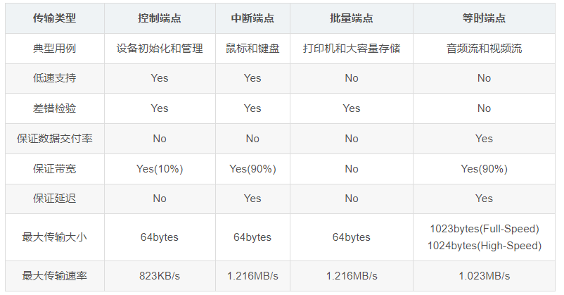

# **Basical knowledge**
Author: Buendia.Deng[^1a]  
Rev 1.0  
[^1a]: Buendia.Deng@volex.com 

## USB(HID)
### 端点
在USB规范中，设备端点是USB设备的一个可以唯一寻址的部分，端点是 USB 设备与主机之间通信的通道。每个端点都有一个唯一的地址和方向（IN 或 OUT），以及一个特定的传输类型（如控制、批量、中断或同步）。端点不仅用于数据传输，还包括控制传输，用于设备管理和状态控制。
控制端点或端点0用于与设备进行通信，它由端点0 IN和端点0 OUT组成。USB规范要求每个USB设备都必须支持 端点0，因为它是用于设备枚举和基本通信的必要组成部分。
USB规范进一步定义了四种类型的端点，并基于类型和支持的设备速度设置了最大数据包大小。
(1)控制端点(Control Endpoint)
用于控制传输，所有设备都必须支持。控制传输在总线上发送和接收设备信息。它的优点是能够保证准确性，发生的错误会被正确检测，数据将被重新发送。在低速和全速设备上，控制传输在总线上有10%的保留带宽(高速设备为20%)，并提供USB系统级的控制。

(2)中断端点(Interrupt Endpoints)
主要用于需要使用高可靠性方法传输少量数据的设备，通常在人机界面设备(HID)中常见。它不是真正的中断，而是使用轮询，它可以保证主机以可预测的间隔检查数据。中断传输提供了准确性保证，因为错误会被正确检测，并在下一个事务中进行重试。在低速和全速设备上，中断传输具有90%的保证带宽，而在高速设备上为80%。这个带宽与等时端点共享。

中断端点的最大数据包大小取决于设备的速度。高速设备支持最大数据包大小为1024字节。全速设备支持最大数据包大小为64字节。低速设备支持最大数据包大小为8字节。

(3)批量端点(Bulk Endpoints)
用于批量传输，通常用于需要在不定的时间内传输相对大量数据的设备，其中传输可以使用任何可用的带宽空间。它是USB设备最常见的传输类型。批量传输的时间是可变的，取决于总线上有多少可用带宽，因为没有为传输设置预留的带宽。批量传输提供了准确性保证，因为错误会被正确检测，事务会被重新发送。批量传输在传输大量数据，但对传输时间不敏感的情况下非常有用。

批量端点的最大数据包大小取决于设备速度。高速设备支持的最大BULK数据包大小为512字节。全速设备支持的最大数据包大小为64字节。低速设备不支持批量传输类型。

(4)等时端点(Isochronous Endpoints)
用于等时传输，这是连续的、实时的传输，具有主机和设备事先协商好的带宽。等时传输必须支持容忍错误数据流，因为它们没有错误恢复机制或握手。错误通过CRC字段检测，但不会被更正。在等时传输中，需要权衡保证交付与保证准确性。音乐流或视频流是使用等时端点的应用示例，因为偶尔丢失的数据会被人类的耳朵和眼睛忽略。等时传输在低速和全速设备上有90%的保证带宽(高速设备为80%)，并与中断端点共享。

端点属性一般在设备描述中，在LoopBack中，定义在
```c
USBD_CUSTOM_HID_CfgFSDesc

  CUSTOM_HID_EPIN_ADDR,                               /* bEndpointAddress: Endpoint Address (IN) */
  0x03,                                               /* bmAttributes: Interrupt endpoint */
  CUSTOM_HID_EPIN_SIZE,                               /* wMaxPacketSize: 2 Byte max */
```

### 设备标准描述符
USB Full Speed Device describe
```c
__ALIGN_BEGIN uint8_t USBD_FS_DeviceDesc[USB_LEN_DEV_DESC] __ALIGN_END =
{
  0x12,                       /*bLength */
  USB_DESC_TYPE_DEVICE,       /*bDescriptorType*/
  0x00,                       /*bcdUSB */
  0x02,                       //规范的版本号
  0x00,                       /*bDeviceClass设备的类代码*/
  0x00,                       /*bDeviceSubClass子类代码*/
  0x00,                       /*bDeviceProtocol 协议代码*/
  USB_MAX_EP0_SIZE,           /*bMaxPacketSize零号端点的最大包大小*/
  LOBYTE(USBD_VID),           /*idVendor*/
  HIBYTE(USBD_VID),           /*idVendor*/
  LOBYTE(USBD_PID_FS),        /*idProduct*/
  HIBYTE(USBD_PID_FS),        /*idProduct*/
  0x00,                       /*bcdDevice rel. 2.00*/
  0x02,
  USBD_IDX_MFC_STR,           /*Index of manufacturer  string*/
  USBD_IDX_PRODUCT_STR,       /*Index of product string*/
  USBD_IDX_SERIAL_STR,        /*Index of serial number string*/
  USBD_MAX_NUM_CONFIGURATION  /*bNumConfigurations*/
};
```
**bDescriptorType**
bDescriptorType = 1: 包含了设备的基本信息，如 USB 版本、厂商 ID、产品 ID 等。
bDescriptorType = 2: 描述了设备的配置信息，包括电源模式、接口数等。
bDescriptorType = 3: 用于存储用数字索引指向的字符串，如制造商名、产品名、序列号等。
bDescriptorType = 4: 描述了设备的一个接口及其设置，包括接口编号、使用的端点数等。
bDescriptorType = 5: 定义了一个端点的属性，包括端点地址、传输类型、最大包大小等。
bDescriptorType = 6: 描述了其他速度的设备信息（如全速设备的高速信息）。
bDescriptorType = 7: 用于高速设备，描述了当设备工作在非最高速度模式时的配置。
bDescriptorType = 8: 指示接口所需的最大功率。
BOS 描述符 (bDescriptorType = 15): 用于 USB 3.0，描述设备级别的功能总集。
设备功能描述符 (bDescriptorType = 16): 用于定义设备的功能，如 USB 2.0 扩展和 SuperSpeed USB 设备。
SS 端点伴随描述符 (bDescriptorType = 30): 描述超速设备端点的额外属性。

**bDeviceClass**
0x00: 在接口级别指定设备类。这意味着每个接口指定其自己的类代码。
0x01: 音频设备类 0x02: 通信设备类。
0x03: 人机接口设备类（HID），如键盘、鼠标 0x05: 物理设备类。
0x06: 图像设备类，如摄像头 0x07: 打印机。
0x08: 大容量存储设备类，如 USB 闪存驱动器、硬盘驱动器。
0x09: USB 集线器 0x0A: CDC-Data，用于网络和其他通信设备的数据接口。
0x0B: 智能卡 0x0D: 内容安全设备类。
0x0E: 视频设备类 0x0F: 个人健康设备类。
0x10: 音频/视频设备类 0x11: 可用于 USB3 视觉类的设备。
0xDC: 诊断设备 0xE0: 无线控制器。
0xEF: 杂项设备类，通常包括具有 IAD (接口相关描述符) 的设备。
0xFE: 应用程序特定设备类 0xFF: 厂商特定设备类。

**bSubDeviceClass**
通信设备类（0x02）
0x00: 直接线控，无特定的通信协议 0x01: AT 命令集（调制解调器） 
0x02: 电话控制模型 0x03: 多通道控制模 
0x04: CAPI 控制模型 0x05: 以太网仿真模型。
0x06: ATM 网络控制 人机接口设备类（HID, 0x03）
0x00: 无特定子类（常规 HID 设备）0x01: 启动接口子类（例如，键盘和鼠标） 
大容量存储设备类（0x08）
0x01: SCSI 透明命令集。0x02: ATAPI 命令集。
0x03: QIC-157 命令集。0x04: UFI 命令集（通常用于软盘）。
0x05: SFF-8070i 命令集。0x06: SCSI 命令包。
0x07: LOCK 命令集。
打印机类（0x07）
0x00: 保留。0x01: 打印机子类。
0x02: 扫描仪子类。
音频设备类（0x01）
0x00: 定义在接口描述符中。0x01: 音频控制。
0x02: 音频流。0x03: MIDI 流。
视频设备类（0x0E）
0x00: 未定义。0x01: 视频控制。
0x02: 视频流。0x03: 视频接口集合。

最大包大小（bMaxPacketSize）：这个值取决于设备的速度：
低速设备（Low-Speed）：最大包大小固定为 8 字节。
全速设备（Full-Speed）：最大可以是 8、16、32 或 64 字节。
高速设备（High-Speed）：固定为 64 字节。
超高速设备（SuperSpeed）：通常为 512 字节。

STM32HAL为用户提供了一个USB设备HID接口类的文件，即usbd_custom_hid_if.c/h，以便用户自行配置HID报告描述符
## report ddesscribe
```c
__ALIGN_BEGIN static uint8_t CUSTOM_HID_ReportDesc_FS[USBD_CUSTOM_HID_REPORT_DESC_SIZE] __ALIGN_END =
{
  /* USER CODE BEGIN 0 */
	0x06, 0x00, 0xff,              // USAGE_PAGE (Vendor Defined Page 1)
	0x09, 0x01,                    // USAGE (Vendor Usage 1)
	0xa1, 0x01,                    // COLLECTION (Application)
	0x09, 0x01,                    //   USAGE (Vendor Usage 1)
	0x15, 0x00,                    //   LOGICAL_MINIMUM (0)
	0x26, 0xff, 0x00,              //   LOGICAL_MAXIMUM (255)
	0x95, 0x40,                    //   REPORT_COUNT (64)
	0x75, 0x08,                    //   REPORT_SIZE (8)
	0x81, 0x02,                    //   INPUT (Data,Var,Abs)
	0x09, 0x01,                    //   USAGE (Vendor Usage 1)
	0x15, 0x00,                    //   LOGICAL_MINIMUM (0)
	0x26, 0xff, 0x00,              //   LOGICAL_MAXIMUM (255)
	0x95, 0x40,                    //   REPORT_COUNT (64)
	0x75, 0x08,                    //   REPORT_SIZE (8)
  0x91, 0x02,                    //   OUTPUT (Data,Var,Abs)
  /* USER CODE END 0 */
  0xC0    /*     END_COLLECTION	             */
};

```
LOGICAL_MAXIMUM：逻辑最大值指定了特定数据项在报告中可以达到的最高数值
REPORT_COUNT：定义了随后的数据字段在单个报告中的实例数，或称报告计数
REPORT_SIZE：定义了单个数据字段的大小，单位是位（bit）

## EXTI/NVIC
EXTI(External Interrupt/Event Controller)
外部中断/事件控制器,EXTI 用于处理外部引脚的中断和事件请求。它将特定的 GPIO 引脚连接到中断控制器上，以便在检测到某个引脚的电平变化（如上升沿、下降沿或任意变化）时，生成中断或事件。配置中断触发条件，如上升沿触发、下降沿触发或双边沿触发。
NVIC（Nested Vectored Interrupt Controller）
嵌套向量中断控制器
NVIC 用于管理整个系统的中断请求，是处理器核心中断控制的核心模块。它根据中断的优先级和嵌套规则，决定何时执行哪个中断服务程序。
EXTI 负责检测和配置外部引脚的中断触发条件，一旦满足触发条件，就会向 NVIC 发送中断请求。
NVIC 负责接收来自 EXTI 或其他中断源的请求，并根据优先级决定是否执行中断服务程序。
**事件**：事件是硬件检测到某个触发条件（例如引脚电平变化）时发生的动作，但不会触发CPU的中断服务程序。事件主要用于那些不需要立即响应的场合，可以用来同步或触发外设。
**中断**：中断是当某个触发条件满足时，CPU会暂停当前的执行，跳转到中断服务程序（ISR）去处理相应的任务。这是硬件触发的软件处理方式，用于处理需要快速响应的情况。

定时器对齐模式
边沿对齐模式：计数器从 0 到 ARR，始终向上计数。
中心对齐模式1：计数器从 0 到 ARR，再从 ARR 到 0。
中心对齐模式2：计数器从 ARR 到 0，再从 0 到 ARR。
中心对齐模式3：计数器从 0 到 ARR，再从 ARR 到 0，计数方向在 ARR 和 0 时反转。

定时器中断：
设置超声波的时候 需要计算高电平事件，但是如果只是开启溢出中断后，会一直产生溢出中断，因为定时器一直计数
```c
void MX_TIM1_Init(void)
{

  /* USER CODE BEGIN TIM1_Init 0 */

  /* USER CODE END TIM1_Init 0 */

  TIM_MasterConfigTypeDef sMasterConfig = {0};
  TIM_IC_InitTypeDef sConfigIC = {0};

  /* USER CODE BEGIN TIM1_Init 1 */

  /* USER CODE END TIM1_Init 1 */
  htim1.Instance = TIM1;
  htim1.Init.Prescaler = 71;
  htim1.Init.CounterMode = TIM_COUNTERMODE_UP;
  htim1.Init.Period = 1000;
  htim1.Init.ClockDivision = TIM_CLOCKDIVISION_DIV1;
  htim1.Init.RepetitionCounter = 0;
  htim1.Init.AutoReloadPreload = TIM_AUTORELOAD_PRELOAD_DISABLE;
  if (HAL_TIM_IC_Init(&htim1) != HAL_OK)
  {
    Error_Handler();
  }
  sMasterConfig.MasterOutputTrigger = TIM_TRGO_RESET;
  sMasterConfig.MasterSlaveMode = TIM_MASTERSLAVEMODE_DISABLE;
  if (HAL_TIMEx_MasterConfigSynchronization(&htim1, &sMasterConfig) != HAL_OK)
  {
    Error_Handler();
  }
  sConfigIC.ICPolarity = TIM_INPUTCHANNELPOLARITY_RISING;
  sConfigIC.ICSelection = TIM_ICSELECTION_DIRECTTI;
  sConfigIC.ICPrescaler = TIM_ICPSC_DIV1;
  sConfigIC.ICFilter = 0;
  if (HAL_TIM_IC_ConfigChannel(&htim1, &sConfigIC, TIM_CHANNEL_1) != HAL_OK)
  {
    Error_Handler();
  }
  /* USER CODE BEGIN TIM1_Init 2 */
  HAL_NVIC_SetPriority(TIM1_CC_IRQn, 1, 3);
  HAL_NVIC_EnableIRQ(TIM1_CC_IRQn);

  HAL_NVIC_SetPriority(TIM1_UP_IRQn, 1, 2);
    HAL_NVIC_EnableIRQ(TIM1_UP_IRQn);

  __HAL_TIM_ENABLE_IT(&htim1, TIM_IT_CC1);
//  __HAL_TIM_ENABLE_IT(&htim1, TIM_IT_UPDATE);

  HAL_TIM_Base_Start(&htim1);
  HAL_TIM_IC_Start_IT(&htim1, TIM_CHANNEL_1);
  /* USER CODE END TIM1_Init 2 */
}
```
只有当进行高电平读数的时候 开启溢出中断，否则关闭
```c
volatile uint8_t TIM1CH1_CAPTURE_STA;
volatile uint16_t TIM1CH1_CAPTURE_VAL;
static uint8_t  tim1ch1_capture_ovf  = 0;
void TIM1_CC_IRQHandler(void)
{
    if (!(TIM1CH1_CAPTURE_STA & 0x80))
    {
        if (__HAL_TIM_GET_FLAG(&htim1, TIM_FLAG_CC1))
        {
            if (TIM1CH1_CAPTURE_STA & 0x40)  // falling capture
            {
                TIM1CH1_CAPTURE_STA |= 0x80;  // 捕获逻辑高，获取距离值
                TIM1CH1_CAPTURE_VAL = __HAL_TIM_GET_COMPARE(&htim1, TIM_CHANNEL_1);
                __HAL_TIM_DISABLE_IT(&htim1, TIM_IT_UPDATE);//关闭溢出中断

                // 将捕获值存入环形队列，处理溢出次数
                if (capture_queue.count < QUEUE_SIZE)
                {
                    capture_queue.tail = (capture_queue.tail + 1) % QUEUE_SIZE;
                    capture_queue.capture_val[capture_queue.tail] = TIM1CH1_CAPTURE_VAL;
                    capture_queue.overflow_count[capture_queue.tail] = tim1ch1_capture_ovf;
                    capture_queue.count++;
                }
                else
                {
                    capture_queue.head = (capture_queue.head + 1) % QUEUE_SIZE;
                    capture_queue.capture_val[capture_queue.tail] = TIM1CH1_CAPTURE_VAL;
                    capture_queue.overflow_count[capture_queue.tail] = TIM1CH1_CAPTURE_STA & 0x3F;
                    capture_queue.tail = (capture_queue.tail + 1) % QUEUE_SIZE;
                }

                __HAL_TIM_SET_CAPTUREPOLARITY(&htim1, TIM_CHANNEL_1, TIM_INPUTCHANNELPOLARITY_RISING);
            }
            else  // rising capture
            {
                TIM1CH1_CAPTURE_STA = 0;
                TIM1CH1_CAPTURE_VAL = 0;
                tim1ch1_capture_ovf = 0;
                TIM1CH1_CAPTURE_STA |= 0x40;  // 捕获上升沿标志
                __HAL_TIM_SET_COUNTER(&htim1, 0);  // 清零计数器
                __HAL_TIM_ENABLE_IT(&htim1, TIM_IT_UPDATE);//此时进入高电平计时，打开溢出中断
                __HAL_TIM_SET_CAPTUREPOLARITY(&htim1, TIM_CHANNEL_1, TIM_INPUTCHANNELPOLARITY_FALLING);
            }
        }

    }

    __HAL_TIM_CLEAR_FLAG(&htim1,TIM_FLAG_CC1);  // 清除中断标志
}


void TIM1_UP_IRQHandler(void)
{
	 if (TIM1CH1_CAPTURE_STA & 0x40)
	{
		 if (tim1ch1_capture_ovf >= 63)
		{
			TIM1CH1_CAPTURE_VAL = 1000;
			TIM1CH1_CAPTURE_STA |= 0x80;
			__HAL_TIM_DISABLE_IT(&htim1, TIM_IT_UPDATE);//关闭溢出中断
		}
		else
		{
			tim1ch1_capture_ovf++;
		}
	}
	  __HAL_TIM_CLEAR_FLAG(&htim1, TIM_FLAG_UPDATE);
}

int Get_Distance(void)
{
    int distance = 0;
    int res = 0;
    HAL_GPIO_WritePin(GPIOA, GPIO_PIN_11, GPIO_PIN_SET);  // 触发超声波信号
    HAL_Delay(15);
    HAL_GPIO_WritePin(GPIOA, GPIO_PIN_11, GPIO_PIN_RESET);
    if (TIM1CH1_CAPTURE_STA&0x80)
    {
		if (capture_queue.count > 0)  // 确保队列中有数据
		{
			// 获取队列中的最新数据
			uint16_t capture_val = capture_queue.capture_val[capture_queue.head];
			uint8_t overflow_count = capture_queue.overflow_count[capture_queue.head];

			// 计算完整的计数值，包括溢出
			distance = (overflow_count & 0x3E) * 1000 + capture_val;

			// 计算距离
			Dis_Buf[BufHead] = (distance * 174) >> 10;
			BufHead = BufHead > 10? 0 : (BufHead + 1) % QUEUE_SIZE;

			// 更新队列头指针，准备读取下一条数据
			capture_queue.head = (capture_queue.head + 1) % QUEUE_SIZE;
			capture_queue.count--;
		}
		TIM1CH1_CAPTURE_STA = 0;
    }

    return Dis_Buf[BufHead];
}
```

## 实时系统中的按键检测
按键检测需要进行防抖，一般的按键检测可能通过中断实现，或者在mian函数中进行判断
```c
uint8_t Key_Scan(void)
{
    static uint8_t key_last_state = KEY_OFF;
    uint8_t key_current_state = HAL_GPIO_ReadPin(GPIOC, GPIO_PIN_13);

    if (key_current_state == GPIO_PIN_SET)
    {
        HAL_Delay(20); // 去抖延时
        if (HAL_GPIO_ReadPin(GPIOC, GPIO_PIN_13) == GPIO_PIN_SET)
        {
            if (key_last_state == KEY_OFF)
            {
                key_last_state = KEY_ON;
                return KEY_ON;
            }
        }
    }
    else
    {
        key_last_state = KEY_OFF;  // 按键松开时，重置状态
    }

    return KEY_OFF; // 默认返回按键未被按下
}
```
但是考虑到在freeRTOS中，进行判断，按下单次，多次，按下时长等判断，因此考虑采用状态机来实现
思路是 状态机分为 **按下**，**松开**，**长按**和**空闲**
```c
void CheckButtonPress(void)
{
    switch (buttonState) {
        case IDLE:
            if (HAL_GPIO_ReadPin(GPIOA, GPIO_KEY) == GPIO_PIN_RESET) {
                // 检测到按键按下
                buttonState = PRESSED;
                lastPressTime = xTaskGetTickCount(); // 记录按下开始时间
                pressDuration = 0;             // 重置按下持续时间
            }else {
            	pressDuration = xTaskGetTickCount();
            	 if (pressDuration - lastIdleTime >= 10000) {
					lastIdleTime = pressDuration;
					pressDuration = 0;
					pressCount = 0;
					buttonResult = 0;
					}
			}
            break;

        case PRESSED:
            if (HAL_GPIO_ReadPin(GPIOA, GPIO_KEY) == GPIO_PIN_SET) {
                // 检测到按键释放
                buttonState = RELEASED;
                pressCount++; // 增加按下次数
            } else {
                // 检测按键按下持续时间
                pressDuration = xTaskGetTickCount() - lastPressTime;
                if (pressDuration >= LONG_PRESS_THRESHOLD) {
                    buttonState = LONG_PRESS;
                }
            }
            break;

        case RELEASED:
            if (HAL_GPIO_ReadPin(GPIOA, GPIO_KEY) == GPIO_PIN_RESET) {
                // 再次检测到按键按下
                buttonState = PRESSED;
                lastPressTime = xTaskGetTickCount(); // 记录按下开始时间
                pressDuration = 0;             // 重置按下持续时间
            } else {
                    if (pressCount == 1) {
                        buttonResult = 1; // 按下1次
                    } else if (pressCount == 2) {
                        buttonResult = 2; // 按下2次
                    } else {
                        buttonResult = 0; // 按下多次或长按
                        pressCount = 0;
                    }
                    lastPressTime = 0;
                    buttonState = IDLE;
            }
            break;

        case LONG_PRESS:
			buttonResult = 0;
			buttonState = IDLE;
			pressCount = 0;
            break;
    }
}
```
在idle状态下，如果按下就进入PRESSED状态。
PRESSED状态：如果下一次检测到按键松开，那么状态变为RELEASED，且按下次数+1，如果仍然按住，进行计时，计时大于定义的时间就认为是长按。
在RELEASED状态：如果此时按键按下，开始计时，并且回到按下状态，如果仍然是按下的，根据按下次数进行判断，并且状态位清零。

## 中断相关操作
1.在串口中断初始化时候，开启中断的时候，会产生溢出风险
```c
static uint8_t usart_rec[64];
HAL_UART_Receive_IT(&huart3, &usart_rec[64], 1);
```

数组usart_rec大小为64，索引64已越界（合法范围为0~63）改为
```c
HAL_UART_Receive_IT(&huart3, usart_rec, 1); // 正确用法
```
2.freeRTOS队列收发数据
```c
#define configPRIO_BITS         4
#define configMAX_SYSCALL_INTERRUPT_PRIORITY 	( configLIBRARY_MAX_SYSCALL_INTERRUPT_PRIORITY << (8 - configPRIO_BITS) )
```
freeRTOS本身具有中断优先级(例子中是0x50),而发送队列时候，发送的回调中断优先级要≥这里的0x50，因此把串口优先级修改为
```c
HAL_NVIC_SetPriority(USART3_IRQn, 5, 2);
```
3.freeRTOS与HAL_Delay的问题
函数 **vTaskStartScheduler**会开启时钟，FreeRTOS 接管了 SysTick 定时器，用于其内部的任务调度和时间管理。由于 HAL_Delay() 和 HAL_GetTick() 函数默认依赖于 SysTick 定时器的中断来递增计时变量 uwTick，当 FreeRTOS 接管 SysTick 后，uwTick 可能不再被更新，导致这些函数失效。
而设置了队列会提前开启freeRTOS
```c
void queue_init(void) {

    app_queue = xQueueCreate(FRAME_QUEUE_LENGTH, FRAME_QUEUE_ITEM_SIZE);
    if (app_queue == NULL) {
        Error_Handler();
    }
}
```
要么所有的HAL_Delay都在所有freeRTOS操作以前，要么重新写一个Delay函数
```c
void Delay(uint32_t ms)
{
    uint32_t count = ms * (SystemCoreClock / 8000); // 估算循环次数（假设 1 次循环大约 125 ns）
    while (count--) __NOP();  // `__NOP()` 防止编译器优化掉空循环
}
```
这里/8000是因为手上pcb 的外部晶振是8Mhz的，8000000/8000 就是1hz了

4.队列发送问题
在创建队列的时候
```c
#define FRAME_QUEUE_LENGTH 10  // 队列长度（可存放的帧数量）
#define FRAME_QUEUE_ITEM_SIZE sizeof(uint8_t*)  
frame_queue = xQueueCreate(FRAME_QUEUE_LENGTH, FRAME_QUEUE_ITEM_SIZE);
```
如果只是往队列里塞“结构体的指针”，那么很容易出现指针指向的内存已经被覆盖/无效的情况，从而导致接收端读出的 length、data 都出现错误(比如本来是 6，却读出了 31b 等等)。
在局部变量上组包，却把该局部变量的地址塞进了队列。函数返回后，此局部变量就失效了；或在下一次循环中被覆盖
把 队列的 item size 改为 sizeof(FrameData_t) 把整个地址发送出去。