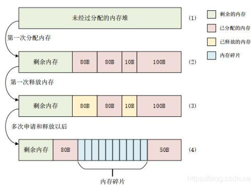
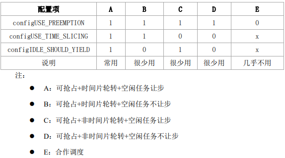
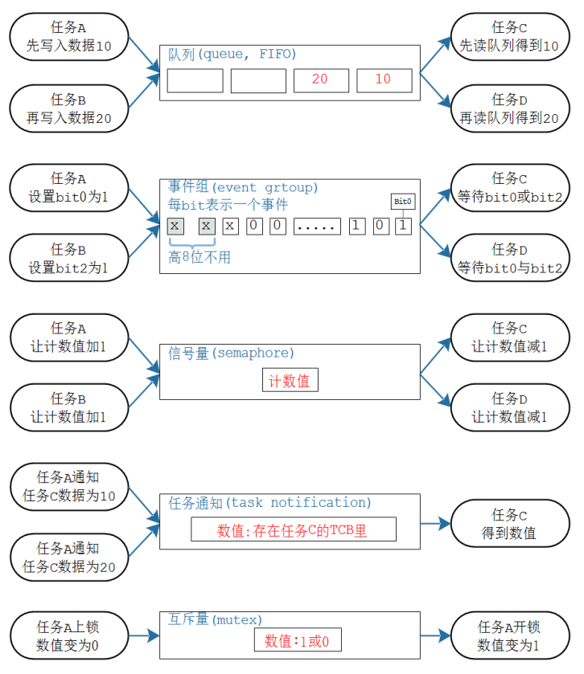

# **FreeRTOS**
Author: Buendia.Deng[^1a]  
Rev 1.0  
[^1a]: Buendia.Deng@volex.com 


---
## RTOS基础
### `FreeRTOS内存管理与其函数`
**内存管理简介**：FreeRTOS创建任务、信号量、队列等的时候有两种内存申请的方法：一种是动态的申请所需的RAM；一种是由用户自行定义所需的RAM（静态申请）
**两者的区别** | **动态内存** | **空间不同**
:----: | :----: | :----:
**时间不同** | 发生在程序调入和执行的时候 | 堆只能动态分配；栈可以动态分配；动态分配由函数malloc进行（栈的动态分配由编译器进行）
**空间不同** | 发生在程序编译和连接的时候 | 也可以静态分配；静态分配是编译器完成的   

**动态内存分配**需要一个内存堆，不管哪种分配方法，FreeRTOS中的内存堆都为uxHeap[]，大小为configTOTAL_HEAP_SIZE,其在heap_x.c（x为1~5）中定义
```bash
#if (configAPPLICATION_ALLCATED_HEAP == 1)	
	extern uint8_t ucHeap[configTOTAL_HEAP_SIZE]; //需要用户自行定义内存堆
#else
	static uint8_t ucHeap[configTOTAL_HEAP_SIZE]; //编译器决定
``` 
**内存碎片**是指小块的、碎片化的内存。内存碎片是伴随着内存申请和释放而来的


- `堆（heap）`:一块空闲内存，需要内存管理函数[^2]  
[^2]:C语言一般用malloc 开辟空间,free 释放空间  
- `栈（stack）`:内存，可以从heap中选择空间使用， 由CPU的SP指针指向，多用于函数调用，保存局部变量，多任务系统保存现场。 


在freeRTOS中，开辟内存空间的代码为pvPortMalloc，释放空间为vPortFree[^3]  
[^3]:不建议使用malloc，该函数在小型嵌入式系统中效率不高，几乎都不是安全的，具有不确定性，每次执行的时间不同，有可能产生内存碎片，若允许堆空间的生长方向覆盖其他变量占据的内存，会成为 debug 的灾难  
```bash
void *pvPortMalloc( size_t xWantedSize )；
void vPortFree( void *pv )；
```
$Example:$  
```bash
#include "FreeRTOS.h"
int *p = (int *)pvPortMalloc(sizeof(int));
if (p != NULL) {
    *p = 10;  // 使用分配的内存
}
vPortFree(p);
p = NULL;  // 防止野指针
```
### `堆分区`

**堆区** | **优点** | **缺点**
:----: | :----: | :----:
**heap1** | 分配简单，时间确定 | 不回收
**heap2** | 动态分配 | 碎片，时间不确定
**heap3** | 使用标准库，并提供了线程保护 | 速度慢，时间不确定
**heap4** | 在heap_2.c的基础上增加了内存块合并功能，降低了内存碎片的产生 | 时间不确定
**heap5** | heap4基础上支持内存堆使用不连续的内存块 | 时间不确定

`各区特点：`
**heap1**
- 用于创建好任务、信号量和队列就不会删除的应用
- 具有可确定性，不会导致内存碎片
- 代码实现和内存分配过程简单，内存是从一个静态数字中分配，适合于不需要动态内存分配的应用

heap1使用pvPortMalloc 和 vPortFree

**heap2**
提供了内存释放函数,缺点是不会把释放的内存块合并成大的内存块，因此随着不断的申请释放内存，内存堆就会被分为多个大小不一的内存块，也就是会导致内存碎片
内存块：为了实现内存释放，heap_2引入了内存块概念，每分出去一段内存就是一个内存块，剩下的空闲内存也是一个内存块，内存块大小不定。使用链表结构来管理内存块，其结构如下所示：
```bash
typedef struct A_BLOCK_LINK
{
	struct A_BLOCK_LINK *pxNextFreeBlock;  //指向下一个空闲内存块
	size_t xBlockSize;  //当前空闲内存块大小
} BlockLink_t;
```
- 可使用在可能会重复的删除任务、队列、信号量等的应用中
- 若分配和释放的内存大小是随机的，不建议使用该分配方法
- 具有不可确定性，但仍比标准C中的malloc()和free()效率高

内存堆初始化函数:
```bash
static void prvHeapInit( void ) 
```
堆内存初始化后：

`ucHeap:`User Configurable Heap，表示用户可配置的堆空间。这是一个静态数组，用于动态内存分配，大小由 configTOTAL_HEAP_SIZE 定义，这个定义指定了整个堆区域的总大小。
`pucAlignedHeap:` 是一个指向 ucHeap 的指针，它调整以确保堆开始于一个适当的对齐边界。在许多处理器架构中，数据对齐是必要的，可以提高内存访问的效率。
图中所指的 top 和 bottom 的 4 字节丢弃，通常关联于堆管理为了保持对齐而故意留下的未使用空间。在堆的开始和结束位置，可能需要插入一些额外的字节来确保所有分配的块都符合特定的对齐要求。这样做的目的是防止在分配时出现由于地址对齐不当导致的效率降低或错误。这些字节在实际应用中不用于存储任何数据，它们只是确保堆的起始和结束部分按照预期的边界对齐，从而使得堆内的所有分配都是对齐的。  

heap 内存块插入函数:
```bash
#define prvInsertBlockIntoFreeList( pxBlockToInsert ){	
  BlockLink_t *pxIterator;					
  size_t xBlockSize;			
  xBlockSize = pxBlockToInsert->xBlockSize;	
  /* 遍历链表，查找插入点 */												
  for(pxIterator=&xStart;pxIterator->pxNextFreeBlock->xBlockSize<xBlockSize;\
  pxIterator = pxIterator->pxNextFreeBlock){																				
	/* 不做任何操作 */
  }																				
  /* 将内存块插入到插入点 */																	
  pxBlockToInsert->pxNextFreeBlock = pxIterator->pxNextFreeBlock;		
  pxIterator->pxNextFreeBlock = pxBlockToInsert;			
}
```
**heap3**
Heap_3是对标准C中的malloc()和free()的简单封装，并做了线程保护
- 需要编译器提供一个内存堆，编译器库要提供malloc()和free()函数
- 通过修改启动文件中的Heap_Size来修改内存堆的大小（STM32中）
- configTOTAL_HEAP_SZIE不起作用
- 具有不确定性，并且会增加代码量

**heap4**
heap_4提供了一个最优的匹配算法，与heap_2不同，heap_4会将内存碎片合并成一个大的可用内存块
- 可用在需要重复创建和删除任务、队列、信号量等的应用中
- 不会像heap_2那样产生严重的内存碎片
- 具有不确定性，但比标准C中的malloc()和free()效率高

内存堆初始化函数
```bash
static void prvHeapInit( void )
```

**heap5**
heap_5使用与heap_4相同的合并算法，内存管理基本相同。但是heap_5允许内存堆跨越多个不连续的内存段。
heap_5使用与heap_4相同的合并算法，内存管理基本相同。但是heap_5允许内存堆跨越多个不连续的内存段。比如外接了SRAM的STM32，如果使用heap_4的话就只能在内部RAM和外部SRAM中二选一，若使用heap_5则两个都可以一起作为内存堆来使用
使用heap_5的话，需要在调用API函数之前先调用函数 vPortDefineHeapRegions() 来对内存堆做初始化处理
内存初始化：
-  在使用 pvPortMalloc 之前，必须先指定内存块的信息
- 使用 vPortDefineHeapRegions 来指定这些信息  

指定内存块的信息：
```bash
void vPortDefineHeapRegions( (const HeapRegion_t *) xHeapRegions)
//其参数是一个HeapRegion_t类型的数组
typedef struct HeapRegion
{
	uint8_t *pucStartAddress;	//内存块的起始地址
	size_t xSizeInBytes;		//内存段大小
}HeapRegion_t;
```
$example$
以STM32F103为例，现有两个内存段：内部SRAM和外部SRAM，起始地址分别为：0x20000000、0x68000000，大小分别为：64KB，1MB，那么数组就如下：
```bash
HeapRegion_t xHeapRegions[] = 
{
	{(uint8_t *)0x20000000UL,0x10000},	//内部SRAM内存
	{(uint8_t *)0x68000000UL,0x100000},	//外部SRAM内存
	{NULL,0}							//必须添加的数组结尾
}
```
指定信息：
```bash
void vPortDefineHeapRegions( const HeapRegion_t * const pxHeapRegions );
```
把 xHeapRegions 数组传给 vPortDefineHeapRegions 函数，即可初始化 Heap_5

### `heap 相关函数`
获取空闲内存：
```bash
size_t xPortGetFreeHeapSize( void );
```
获取程序运行过程中，空闲内存容量的最小值(只有heap_4、heap_5支持此函数)
```bash
size_t xPortGetMinimumEverFreeHeapSize( void );
```
 malloc 失败的钩子函数
```bash
void * pvPortMalloc( size_t xWantedSize )vPortDefineHeapRegions
{
 ......
 #if ( configUSE_MALLOC_FAILED_HOOK == 1 ）
 {
 if( pvReturn == NULL )
 {
 extern void vApplicationMallocFailedHook( void );
 vApplicationMallocFailedHook();
 }
 }
 #endif
 
 return pvReturn; 
}
```
想使用这个钩子函数：
- 在 FreeRTOSConfig.h 中，把 configUSE_MALLOC_FAILED_HOOK 定义为 1
- 提供 vApplicationMallocFailedHook 函数
- pvPortMalloc 失败时，才会调用此函数

## `FreeRTOS 任务`
任务函数有以下特点：
- 无返回值
- 多个任务可以运行同一个函数
- 函数内部，尽量使用局部变量:
1. 每个任务都有自己的栈
2. 每个任务运行这个函数时不同任务的局部变量，有自己的副本
- 函数使用全局变量、静态变量的话:
1. 只有一个副本：多个任务使用的是同一个副本
2. 防止冲突

创建任务，包括动态分配内存，静态分配内存：
动态分配内存：
```bash
BaseType_t xTaskCreate( 
 TaskFunction_t pxTaskCode, // 函数指针, 任务函数永远不退出，或者退出时要调用"vTaskDelete(NULL)"
 const char * const pcName, // 任务的名字
 const configSTACK_DEPTH_TYPE usStackDepth, // 栈大小,单位为word,10表示40字节
 void * const pvParameters, // 调用任务函数时传入的参数
 UBaseType_t uxPriority, // 优先级
 TaskHandle_t * const pxCreatedTask ); // 任务句柄, 以后使用它来操作这个任务
```
动态分配内存：
```bash
TaskHandle_t xTaskCreateStatic ( 
 TaskFunction_t pxTaskCode, // 函数指针, 任务函数
 const char * const pcName, // 任务的名字
 const uint32_t ulStackDepth, // 栈大小,单位为word,10表示40字节
 void * const pvParameters, // 调用任务函数时传入的参数
 UBaseType_t uxPriority, // 优先级
 StackType_t * const puxStackBuffer, // 静态分配的栈，就是一个buffer
 StaticTask_t * const pxTaskBuffer // 静态分配的任务结构体的指针，用它来操作这个任务
);
```
$Example - of - Task Creat$
```bash
void vTaskFunction( void *pvParameters )
{
struct DisplayInfo *info = pvParameters
...
}
```
info 来自参数 pvParameters，由xTaskCreate传入
删除任务
```bash
void vTaskDelete( TaskHandle_t xTaskToDelete );// 任务句柄，使用xTaskCreate 创建任务时可以得到一个句柄。也可传入 NULL，这表示删除自己。
```
- 自杀：vTaskDelete(NULL)
- vTaskDelete(pvTaskCode)
### `FreeRTOS  任务优先级和 Tick`
任务优先级包括
Tick:
两次中断之间的时间被称为时间片(time slice、tick period),时间片的长度由 configTICK_RATE_HZ 决定，假设 configTICK_RATE_HZ 为100，那么时间片长度就是 10ms，10ms就是一个tick
相同优先级的任务随机切换
使用tick衡量时间：
```bash
vTaskDelay(2); // 等待2个Tick，假设configTICK_RATE_HZ=100, Tick周期时10ms, 等待20ms
// 也可以使用pdMS_TO_TICKS宏把ms转换为tick
vTaskDelay(pdMS_TO_TICKS(100)); // 等待100ms
```
基于Tick实现的延时并不精确，比如vTaskDelay(2)的本意是延迟2个Tick周期，有可能经过1个Tick多一点就返回了。

**优先级修改**
获取优先级：
```bash
UBaseType_t uxTaskPriorityGet( const TaskHandle_t xTask )；
```
使用参数 xTask 来指定任务，设置为 NULL 表示获取自己的优先级。

设置优先级：
```bash
void vTaskPrioritySet( TaskHandle_t xTask,
 UBaseType_t uxNewPriority )；
```
使用参数 xTask 来指定任务，设置为 NULL 表示设置自己的优先级， 参数 uxNewPriority 表示新的优先级，取值范围是 0~(configMAX_PRIORITIES – 1)

### `FreeRTOS 任务状态`

在实际工作中，任务并非一直运行，该任务处于等待状态，需要“事件驱动”才会运行，在等待事件过程中，并不消耗 CPU 资源，该状态称为Block

`Block`状态等待两种类型
- 时间相关：根据设定时钟进入read，类似轮询
- 同步事件：由其他任务或中断唤醒
同步事件包括：queue，binary/counting semaphores(二进制/计数信号量), mutexes, recursive mutexes(递归锁), event groups(事件组), task notifications(任务通知)

`Suspend`状态
```bash
void vTaskSuspend( TaskHandle_t xTaskToSuspend );
```
参数 xTaskToSuspend 表示要暂停的任务，如果为 NULL，表示暂停自己。
退出暂停状态只能由别的任务调用(vTaskResume)或者中断程序调用(xTaskResumeFromISR)

`Read`状态
任务完全准备好了，随时可以运行，但优先级未排队到，处于就绪等待


**FreeRTOS中Delay函数**
```bash
void vTaskDelay( const TickType_t xTicksToDelay ); /* xTicksToDelay: 等待多少给Tick */
/* pxPreviousWakeTime: 上一次被唤醒的时间
* xTimeIncrement: 要阻塞到(pxPreviousWakeTime + xTimeIncrement)
* 单位都是Tick Count*/
BaseType_t xTaskDelayUntil( TickType_t * const pxPreviousWakeTime,
 const TickType_t xTimeIncrement );
```
vTaskDelay让任务在指定的tick后被唤醒，但执行时间取决于调用函数的时间，由于中断，实际等待时间可能大于xTicksToDelay
xTaskDelayUntil调用后，会任务在设定的周期后再次启动，即使某一次被中断打断，也会等到下一个周期开始进入等待

**钩子函数**
FreeRTOS中 最好让不同任务都处于阻塞状态，那么一直运行的任务就是一个idle task，钩子函数就是idle task进行的工作，他需要
1. 空闲任务优先级为 0：它不能阻碍用户任务运行
2. 空闲任务要么处于就绪态，要么处于运行态，永远不会阻塞
钩子函数可以用于
1. 低优先级，持续运行的函数
2. 测量系统的cpu占有率
3. 系统进入省电模式

使用钩子函数需要把 task.c 中的 configUSE_IDLE_HOOK 定义为 1

**任务调度**
确定block，suspend,ready谁可以变成run
利用 FreeRTOSConfig.h配置，包括configUSE_PREEMPTION、configUSE_TIME_SLICING configUSE_TICKLESS_IDLE
configUSE_PREEMPTION：抢占优先级，是否高优先级的任务可以抢占执行
- 使能，配置抢占优先级则可以被称为"Pre-emptive" 可抢占调度
- 不使能， "合作调度模式"(Co-operative Scheduling) 协商调度，当前任务执行时，更高优先级的任务就绪了也不能马上运行，只能等待当前任务主动让出 CPU 资源

configUSE_TIME_SLICING：可抢占的前提下，同优先级的任务是否轮流执行
轮流执行(Time Slicing),不轮流执行(without Time Slicing)
configIDLE_SHOULD_YIELD: 设置了Pre-emptive和Time Slicing后，空闲任务是否让步于用户任务



### `同步/互斥`
临界资源：多个任务都需要调用的资源
**互斥** 是指散步在不同任务之间的若干程序片断，当某个任务运行其中一个程序片段时，其它任务就不能运行它们之中的任一程序片段，只能等到该任务运行完这个程序片段后才可以运行，最基本的场景就是对资源的同时写，为了保持资源的一致性，往往需要进行互斥访问。
**同步** 是指散步在不同任务之间的若干程序片断，它们的运行必须严格按照规定的某种先后次序来运行，这种先后次序依赖于要完成的特定的任务，最基本的场景就是任务之间的依赖，比如A任务的运行依赖于B任务产生的数据。
对于临界资源，使用之前**关闭中断**，例子：
```bash
int LCD_PrintString(int x, int y, char *str)
{
  static int bCanUse = 1;
  disable_irq();
  bCanUse--;
  enable_irq();
  if (bCanUse == 0)
  {
    /* 使用LCD */
    bCanUse++;
    return 0;
  }
  else
  {
    disable_irq();
    bCanUse++;
    enable_irq();
    return -1;
  }
}
```
可实现同步互斥操作内核区分

队列：发送者、接收者无限制，一个数据只能唤醒一个接收者
事件组: 用来传递事件，可以是 N 个事件，发送者、接受者无限制，可以唤醒多个接收者
信号量：用来维持资源的个数，生产者、消费者无限制，1 个资源只能唤醒 1个接收者
任务通知：N 对 1 的关系，发送者无限制，接收者只能是这个任务
互斥量：只能由上锁的任务解锁

**队列**
- 队列可以包含若干个数据：队列中有若干项，这被称为"长度"(length)
- 每个数据大小固定
- 创建队列时就要指定长度、数据大小
- 数据的操作采用先进先出的方法(FIFO，First In First Out)：写数据时放到尾部，读数据时从头部读，也可以强制写队列头部：覆盖头部数据
队列传输数据：
拷贝：数据、把变量的值复制进队列里
引用：数据、把变量的地址复制进队列里
对于有内存保护功能的系统，如果队列使用引用方法，必须确保双方任务对这个地址都有访问权限。使用拷贝方法时，则无此限制。
队列的阻塞访问：读写失败/超时 都可以进入block，进入ready的任务
- 更高优先级
- 优先级相同，等待时间最长

创建队列
动态分配内存
```bash
QueueHandle_t xQueueCreate( UBaseType_t uxQueueLength, UBaseType_t uxItemSize );
```
uxQueueLength 队列长度，最多能存放多少个数据(item)
静态队列
```bash
QueueHandle_t xQueueCreateStatic(
 UBaseType_t uxQueueLength,
UBaseType_t uxItemSize,
uint8_t *pucQueueStorageBuffer,
 StaticQueue_t *pxQueueBuffer
 );
```
如果 uxItemSize 非 0，**pucQueueStorageBuffer** 必须指向一个 uint8_t 数组，此数组大小至少为"uxQueueLength * uxItemSize"

pxQueueBuffer:必须执行一个 StaticQueue_t 结构体，用来保存队列的数据结构

队列复位：恢复成初始状态
```bash
BaseType_t xQueueReset( QueueHandle_t pxQueue);
```
删除队列
```bash
void vQueueDelete( QueueHandle_t xQueue );

```
写队列
```bash
BaseType_t xQueueSend(QueueHandle_t xQueue,const void *pvItemToQueue, 
TickType_t xTicksToWait);
// 往队列尾部写入数据，如果没有空间，阻塞时间为xTicksToWait
BaseType_t xQueueSendToBack(QueueHandle_t xQueue,const void *pvItemToQueue,
TickType_t xTicksToWait);
//往队列尾部写入数据，此函数可以在中断函数中使用，不可阻塞
BaseType_t xQueueSendToFront(QueueHandle_t xQueue,const void *pvItemToQueue,
TickType_t xTicksToWait);
//往队列头部写入数据，如果没有空间，阻塞时间为xTicksToWait
BaseType_t xQueueSendToFrontFromISR(QueueHandle_t xQueue,const void *pvItemToQueue,
BaseType_t *pxHigherPriorityTaskWoken);
//往队列头部写入数据，此函数可以在中断函数中使用，不可阻塞
```
读队列
```bash
BaseType_t xQueueReceive( QueueHandle_t xQueue, void * const pvBuffer,
 TickType_t xTicksToWait );
BaseType_t xQueueReceiveFromISR(QueueHandle_t xQueue, void *pvBuffer,
BaseType_t *pxTaskWoken );
```
pvBuffer:bufer 指针，队列的数据会被复制到这个 buffer
xTicksToWait:xTicksToWait 表示阻塞的最大时间(Tick Count)。如果被设为 0，无法读出数据时函数会立刻返回；如果被设为 portMAX_DELAY，则会一直阻塞直到有数据可写
查询队列
```bash
/*
* 返回队列中可用数据的个数
*/
UBaseType_t uxQueueMessagesWaiting( const QueueHandle_t xQueue );
/*
* 返回队列中可用空间的个数
*/
UBaseType_t uxQueueSpacesAvailable( const QueueHandle_t xQueue )
```
覆盖数据
```bash
BaseType_t xQueueOverwrite(QueueHandle_t xQueue,const void * pvItemToQueue);
BaseType_t xQueueOverwriteFromISR(QueueHandle_t xQueue,const void * pvItemToQueue,
 BaseType_t *pxHigherPriorityTaskWoken);
 // pvItemToQueue: 数据地址
 ```
 多任务读取，读取后保留数据
 ```bash
/* xQueue: 偷看哪个队列
* pvItemToQueue: 数据地址, 用来保存复制出来的数据
* xTicksToWait: 没有数据的话阻塞一会
* 返回值: pdTRUE表示成功, pdFALSE表示失败
*/
BaseType_t xQueuePeek(
 QueueHandle_t xQueue,
 void * const pvBuffer,
 TickType_t xTicksToWait
 );
BaseType_t xQueuePeekFromISR(
 QueueHandle_t xQueue,
void *pvBuffer,
 );

 ```


 FreeRTOS compare with RTOS
 创建任务：
 ```bash
//FreeRTOS:

xTaskCreate(PlayMusic, "MusicTask", 128, NULL, osPriorityNormal, NULL);

//RTOS 开辟了一个线程
osThreadDef(RAM_Task, RAMTask, osPriorityNormal, 0, 128);
RAMTaskHandle = osThreadCreate(osThread(RAM_Task), NULL);
#define osThreadDef(name, thread, priority, instances, stacksz)  \
const osThreadDef_t os_thread_def_##name = \
{ #name, (thread), (priority), (instances), (stacksz)}
osThreadId osThreadCreate (const osThreadDef_t *thread_def, void *argument)
//thread：线程函数，指向线程的入口函数。
//instances：线程的实例数量。
//stacksz：线程栈的大小，单位为字节。
 ```
队列bulk传输
FreeRTOS的队列使用拷贝传输，也就是要传输uint32_t时，把4字节的数据拷贝进队列；要传输一个8字节的结构体时，把8字节的数据拷贝进队列。如果要传输bulk数据时，拷贝传输效率不够，因此，Bulk传输可以采用共享RAM的方法。
具体做法：创建1个发送队列，长度为 1，用来传输"char *"指针
再创建读写队列的任务，其中读任务的优先级需要低于写任务。

队列集

创建队列集
```bash
QueueSetHandle_t xQueueCreateSet( const UBaseType_t uxEventQueueLength )
//返回值 非 0：成功，返回句柄，以后使用句柄来操作队列 NULL：失败，因为内存不足
```
加入队列集
```bash
BaseType_t xQueueAddToSet( QueueSetMemberHandle_t xQueueOrSemaphore,QueueSetHandle_t xQueueSet );
```
读取队列集
```bash
QueueSetMemberHandle_t xQueueSelectFromSet( QueueSetHandle_t xQueueSet,
 TickType_t const xTicksToWait );
//xTicksToWait 如果队列集空则无法读出数据，可以让任务进入阻塞状态，xTicksToWait 表示阻塞的最大时间(Tick Count)。如果被设为 0，无法读出数据时函数会立刻返回；如果被设为 portMAX_DELAY，则会一直阻塞直到有数据可写
```


**信号量（Semaphores）**
计数型信号量(Counting Semaphores):信号量数目无上限
二进制信号量(Binary Semaphores)：信号量只能是0/1
binary semaohores creation
```bash
//动态分配内存
SemaphoreHandle_t xSemaphoreCreateBinary(void);
//无需动态分配
SemaphoreHandle_t xSemaphoreCreateBinaryStatic(StaticSemaphore_t *pxSemaphoreBuffer);
```
创建计数型
```bash
SemaphoreHandle_t xSemaphoreCreateCounting(UBaseType_t uxMaxCount, UBaseType_t uxInitialCount);
SemaphoreHandle_t xSemaphoreCreateCountingStatic( UBaseType_t uxMaxCount,UBaseType_t uxInitialCount,StaticSemaphore_t *pxSemaphoreBuffer);
```
删除信号量
```bash
void vSemaphoreDelete( SemaphoreHandle_t xSemaphore );
```
semaphores operation of give/take
在多任务环境中，信号量是用来协调不同任务对共享资源的访问的同步机制。它们的主要作用如下：

- Take (获取): 任务通过“获取”操作来申请对共享资源的访问权限。如果信号量的值为非零（表示资源可用），信号量的值会减一，任务继续执行。如果信号量的值为零（资源不可用），任务将根据信号量的类型可能被挂起，直到信号量被释放。
- Give (释放): 当任务完成对共享资源的使用后，它必须“释放”信号量，这通常通过增加信号量的值来实现。这个操作使得其他等待该资源的任务可以继续执行。
```bash
BaseType_t xSemaphoreGive( SemaphoreHandle_t xSemaphore );
BaseType_t xSemaphoreTake(SemaphoreHandle_t xSemaphore,TickType_t xTicksToWait)
//xTicksToWait 如果无法马上获得信号量，阻塞一会：0：不阻塞，马上返回portMAX_DELAY: 一直阻塞直到成功

BaseType_t xSemaphoreTakeFromISR(SemaphoreHandle_t xSemaphore,
BaseType_t *pxHigherPriorityTaskWoken);
//pxHigherPriorityTaskWoken 如果获取信号量导致更高优先级的任务变为了就绪态，则*pxHigherPriorityTaskWoken = pdTRUE
```
信号量防止多次传输丢失，采用环形buffer存储，每次读取buffer数据

正常来说：在任务 A 占有互斥量的过程中，任务 B、任务 C 等等，都无法释放互斥量。
但是FreeRTOS未实现这点：任务A占有互斥量的情况下，任务B也可释放互斥量。

互斥量函数
```bash
SemaphoreHandle_t xSemaphoreCreateMutex( void );
SemaphoreHandle_t xSemaphoreCreateMutexStatic(StaticSemaphore_t *pxMutexBuffer );
```
要想使用互斥量，需要在配置文件FreeRTOSConfig.h中定义：
```bash
# define configUSE_MUTEXES 1
```
使用互斥量时有如下特点：
- 刚创建的互斥量可以被成功"take"
- "take"互斥量成功的任务，被称为"holder"，只能由它"give"互斥量；别的任务"give"不成功
- 在 ISR 中不能使用互斥量
```bash
void vSemaphoreDelete( SemaphoreHandle_t xSemaphore );
BaseType_t xSemaphoreGive( SemaphoreHandle_t xSemaphore );
//ISR 释放mutex
BaseType_t xSemaphoreGiveFromISR(SemaphoreHandle_t xSemaphore,BaseType_t *pxHigherPriorityTaskWoken)
BaseType_t xSemaphoreTake(SemaphoreHandle_t xSemaphore,TickType_t xTicksToWait);
xSemaphoreGiveFromISR(SemaphoreHandle_t xSemaphore,BaseType_t *pxHigherPriorityTaskWoken);
```
互斥锁使用:
```bash
//创建mutex
xMutex = xSemaphoreCreateMutex( );
for( ;; ){
xSemaphoreTake(xMutex, portMAX_DELAY);//lock
...task...
xSemaphoreGive(xMutex);//unlock
```
由其他任务设立的互斥锁可以被另外的任务打开
举个例子：

任务进入vTaskDelay即进入堵塞状态

死锁：
多任务：某任务需要互斥量，但该互斥量需要另一个任务发送，但另一任务进入阻塞状态，最终两任务全部进入阻塞，死锁发送。
单任务：某任务需要自己释放互斥量，结果自己进入阻塞态，最终进入死锁。

**任务** | **递归锁 ** | **一般互斥量**
:----: | :----: | :----:
**创建** | xSemaphoreCreateRecursiveMutex | xSemaphoreCreateMutex
**获得** | xSemaphoreTakeRecursive | xSemaphoreTake
**释放** | xSemaphoreGiveRecursive | xSemaphoreGive
用递归锁(Recursive Mutexes)，它的特性如下：
- 任务 A 获得递归锁 M 后，它还可以多次去获得这个锁
- "take"了 N 次，要"give"N 次，这个锁才会被释放

函数原型
```bash
SemaphoreHandle_t xSemaphoreCreateRecursiveMutex( void );
BaseType_t xSemaphoreGiveRecursive( SemaphoreHandle_t xSemaphore );
BaseType_t xSemaphoreTakeRecursive(SemaphoreHandle_t xSemaphore,TickType_t xTicksToWait);
```


### `事件组`
事件组可以简单地认为就是一个整数,每一位表示一个事件
事件组用一个整数来表示，其中的高8位留给内核使用，只能用其他的位来表示事件。
事件组创建：
```bash
/* 创建一个事件组，返回它的句柄。
* 此函数内部会分配事件组结构体
* 返回值: 返回句柄，非 NULL 表示成功*/
EventGroupHandle_t xEventGroupCreate( void );

/* 创建一个事件组，返回它的句柄。
* 此函数无需动态分配内存，所以需要先有一个 StaticEventGroup_t 结构体，并传入它的指针
* 返回值: 返回句柄，非 NULL 表示成功*/
EventGroupHandle_t xEventGroupCreateStatic( StaticEventGroup_t * pxEventGroupBuffer
);
```
删除事件组
```bash
void vEventGroupDelete( EventGroupHandle_t xEventGroup );
```
设置事件
```bash
/*
* xEventGroup: 哪个事件组， uxBitsToSet: 设置哪些位
可以用来设置多个位，比如 0x15 就表示设置 bit4, bit2, bit0
*/
EventBits_t xEventGroupSetBits( EventGroupHandle_t xEventGroup,const EventBits_t uxBitsToSet );
//* pxHigherPriorityTaskWoken: 有没有导致更高优先级的任务进入就绪态? pdTRUE-有, pdFALSE-没
BaseType_t xEventGroupSetBitsFromISR( EventGroupHandle_t xEventGroup,const EventBits_t uxBitsToSet, BaseType_t * pxHigherPriorityTaskWoken );
```
设置事件组时，有可能导致多个任务被唤醒，这会带来很大的不确定性。所以xEventGroupSetBitsFromISR函数不是直接去设置事件组，而是给一个FreeRTOS后台任务(daemon task)发送队列数据，由这个任务来设置事件组。如果后台任务的优先级比当前被中断的任务优先级高，xEventGroupSetBitsFromISR会设置*pxHigherPriorityTaskWoken为pdTRUE。如果daemon task成功地把队列数据发送给了后台任务，那么xEventGroupSetBitsFromISR的返回值就是pdPASS。

等待事件
```c
/*
uxBitsToWaitFor： 等待的位
xClearOnExit：函数退出前是否要清除事件
xWaitForAllBits：测试方式：&& 还是 ||
xTicksToWait：如果期待的事件未发生，阻塞事件
*/
/*
当 xWaitForAllBits 设置为 1 时，函数会等待所有在 uxBitsToWaitFor 参数中指定的事件位都被设置。只有当所有这些位都为 1 时，函数才会从阻塞状态返回。
当 xWaitForAllBits 设置为 0 时，函数会等待 uxBitsToWaitFor 中任何一个事件位被设置。一旦其中任何一位被设置，函数就会返回。
当 xClearOnExit 设置为 1 时，函数返回前会自动清除在 uxBitsToWaitFor 参数中指定的所有事件位，这意味着这些事件位将被设置为 0。
当 xClearOnExit 设置为 0 时，无论这些事件位的状态如何，函数在返回时不会对它们进行任何更改。
*/
EventBits_t xEventGroupWaitBits( EventGroupHandle_t xEventGroup,
 const EventBits_t uxBitsToWaitFor,
 const BaseType_t xClearOnExit,
 const BaseType_t xWaitForAllBits,
 TickType_t xTicksToWait );
```
unblock condition。一个任务在等待事件发生时，它处于阻塞状态；当期望的时间发生时，这个状态就叫"unblock condition"，非阻塞条件，或称为"非阻塞条件成立"；当"非阻塞条件成立"后，该任务就可以变为就绪态。

使用xEventGroupSync()同步多个任务
```c
EventBits_t xEventGroupSync( EventGroupHandle_t xEventGroup,
const EventBits_t uxBitsToSet,
const EventBits_t uxBitsToWaitFor,
TickType_t xTicksToWait );
//xEventGroup 需要同步的事件组
//uxBitsToSet 要设置的事件，完成的事件
//uxBitsToWaitFor 等待的位
//xTicksToWait 阻塞时间
```


在以上例子中，cook等待wash和fire，而fire等待wash，当fire等到wash后，并不会清楚xEventGroup的标志位，该位用于cook等待条件，而wash仅设置了其对应的bit位，其等待的条件即为下一次循环的开始。

### Task Notifications
任务通知的使用：
**发出通知**
```c
/*简化版*/
BaseType_t xTaskNotifyGive( TaskHandle_t xTaskToNotify );
//xTaskToNotify：创建任务时的任务句柄
void vTaskNotifyGiveFromISR( TaskHandle_t xTaskHandle, BaseType_t *pxHigherPriorityTaskWoken );
//xTaskHandle：创建任务时的任务句柄
//pxHigherPriorityTaskWoken：被通知的任务，函数发出通知后，被通知的任务由阻塞态切为就绪态，当被唤醒的任务优先级高于xTaskHandle时，pxHigherPriorityTaskWoken为pdTRUE
/*专业版*/
BaseType_t xTaskNotify( TaskHandle_t xTaskToNotify, uint32_t ulValue, eNotifyAction eAction );
//xTaskToNotify：创建任务时的任务句柄
//ulValue:由 eAction 参数决定
BaseType_t xTaskNotifyFromISR( TaskHandle_t xTaskToNotify,uint32_t ulValue,eNotifyAction eAction,BaseType_t *pxHigherPriorityTaskWoken );
//pxHigherPriorityTaskWoken 如果被唤醒的任务的优先级，高于当前任务的优先级，则"*pxHigherPriorityTaskWoken"被设置为 pdTRUE，这表示在中断返回之前要进行任务切换
```

**eNoAction** | **说明** 
:----: |----
**eNoAction** | 更新通知状态为"pending"，未使用ulValue
**eSetBits** | 原来的通知值 位或 ulValue 
**eIncrement** | 通知值 = 原来的通知值 + 1，未使用ulValue
**eSetValueWithoutOverwrite** | 如果通知状态为"pending"则此次调用 xTaskNotify 不做任何事，返回pdFAIL。如果通知状态不是"pending"(表示没有新数据)，则：通知值 = ulValue。
**eSetValueWithOverwrite** | 覆盖，无论如何，通知值 = ulValue

**取出通知**
```c
/*简化版*/
uint32_t ulTaskNotifyTake( BaseType_txClearCountOnExit, TickType_t xTicksToWait);
//xClearCountOnExit：函数返回前是否清零
//pdTRUE：把通知值清零
//pdFALSE：如果通知值大于 0，则把通知值-1
//xTicksToWait：任务进入阻塞态的超时时间，它在等待通知值
//该值为0时，不等待，直接返回
//该值为portMAX_DELAY：一直等待，直到通知值大于 0
//其他值：Tick Count，可以用 pdMS_TO_TICKS()把 ms 转换为 Tick Count
/*专业版*/
BaseType_t xTaskNotifyWait(uint32_tulBitsToClearOnEntry,uint32_t ulBitsToClearOnExit, uint32_t *pulNotificationValue,TickType_t xTicksToWait);
//ulBitsToClearOnEntry，在xTaskNotifyWait入口处需要清除的位，只有当通知状态不是"pending"情况下才会被清除
//通知值 &= ~（ulBitsToClearOnEntry）
//ulBitsToClearOnExit在xTaskNotifyWait出口处退出   
//通知值 = 通知值 & ~(ulBitsToClearOnExit)。
```

### Software timer
在FreeRTOS中，软件定时器的使用通常需要一个守护任务（Timer-Service Task）来管理这些定时器。这个守护任务是由FreeRTOS自动创建的，其主要职责如下：

- 管理定时器：守护任务负责`维护一个所有活动软件定时器的列表`，并且`周期性地检查每个定时器的状态`，比如是否已经到期。
- 调度回调：当一个定时器到期时，`守护任务会调度与该定时器关联的回调函数。这样可以确保定时器回调函数在一个可预测的环境中运行`，而不是直接在中断上下文中执行，这有助于保持系统的稳定性和响应性。
- 处理更新请求：如果应用程序需要添加新的定时器或者更改现有定时器的配置（如重置或删除定时器），这些请求也会由守护任务来处理。
- 保证系统的确定性行为：通过将定时器管理的任务从应用程序代码中分离出来，守护任务帮助维持了系统的确定性行为，因为定时器相关的操作都是在一个独立的任务中完成的。

守护任务的调度，跟普通的任务并无差别。当守护任务是当前优先级最高的就绪态任务时，它就可以运行。它的工作有两类：
1. 处理命令：从命令队列里取出命令、处理
2. 执行定时器的回调函数

能否及时处理定时器的命令、能否及时执行定时器的回调函数，严重依赖于守护任务的优先级。

定时器结构体

```c
typedef struct tmrTimerControl
{
	const char				*pcTimerName;		/*<< Text name.  This is not used by the kernel, it is included simply to make debugging easier. */ /*lint !e971 Unqualified char types are allowed for strings and single characters only. */
	ListItem_t				xTimerListItem;		/*<< Standard linked list item as used by all kernel features for event management. */
	TickType_t				xTimerPeriodInTicks;/*<< How quickly and often the timer expires. */
	UBaseType_t				uxAutoReload;		/*<< Set to pdTRUE if the timer should be automatically restarted once expired.  Set to pdFALSE if the timer is, in effect, a one-shot timer. */
	void 					*pvTimerID;			/*<< An ID to identify the timer.  This allows the timer to be identified when the same callback is used for multiple timers. */
	TimerCallbackFunction_t	pxCallbackFunction;	/*<< The function that will be called when the timer expires. */
	#if( configUSE_TRACE_FACILITY == 1 )
		UBaseType_t			uxTimerNumber;		/*<< An ID assigned by trace tools such as FreeRTOS+Trace */
	#endif

	#if( ( configSUPPORT_STATIC_ALLOCATION == 1 ) && ( configSUPPORT_DYNAMIC_ALLOCATION == 1 ) )
		uint8_t 			ucStaticallyAllocated; /*<< Set to pdTRUE if the timer was created statically so no attempt is made to free the memory again if the timer is later deleted. */
	#endif
} xTIMER;
```
定时器的回调函数原型：
```c
void ATimerCallback( TimerHandle_t xTimer );
```

定时器创建:
```c
/* 使用动态分配内存的方法创建定时器
* pcTimerName:定时器名字, 用处不大, 尽在调试时用到
* xTimerPeriodInTicks: 周期, 以 Tick 为单位
* uxAutoReload: 类型, pdTRUE 表示自动加载, pdFALSE 表示一次性
* pvTimerID: 回调函数可以使用此参数, 比如分辨是哪个定时器
* pxCallbackFunction: 回调函数
* 返回值: 成功则返回 TimerHandle_t, 否则返回 NULL
*/
TimerHandle_t xTimerCreate( const char * const pcTimerName,
const TickType_t xTimerPeriodInTicks,
const UBaseType_t uxAutoReload,
void * const pvTimerID,
TimerCallbackFunction_t pxCallbackFunction );
/* 使用静态分配内存的方法创建定时器
* pcTimerName:定时器名字, 用处不大, 尽在调试时用到
* xTimerPeriodInTicks: 周期, 以 Tick 为单位
* uxAutoReload: 类型, pdTRUE 表示自动加载, pdFALSE 表示一次性
* pvTimerID: 回调函数可以使用此参数, 比如分辨是哪个定时器
* pxCallbackFunction: 回调函数
* pxTimerBuffer: 传入一个 StaticTimer_t 结构体, 将在上面构造定时器
* 返回值: 成功则返回 TimerHandle_t, 否则返回 NULL
*/
TimerHandle_t xTimerCreateStatic(const char * const pcTimerName,
 TickType_t xTimerPeriodInTicks,
UBaseType_t uxAutoReload,
void * pvTimerID,
 TimerCallbackFunction_t pxCallbackFunction,
StaticTimer_t *pxTimerBuffer )

void ATimerCallback( TimerHandle_t xTimer );
typedef void (* TimerCallbackFunction_t)( TimerHandle_t xTimer )
```

删除定时器
```c
/* 删除定时器
* xTimer: 要删除哪个定时器
* xTicksToWait: 超时时间
* 返回值: pdFAIL 表示"删除命令"在 xTicksToWait 个 Tick 内无法写入队列
* pdPASS 表示成功
*/
BaseType_t xTimerDelete( TimerHandle_t xTimer, TickType_t xTicksToWait );
```
启动/停止定时器

```c
/* 启动定时器
* xTimer: 定时器
* xTicksToWait: 超时时间
* 返回值: pdFAIL 表示"启动命令"在 xTicksToWait 个 Tick 内无法写入队列
* pdPASS 表示成功
*/
BaseType_t xTimerStart( TimerHandle_t xTimer, TickType_t xTicksToWait );
/* 启动定时器(ISR 版本)
* pxHigherPriorityTaskWoken: 向队列发出命令使得守护任务被唤醒,
* 如果守护任务的优先级比当前任务的高,
* 则"*pxHigherPriorityTaskWoken = pdTRUE",
* 表示需要进行任务调度
* 返回值: pdFAIL 表示"启动命令"无法写入队列
* pdPASS 表示成功
*/
BaseType_t xTimerStartFromISR( TimerHandle_t xTimer,
 BaseType_t *pxHigherPriorityTaskWoken );
/* 停止定时器
* xTicksToWait: 超时时间
* 返回值: pdFAIL 表示"停止命令"在 xTicksToWait 个 Tick 内无法写入队列
* pdPASS 表示成功
*/
BaseType_t xTimerStop( TimerHandle_t xTimer, TickType_t xTicksToWait );
/* 停止定时器(ISR 版本)
* pxHigherPriorityTaskWoken: 向队列发出命令使得守护任务被唤醒,如果守护任务的优先级比当前任务的高, 则"*pxHigherPriorityTaskWoken = pdTRUE",表示需要进行任务调度
* 返回值: pdFAIL 表示"停止命令"无法写入队列
* pdPASS 表示成功
*/
BaseType_t xTimerStopFromISR( TimerHandle_t xTimer,
 BaseType_t *pxHigherPriorityTaskWoken );
```
创建定时器时，设置了它的周期(period)。xTimerStart()函数是用来启动定时器。假设调用xTimerStart()的时刻是Tx，定时器的周期是n，那么在Tx+n时刻定时器的回调函数被调用。如果定时器已经被启动，但是它的函数尚未被执行，再次执行xTimerStart()函数相当于执行xTimerReset()，重新设定它的启动时间。


定时器复位
```c
/* 复位定时器
* xTimer: 定时器
* xTicksToWait: 超时时间
* 返回值: pdFAIL 表示"复位命令"在 xTicksToWait 个 Tick 内无法写入队列
* pdPASS 表示成功
*/
BaseType_t xTimerReset( TimerHandle_t xTimer, TickType_t xTicksToWait );
/* 复位定时器(ISR 版本)*/
BaseType_t xTimerResetFromISR( TimerHandle_t xTimer,
 BaseType_t *pxHigherPriorityTaskWoken );
```
修改周期
```c
/* 修改定时器的周期
* xNewPeriod: 新周期
* xTicksToWait: 超时时间, 命令写入队列的超时时间*/
BaseType_t xTimerChangePeriod( TimerHandle_t xTimer,
 TickType_t xNewPeriod,
TickType_t xTicksToWait );
/* 修改定时器的周期(ISR)*/
BaseType_t xTimerChangePeriodFromISR( TimerHandle_t xTimer,
 TickType_t xNewPeriod,
BaseType_t *pxHigherPriorityTaskWoken );
```
定时器结构体中的定时器ID更新&查询

```c
void *pvTimerGetTimerID( TimerHandle_t xTimer );
void vTimerSetTimerID( TimerHandle_t xTimer, void *pvNewID );
```
example:
```c
##define KEY_FILTERING_PERIOD pdMS_TO_TICKS( 20 )
static void vKeyFilteringTimerFunc( TimerHandle_t xTimer )
{
  static int cnt = 0;
  printf("vKeyFilteringTimerFunc %d\r\n", cnt++);
}

void vEmulateKeyTask( void *pvParameters )
{
  int cnt = 0;
  const TickType_t xDelayTicks = pdMS_TO_TICKS( 200UL );
  for( ;; )
  {
  /* 模拟按键抖动, 多次调用 xTimerReset */
    xTimerReset(xKeyFilteringTimer, 0); cnt++;
    xTimerReset(xKeyFilteringTimer, 0); cnt++;
    xTimerReset(xKeyFilteringTimer, 0); cnt++;
    printf("Key jitters %d\r\n", cnt);
    vTaskDelay(xDelayTicks);
  }
}

int main( void )
{
  prvSetupHardware();
  xKeyFilteringTimer = xTimerCreate(
  "KeyFiltering", /* 名字, 不重要 */
  KEY_FILTERING_PERIOD, /* 周期 */
  pdFALSE, /* 一次性 */
  0, /* ID */
  vKeyFilteringTimerFunc /* 回调函数 */
  );
  xTaskCreate( vEmulateKeyTask, "EmulateKey", 1000, NULL, 1, NULL );
  return 0;
}
```

中断管理

在ISR中调用API时不进行任务切换，而只是在"xHigherPriorityTaskWoken"中标记一下，
除了效率，还有多种好处：
- 效率高：避免不必要的任务切换
- 让 ISR 更可控：中断随机产生，在 API 中进行任务切换的话，可能导致问题更复杂
- 可移植性
- 在 Tick 中断中，调用 vApplicationTickHook()：它运行与 ISR，只能使用"FromISR"的函数

任务切换：
```c
portEND_SWITCHING_ISR( xHigherPriorityTaskWoken )
or
portYIELD_FROM_ISR( xHigherPriorityTaskWoken );
```

**屏蔽/使能中断、暂停/恢复调度器。**
屏蔽中断：
```c
/* 在任务中，当前时刻中断是使能的
* 执行这句代码后，屏蔽中断*/
taskENTER_CRITICAL();
// 访问临界资源 coding...
/* 重新使能中断 */
taskEXIT_CRITICAL();
```
在taskENTER_CRITICAL()与taskEXIT_CRITICAL()中，
优先级低于/等于configMAX_SYSCALL_INTERRUPT_PRIORITY的中断将会被屏蔽
而优先级高于该配置的中断可以被产生

若在递归中使用中断屏蔽功能，只有当递归嵌套深度为0时，才能重新使能中断

ISR屏蔽中断
example
```c
void vAnInterruptServiceRoutine( void )
{
 /* 用来记录当前中断是否使能 */
 UBaseType_t uxSavedInterruptStatus;
/* 在 ISR 中，当前时刻中断可能是使能的，也可能是禁止的
* 所以要记录当前状态, 后面要恢复为原先的状态, 执行以下代码后，屏蔽中段*/
uxSavedInterruptStatus = taskENTER_CRITICAL_FROM_ISR();
/* 访问临界资源 */
/* 恢复中断状态 */
 taskEXIT_CRITICAL_FROM_ISR( uxSavedInterruptStatus );
 /* 现在，当前 ISR 可以被更高优先级的中断打断了 */
}

```
优先级调度和上述一致