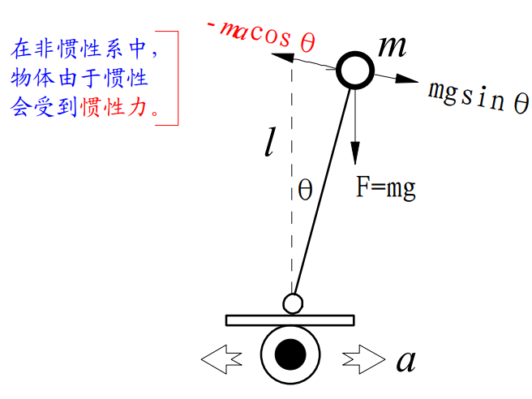
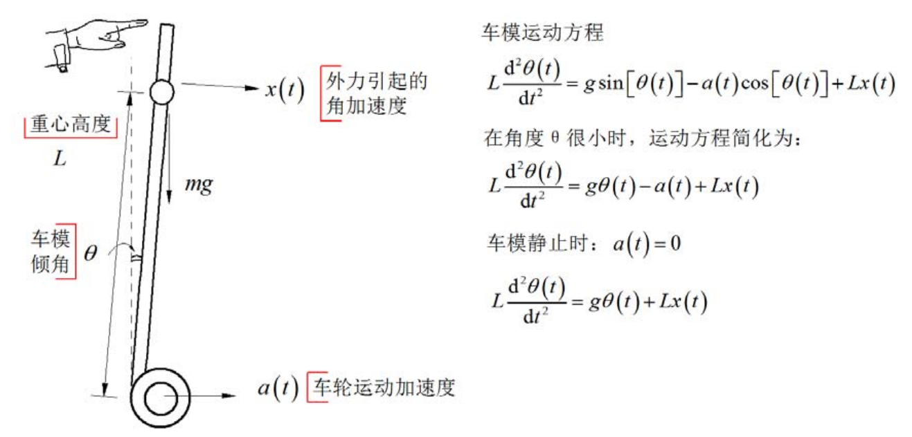
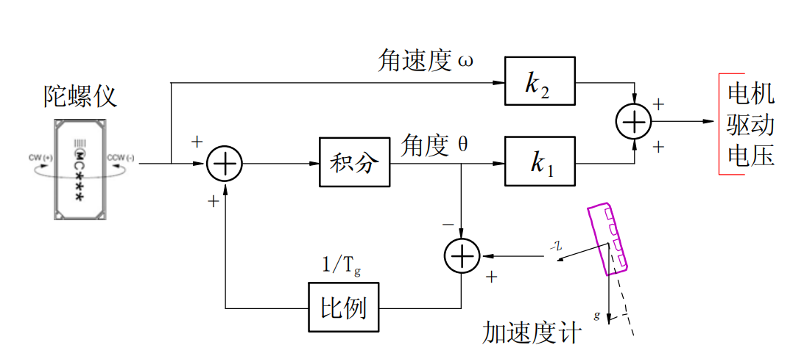
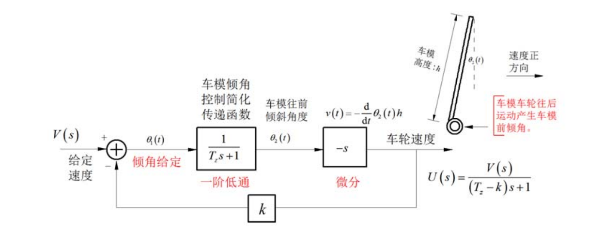
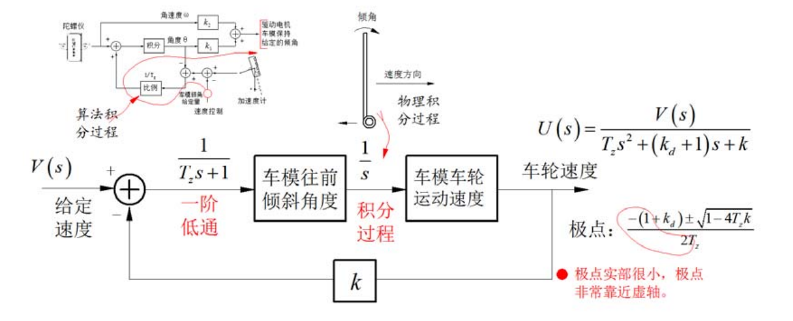
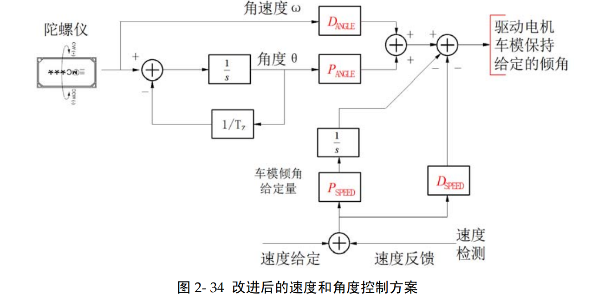
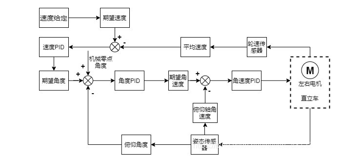

# **balance vechile pid algorithm**

1. **一阶倒立摆原理**
分析小车受力，让小车保持平衡。

小车受力F=ma,对其进行受力分解，向上的力与支撑力互相抵消，收到的偏斜力为mgsin(theta)。为了让小车保持平衡，根据牛顿第二定律F=ma,需要外部加速度形成恢复力。
F=mgsin(theta)-macos(theta)+mk(theta)' 最后一项为阻尼力。
当theta较小时，原方程为：F=mg(theta)+ma+mk(theta)'=k1(theta)+k2(theta)' - （1.1）

2. **小车运动方程**

S^2*L = g*theta(t)+Lx(t)
根据上述分析可知，为了让小车稳定，因此我们需要施加外部加速度，使得小车倾角为0
现在加入加速度，陀螺仪采集加速度、角速度，根据adc采集编码器，计算小车运动速度。

2.1 直立控制

由于我们控制的是小车电机pwm，而反馈量是测量的角度，根据角度变化来调节pwm。根据方程1.1可以得出，采用pd控制，控制框图如下

陀螺仪采样的角速度×k2为微分控制，用于减小震荡
角速度经过积分得到角度，积分的角度与加速计采样的角度经过比例参数放大得到倾角误差
实际控制中，pid需要参数×误差，因此在代码中，都是当前时刻的惯性数据减去上一次惯性数据
```c
int Balance(float Angle,float Target)
{  
   float Bias,PWM;                          
	 static float last_Bias,D_Bias;    	
	 Bias=Angle-Target;                       //角度偏差
	 D_Bias=Bias - last_Bias;                 //两次角度差值
	 PWM=+Balance_KP*Bias + D_Bias*Balance_KD;//PID控制累加
	 last_Bias=Bias;                          //保存为上次偏差
	 if(Start_Flag==0||Start_Flag1==0)last_Bias=0,D_Bias=0;//停止时各参数清零
	 return PWM;	
}
```
因此直立控制的框图如下，其中一阶低通滤波为上图描述的利用加速计负反馈矫正陀螺仪积分角度。

单独的直立控制要求最终倾角为0，难度太高，因此实际情况是让小车在0角度处震荡，就是说，倾角theta应该不为0，给定倾角theta2，让对小车移动速度进行pid控制(由于倾角不为0，因此会产生加速度，从而使得小车速度变化)。这就是串级pid控制。


2.2 速度控制
与直立控制相同，速度控制也是 控制量为电机pwm，反馈量为测量角度计算的测量速度(测量的角度*g 为偏斜加速度，偏斜加速度经过积分可以得到车轮移动速度)，最终的控制结果是测量速度与目标速度的偏差，速度控制框图如下

这里的一阶低通滤波与直立控制相同，但是测量得到的倾角theta其实是我们的倾角的倾角控制结果(倾角控制就是直立控制，只不过把倾角为0变成设定值罢了)，对测量出来的倾角进行积分操作(上面的说明)得到车轮速度。在速度控制，只用了p控制，p参数为k，但是这会造成系统震荡，且静态误差无法清理，因此需要引入d和i控制，简化控制框图，可以让d控制与图中的积分合并成p'控制，那么还需要一个i控制。

测量的速度可以进行求导得到角度(角速度*l=线速度)，矫正陀螺仪的积分误差，因此该原理图没有加速计

```c
int Velocity(int Encoder)
{  
    static float Velocity_Bias,Velocity_integral;
    float PWM,Velocity_Least;

    Velocity_Least =Encoder;                                                //速度偏差
    Velocity_Bias *= 0.8;		                                                //一阶低通滤波器       
    Velocity_Bias += Velocity_Least*0.2;	                                  //一阶低通滤波器    
    Velocity_integral +=Encoder;                                            //积分出位移 
    Velocity_integral  =Velocity_integral-displacement;                     //控制前进后退	
    if(Velocity_integral>+2500)Velocity_integral=+2500; //积分限幅
    if(Velocity_integral<-2500)Velocity_integral=-2500; //积分限幅			
    PWM = Velocity_Bias*Velocity_KP/10 + Velocity_integral*Velocity_KI/100; //PI控制累加	
    if(Start_Flag==0||Start_Flag1==0)Velocity_Bias=0,Velocity_integral=0;//停止时各参数清零
	  return PWM;
}

```


Author: Buendia.Deng[^1a]  
[^1a]: Buendia.Deng@volex.com 


