# **CAN**
Author: Buendia.Deng[^1a]  
Rev 1.0  
[^1a]: Buendia.Deng@volex.com 

## **1. Can protocol insist**
can属于异步通信，利用差分信号，每一个数据位由SS,PTS,PBS1,PBS2组成
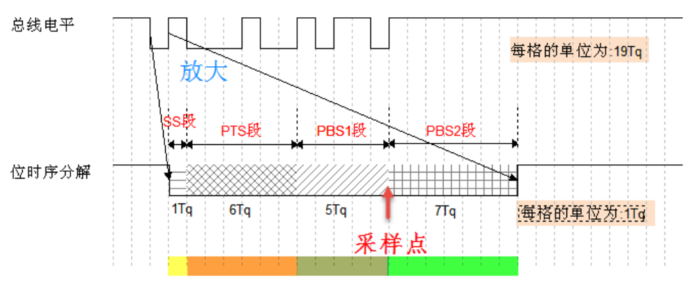
SS：同步段，大小固定为1Tq,检测跳变沿信号
PTS：数据段，大小可变，根据数据长度确定，用于补偿物理延迟(can bus包含很多从机，不同从机距离不同，因此需要设置PTS,从而计算比特率)
PBS1：数据段，大小可变，超前补偿
PBS2：数据段，大小可变，滞后补偿
**can包含的帧**
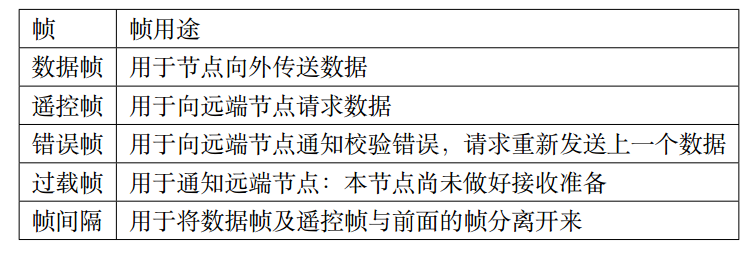
数据帧：用于发送单元向接收单元传送数据的帧。
遥控帧：用于接收单元向具有相同ID的发送单元请求数据的帧。
错误帧：用于当检测出错误时向其它单元通知错误的帧。
过载帧：用于接收单元通知其尚未做好接收准备的帧。
帧间隔：用于将数据帧及遥控帧与前面的帧分离开来的帧。
## **2. 数据帧组成**
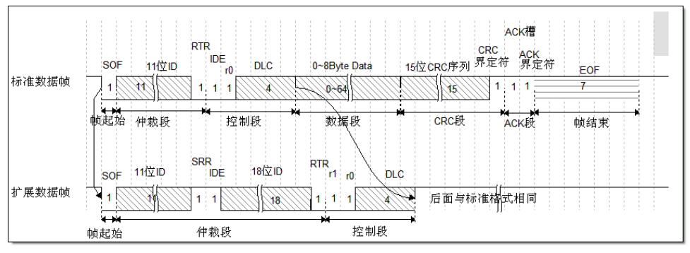
**帧起始段(SOF)**：标志着一个帧的开始，由一个显性位(0)构成，只有在总线空闲的时候发送
**仲裁段**：在标准帧中，仲裁段由11位的标识符和RTR位构成(禁止高7位都是显性电平0)。而在扩展帧中，仲裁段由29位标识符、SRR位、IDE位、RTR位共同组成。
RTR(远程传送请求位)：数据帧RTR位必须为显性电平(0)，远程帧RTR位必须为隐性电平(1)。IDE(标识符扩展位)：在标准帧中，IDE属于控制段且IDE为显性电平(0)。在扩展帧中，IDE属于仲裁段，IDE为隐性电平(1)。
SRR(远程请求位替代)：永远为1，用于划分扩展帧
**控制段**：由6位组成。在标准帧中，控制段包括IDE(IDE=0)、保留位r0(r0=0)以及占4个bit的数据长度码DLC。在扩展帧中，控制段没有IDE位，而是两个保留位r0和r1(均为显性电平)。
**数据段**：数据段包含CAN报文所要发送的数据，由0~8个byte组成(具体为几个byte由控制段中的DLC决定)。从MSB(最高位)开始输出。我们在实际解析报文数据的时候，获取到报文数据后需要根据解析规则，按照Intel(LSB)格式去解析数据，或者根据Motorola(MSB)格式去解析数据。
**ACK段**：ACK段分为ACK槽和ACK界定符。发送节点的ACK槽为隐性电平。接收节点在接收到正确的信息后，会在ACK槽发送显性电平，通知发送单元正常接收结束。这称作“发送ACK”或者“返回ACK”(发送ACK的是在既不处于总线关闭态也不处于休眠态的所有接收节点中，接收到正常消息的节点。所谓正常消息是指不含填充错误、格式错误、CRC错误的消息)。ACK界定符用于将ACK段和帧结束(EOF)隔开(始终为隐性电平)。总结来说就是有节点正确接收到报文时，ACK=0、DEL=1；未正确接收到报文时，ACK和DEL都保持为1。
**帧结束(EOF)**：帧结束表示该该帧的结束的段。由7个位的隐性位构成。节点在监测到11个连续的隐形电平后才会认为总线空闲。
## **3. 遥控帧组成**
接收单元向发送单元请求发送数据所用的帧。遥控帧由6个段组成。遥控帧没有数据帧的数据段且RTR为隐性电平(1)。
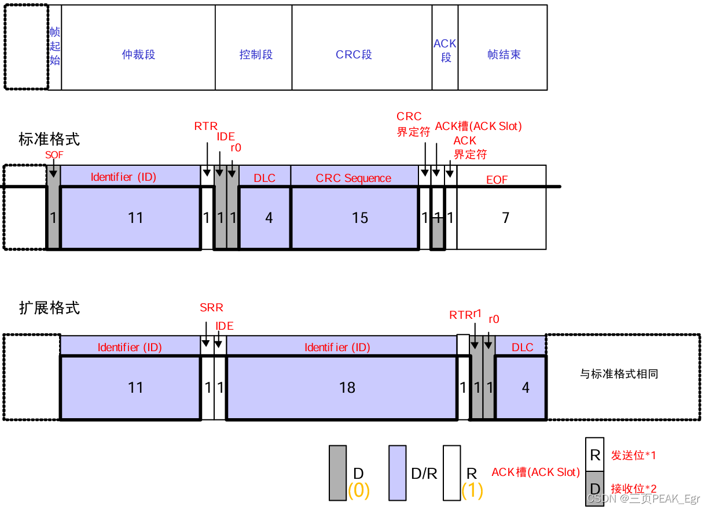
## **4. 错误帧组成**
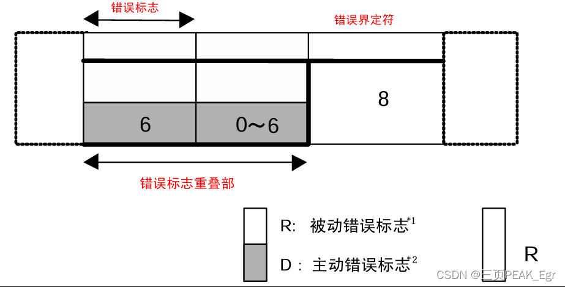
错误标志：错误标志包括主动错误标志和被动错误标志两种。主动错误标志是处于主动错误状态的节点检测出错误时输出的错误标志，是由6个位的显性位组成。被动错误标志是处于被动错误状态的节点检测出错误时输出的错误标志，由6个位的隐性位组成(可以被其他节点的显性位所覆盖)。
**错误界定符**：错误界定符由8个位的隐性位构成
**位错误**：位错误是发送节点或接收节点发现输出的电平与总线电平(不含填充位)不一致时，所监测到的错误。只有在数据帧、遥控帧、错误帧、过载帧中才能监测出“位错误”。当前节点检测出错误后的下一位开始输出错误标志。
**填充错误**：当发送/接收节点监测到数据帧(帧起始到CRC序列)、遥控帧(CRC序列)连续6位都是相同的电平时，就会检测出“填充错误”。当前节点检测出错误后的下一位开始输出错误标志。
**CRC错误**：当接收节点接收到的数据计算出的CRC结果与接收到的CRC序列不同时，就会监测出“CRC错误”。当前节点检测出错误后，将在**ACK 界定符后的下一位**开始输出错误标志。
**格式错误**：格式错误是当接收节点发现固定格式的位有问题时，就会监测到格式错误。比如监测到数据帧/遥控帧中的CRC界定符、ACK界定符和EOF(帧结束段)以及错误界定符、过载界定符不为隐性电平1时，CAN接收节点就会监测到格式错误。当前节点检测出错误后的下一位开始输出错误标志。
**ACK错误**：CAN发送节点发现ACK槽是隐性电平1时，就会检测到ACK错误。当前节点检测出错误后的下一位开始输出错误标志。
处于主动错误的节点可以参与总线通信，并且在检测到主动错误时，发送显性电平的主动错误标志(发送错误帧)。
处于被动错误的节点也可以参与总线通信，但是当此节点检测到错误时，它不能发送主动错误标志，而只能发送隐性电平的被动错误标志(发错误帧)。其次处于被动错误状态的节点在发送结束后不能马上开始下一次的发送。必须在下次发送之前，必须插入“延迟传送”(8个位的隐性位)的帧间隔。
处于总线关闭(Bus Off)的节点，不能参与总线通信(也就是不能往总线发送数据也不能接收总线上的数据)。

## **5. 过载帧组成**
过载帧用于接收单元通知其尚未做好接收准备的帧。过载帧由6个段组成。过载帧没有数据帧的数据段且RTR为隐性电平(1)。
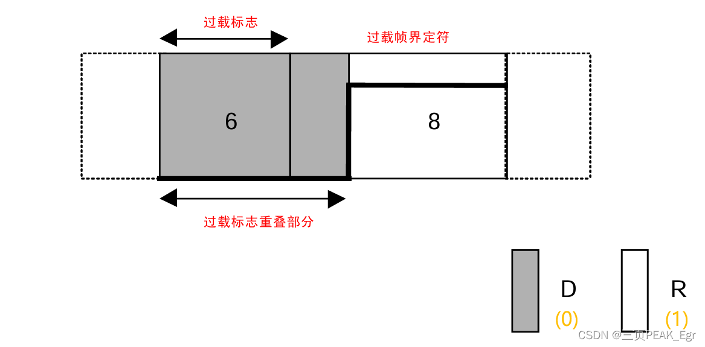
## **6. 帧间隔**
帧间隔是用于分隔数据帧和遥控帧的帧。数据帧和遥控帧可通过插入帧间隔将本帧与前面的任何帧（数据帧、 遥控帧、错误帧、过载帧）分开。需要特别注意的是过载帧和错误帧前不能插入帧间隔。
间隔：3 个位的隐性位
## **充电桩PDU(报文)**
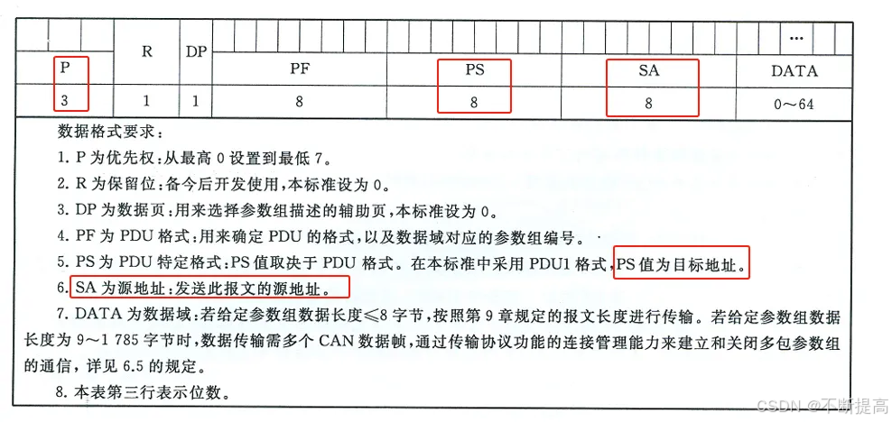
P,R,DP 5位是一组
PF为功能码(PGN)
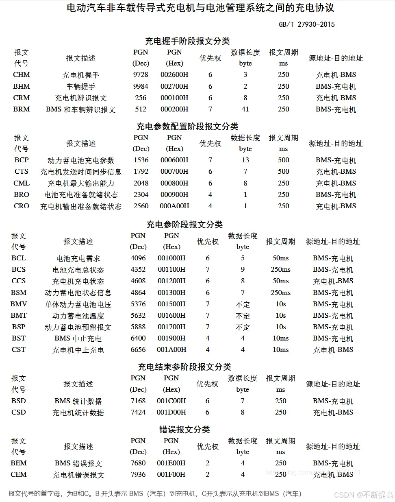
PS和SA为目标地址+源地址
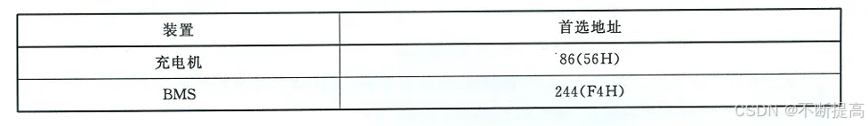

CAN 配置
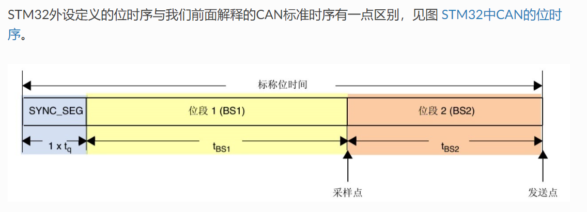
在stm中，can时序是将PTS和PB1合并成BS1
```c
CAN_HandleTypeDef     CanHandle;
CanHandle.Instance = CANx;
    
CanHandle.Init.TimeTriggeredMode = DISABLE;
CanHandle.Init.AutoBusOff = DISABLE;
CanHandle.Init.AutoWakeUp = DISABLE;
CanHandle.Init.AutoRetransmission = ENABLE;
CanHandle.Init.ReceiveFifoLocked = DISABLE;
CanHandle.Init.TransmitFifoPriority = DISABLE;
CanHandle.Init.Mode = CAN_MODE_LOOPBACK;
CanHandle.Init.SyncJumpWidth = CAN_SJW_1TQ;
CanHandle.Init.TimeSeg1 = CAN_BS1_4TQ;
CanHandle.Init.TimeSeg2 = CAN_BS2_2TQ;
CanHandle.Init.Prescaler = 6;
```
Prescaler: 时钟频率/（(1+BS1+BS2)*Prescaler） 
Tq = (BRP[9:0]+1) x TPCLK

Mode : CAN_MODE_NORMAL, CAN_MODE_LISTENONLY, CAN_MODE_LOOPBACK, CAN_MODE_SILENT, CAN_MODE_SILENT_LOOPBACK 四种模式

SyncJumpWidth ：SJW，can重新同步单次增缩最大长度，设置范围为1-4Tq

TimeSeg1 ：BS1，can时钟同步延时，设置范围为1-16Tq

TimeSeg2 ：BS2，can时钟同步延时，设置范围为1-8Tq

TimeTriggeredMode : TTCM(Time triggered communication mode)时间触发模式，它用于配置CAN的时间触发通信模式，在此模式下， CAN使用它内部定时器产生时间戳，并把它保存在CAN_RDTxR、CAN_TDTxR寄存器中。内部定时器在每个CAN位时间累加， 在接收和发送的帧起始位被采样，并生成时间戳。利用它可以实现ISO 11898-4CAN标准的分时同步通信功能。

AutoBusOff : ABOM(Automatic bus-off management)自动总线关闭管理，它用于配置CAN的自动总线关闭管理功能，当CAN总线处于错误状态时，CAN控制器会自动关闭总线，并产生一个总线关闭中断。

AutoWakeUp : ABOM(Automatic bus-off management)自动离线管理，它用于设置是否使用自动离线管理功能。 当节点检测到它发送错误或接收错误超过一定值时， 会自动进入离线状态，在离线状态中，CAN不能接收或发送报文。处于离线状态的时候，可以软件控制恢复或者直接使用这个自动离线管理功能，它会在适当的时候自动恢复。

AutoRetransmission : NART(No automatic retransmission)报文自动重传功能，设置这个功能后，当报文发送失败时会自动重传至成功为止。 若不使用这个功能，无论发送结果如何，消息只发送一次。

ReceiveFifoLocked : RFLM(Receive FIFO locked mode)接收FIFO锁定模式，它用于配置CAN的接收FIFO锁定模式，当接收FIFO锁定时，CAN控制器不会将新的帧存入接收FIFO，直到接收FIFO被清空。

TransmitFifoPriority :报文发送优先级的判定方法，当CAN外设的发送邮箱中有多个待发送报文时， 本功能可以控制它是根据报文的ID优先级还是报文存进邮箱的顺序来发送。

CAN 筛选器
```c
CAN_FilterTypeDef  sFilterConfig;
sFilterConfig.FilterBank = 0;
sFilterConfig.FilterMode = CAN_FILTERMODE_IDMASK;
sFilterConfig.FilterScale = CAN_FILTERSCALE_32BIT;
sFilterConfig.FilterIdHigh = 0x0000;
sFilterConfig.FilterIdLow = 0x0000;
sFilterConfig.FilterMaskIdHigh = 0x0000;
sFilterConfig.FilterMaskIdLow = 0x0000;
sFilterConfig.FilterFIFOAssignment = CAN_RX_FIFO0;
sFilterConfig.FilterActivation = ENABLE;
sFilterConfig.SlaveStartFilterBank = 14;
```
FilterBank  筛选器编号，从0到13，14到27，28到31为扩展筛选器，从14到27为扩展筛选器，从28到31为扩展筛选器。数字越小，优先级越高
16 位列表模式（CAN_FILTERSCALE_16BIT + CAN_FILTERMODE_IDLIST）

1 个 bank 最多能放 4 个 16 位“过滤表项”
适用于标准帧 ID（11 位）或 16 位扩展后的某些组合
16 位掩码模式（CAN_FILTERSCALE_16BIT + CAN_FILTERMODE_IDMASK）

1 个 bank 包含 2 组( ID + 掩码 )，每组占 16 位
32 位列表模式（CAN_FILTERSCALE_32BIT + CAN_FILTERMODE_IDLIST）

1 个 bank 最多能放 2 个 32 位“过滤表项”
32 位掩码模式（CAN_FILTERSCALE_32BIT + CAN_FILTERMODE_IDMASK）

1 个 bank 包含 1 组( ID + 掩码 )，每组占 32 位

FilterMode 本成员用于设置筛选器的工作模式，可以设置为列表模式(宏CAN_FilterMode_IdList)及掩码模式(宏CAN_FilterMode_IdMask)。

FilterScale  筛选器大小，CAN_FILTERSCALE_16BIT表示16位，CAN_FILTERSCALE_32BIT表示32位。

FilterIdHigh  若筛选器工作在32位模式，它存储的是所筛选ID的高16位； 若筛选器工作在16位模式，它存储的就是一个完整的要筛选的ID。
FilterIdLow  若筛选器工作在32位模式，它存储的是所筛选ID的低16位； 若筛选器工作在16位模式，它存储的就是一个完整的要筛选的ID。
FilterMaskIdHigh  CAN_FilterMaskIdHigh存储的内容分两种情况，当筛选器工作在标识符列表模式时，它的功能与CAN_FilterIdHigh相同， 都是存储要筛选的ID；而当筛选器工作在掩码模式时，它存储的是CAN_FilterIdHigh成员对应的掩码，与CAN_FilterMaskIdLow组成一组筛选器。
CAN_FilterMaskIdLow  CAN_FilterMaskIdLow存储的内容分两种情况，当筛选器工作在标识符列表模式时，它的功能与CAN_FilterIdLow相同， 都是存储要筛选的ID；而当筛选器工作在掩码模式时，它存储的是CAN_FilterIdLow成员对应的掩码，与CAN_FilterMaskIdHigh组成一组筛选器。
FilterFIFOAssignment  筛选器分配到哪个FIFO上，CAN_RX_FIFO0表示分配到接收FIFO0上，CAN_RX_FIFO1表示分配到接收FIFO1上。
SlaveStartFilterBank  筛选器扩展的起始编号，从14到27为扩展筛选器，从28到31为扩展筛选器。

STM32 屏蔽(filter)寄存器
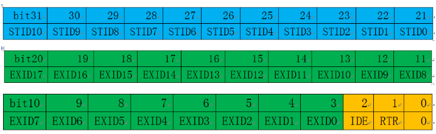
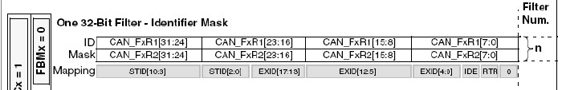
过滤器为32位，帧ID位于bit31-bit21共11位，因此，已知本节点过滤器ID为FilterId，左移21位给寄存器F1R1，这样做是正确的，但是，HAL库把过滤器分成两个16位寄存器来配置，FilterIdHigh包括 F1R1的bit31-bit16, 因此， FilterId左移5位给 FilterIdHigh ：
CAN_FilterStructure.FilterIdHigh = FilterId<<5;
F1R1的低16位CAN_FilterStructure.FilterIdLow包含扩展帧ID、IDE和RTR位，不使用扩展帧，IDE=0，接收数据帧RTR也=0, CAN_FilterStructure.FilterIdLow = 0；
再看屏蔽器的配置，屏蔽器的作用就是“告诉”过滤器在接收信息的时候，过滤器ID哪些位必须匹配，哪些位可以不匹配，凡是屏蔽器的位为1，相对应的过滤器的位就必须与接收信息包含的帧ID位相匹配，不匹配就不接收。相反，凡是屏蔽器的位为0，过滤器对应的位就不关心，因此，如果FilterMaskIdHigh 和 FilterMaskIdLow 都为0， 所有的信息都会全部接收，如果FilterMaskIdHigh 和 FilterMaskIdLow 都为0xFFFF, 只有与过滤器ID完全匹配的信息才接收。

坑：
**1. 没有开启can**
MX生成完can初始化后
```c
void MX_CAN2_Init(void)
{

  /* USER CODE BEGIN CAN2_Init 0 */

  /* USER CODE END CAN2_Init 0 */

  /* USER CODE BEGIN CAN2_Init 1 */

  /* USER CODE END CAN2_Init 1 */
  hcan2.Instance = CAN2;
  hcan2.Init.Prescaler = 12;
  hcan2.Init.Mode = CAN_MODE_NORMAL;
  hcan2.Init.SyncJumpWidth = CAN_SJW_1TQ;
  hcan2.Init.TimeSeg1 = CAN_BS1_10TQ;
  hcan2.Init.TimeSeg2 = CAN_BS2_3TQ;
  hcan2.Init.TimeTriggeredMode = DISABLE;
  hcan2.Init.AutoBusOff = ENABLE;
  hcan2.Init.AutoWakeUp = ENABLE;
  hcan2.Init.AutoRetransmission = DISABLE;
  hcan2.Init.ReceiveFifoLocked = DISABLE;
  hcan2.Init.TransmitFifoPriority = DISABLE;
  if (HAL_CAN_Init(&hcan2) != HAL_OK)
  {
    Error_Handler();
  }
```
只有init 没有设置filter，更重要的是，没有
```c
if (HAL_CAN_Start(&hcan2) != HAL_OK)
	{
	Error_Handler();
	}
```
不start任务不会开始can

**2.滤波器的问题**
can默认使用can1，如果有多个can
```c
// 配置 CAN1
sFilterConfig.FilterBank = 0;              // 从 0 开始
sFilterConfig.SlaveStartFilterBank = 10;   // CAN2 从 10 开始
HAL_CAN_ConfigFilter(&hcan1, &sFilterConfig);

// 配置 CAN2
sFilterConfig.FilterBank = 10;             // 从 10 开始
sFilterConfig.SlaveStartFilterBank = 20;   // CAN3 从 20 开始
HAL_CAN_ConfigFilter(&hcan2, &sFilterConfig);

// 配置 CAN3
sFilterConfig.FilterBank = 20;             // 从 20 开始
sFilterConfig.SlaveStartFilterBank = 28;   // 无需更多过滤器组
HAL_CAN_ConfigFilter(&hcan3, &sFilterConfig);

```
附上can读写
```c
void MX_CAN2_Init(void)
{

  /* USER CODE BEGIN CAN2_Init 0 */

  /* USER CODE END CAN2_Init 0 */

  /* USER CODE BEGIN CAN2_Init 1 */

  /* USER CODE END CAN2_Init 1 */
  hcan2.Instance = CAN2;
  hcan2.Init.Prescaler = 12;
  hcan2.Init.Mode = CAN_MODE_NORMAL;
  hcan2.Init.SyncJumpWidth = CAN_SJW_1TQ;
  hcan2.Init.TimeSeg1 = CAN_BS1_10TQ;
  hcan2.Init.TimeSeg2 = CAN_BS2_3TQ;
  hcan2.Init.TimeTriggeredMode = DISABLE;
  hcan2.Init.AutoBusOff = ENABLE;
  hcan2.Init.AutoWakeUp = ENABLE;
  hcan2.Init.AutoRetransmission = DISABLE;
  hcan2.Init.ReceiveFifoLocked = DISABLE;
  hcan2.Init.TransmitFifoPriority = DISABLE;
  if (HAL_CAN_Init(&hcan2) != HAL_OK)
  {
    Error_Handler();
  }
  /* USER CODE BEGIN CAN2_Init 2 */
	CAN_FilterTypeDef sFilterConfig;

	uint32_t baseID = 0x1830F450;
	uint32_t mask29 = 0x1FFFFFF0;
	uint32_t canId   = (baseID << 3) | CAN_ID_EXT;
	uint32_t canMask = (mask29 << 3);

	sFilterConfig.FilterMode          = CAN_FILTERMODE_IDMASK;
	sFilterConfig.FilterScale         = CAN_FILTERSCALE_32BIT;
	sFilterConfig.FilterIdHigh        = (canId >> 16) & 0xFFFF;
	sFilterConfig.FilterIdLow         = (canId & 0xFFFF);
	sFilterConfig.FilterMaskIdHigh    = (canMask >> 16) & 0xFFFF;
	sFilterConfig.FilterMaskIdLow     = ((canMask & 0xFFFF) | 0x02);
	sFilterConfig.FilterFIFOAssignment = CAN_FILTER_FIFO0;
	sFilterConfig.FilterActivation     = ENABLE;
	sFilterConfig.FilterBank           = 1;
	sFilterConfig.SlaveStartFilterBank = 0;

	if (HAL_CAN_ConfigFilter(&hcan2, &sFilterConfig) != HAL_OK)
	{
	Error_Handler();
	}

   if (HAL_CAN_ActivateNotification(&hcan2, CAN_IT_RX_FIFO0_MSG_PENDING) != HAL_OK)
	{
		Error_Handler();
	}
  //中断
	if (HAL_CAN_Start(&hcan2) != HAL_OK)
	{
	Error_Handler();
	}
  /* USER CODE END CAN2_Init 2 */

}

void HAL_CAN_MspInit(CAN_HandleTypeDef* canHandle)
{

  GPIO_InitTypeDef GPIO_InitStruct = {0};
  if(canHandle->Instance==CAN2)
  {
  /* USER CODE BEGIN CAN2_MspInit 0 */

  /* USER CODE END CAN2_MspInit 0 */
    /* CAN2 clock enable */
    __HAL_RCC_CAN2_CLK_ENABLE();
    __HAL_RCC_CAN1_CLK_ENABLE();

    __HAL_RCC_GPIOB_CLK_ENABLE();
    /**CAN2 GPIO Configuration
    PB12     ------> CAN2_RX
    PB13     ------> CAN2_TX
    */
    GPIO_InitStruct.Pin = GPIO_PIN_12|GPIO_PIN_13;
    GPIO_InitStruct.Mode = GPIO_MODE_AF_PP;
    GPIO_InitStruct.Pull = GPIO_NOPULL;
    GPIO_InitStruct.Speed = GPIO_SPEED_FREQ_VERY_HIGH;
    GPIO_InitStruct.Alternate = GPIO_AF9_CAN2;
    HAL_GPIO_Init(GPIOB, &GPIO_InitStruct);

    /* CAN2 interrupt Init */
    HAL_NVIC_SetPriority(CAN2_RX0_IRQn, 0, 0);
    HAL_NVIC_EnableIRQ(CAN2_RX0_IRQn);
  /* USER CODE BEGIN CAN2_MspInit 1 */

  /* USER CODE END CAN2_MspInit 1 */
  }
}
void CAN_SendMessage(void)
{
    CAN_TxHeaderTypeDef TxHeader;
    uint32_t TxMailbox;
    uint8_t TxData[8] = {0x01, 0x50, 0x02, 0x03, 0x04, 0x00, 0x00, 0x00};

    TxHeader.DLC = 8;
    TxHeader.IDE = CAN_ID_EXT;
    TxHeader.RTR = CAN_RTR_DATA;
    TxHeader.ExtId = 0x1830F457;
    TxHeader.TransmitGlobalTime = DISABLE;


    if (HAL_CAN_AddTxMessage(&hcan2, &TxHeader, TxData, &TxMailbox) != HAL_OK)
    {
        Error_Handler();
    }

    uint32_t timeout = 100000;
    while (HAL_CAN_IsTxMessagePending(&hcan2, TxMailbox))
    {
        if (timeout-- == 0)
        {
            Error_Handler();
        }
    }
}
void HAL_CAN_RxFifo0MsgPendingCallback(CAN_HandleTypeDef *hcan)
{
    if (hcan->Instance == CAN2) { // 检查是 CAN2 的中断
        uint8_t rxData[8];
        CAN_RxHeaderTypeDef rxHeader;

        if (HAL_CAN_GetRxMessage(hcan, CAN_RX_FIFO0, &rxHeader, rxData) == HAL_OK) {
        	HAL_GPIO_WritePin(GPIOF, GPIO_PIN_8, 1);
			HAL_GPIO_WritePin(GPIOF, GPIO_PIN_7, 0);
        }
    }
}
//用中断读取数据
```