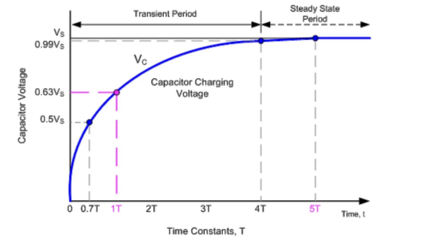
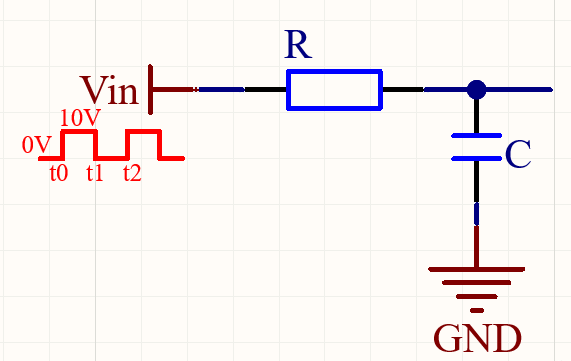
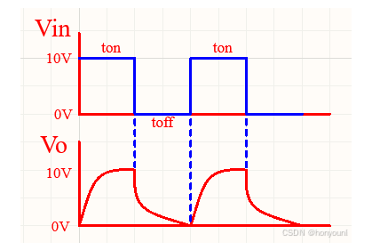
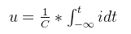
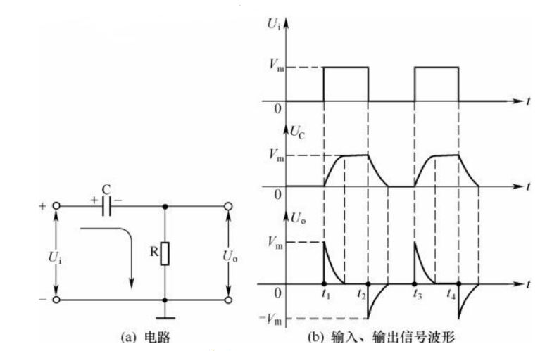
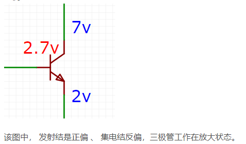
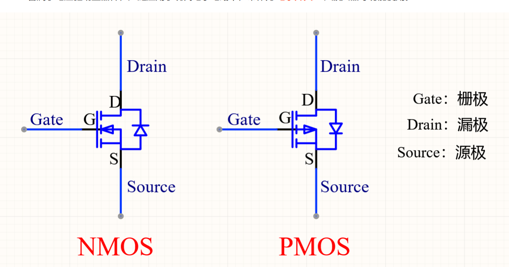
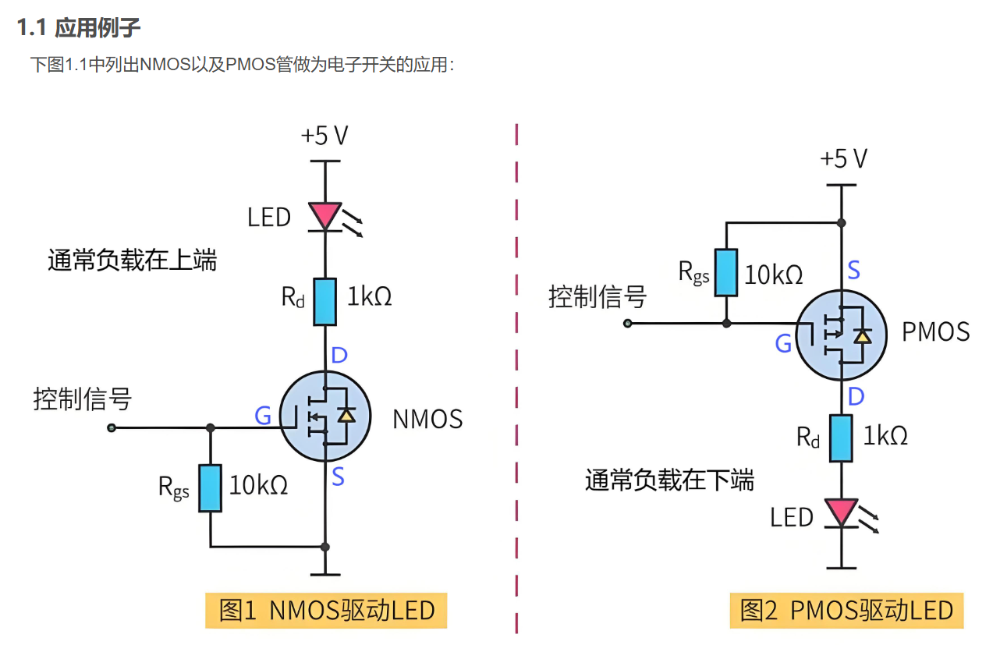
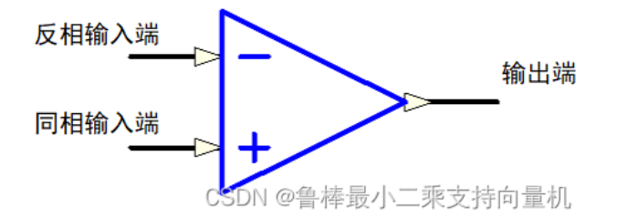
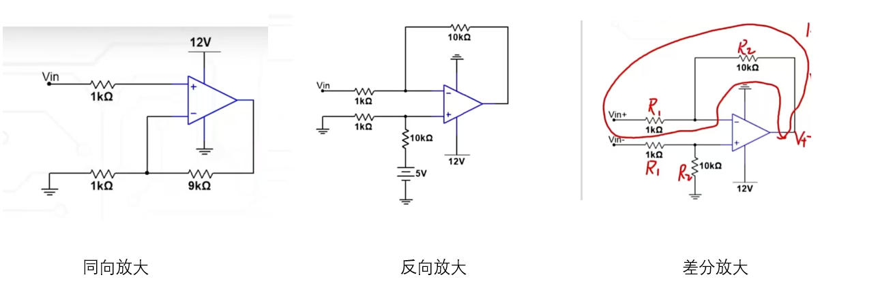

# **Hardware**
Author: Buendia.Deng[^1a]  
Rev 1.0  
[^1a]: Buendia.Deng@volex.com 

## Base
截止频率: 该频率下，功率为最高功率的50%，P=IV=R*V^2 那么 电压为原电压的根号(0.5)=0.707 倍

## 电容
τ = RC
R—电路中的电阻值，单位是欧姆（Ω）
C—电路中的电电值，单位是法拉（F）
τ—电容充放电时间常数，单位是秒（s）

电容定义: C = Q / V 
Q: 电容量
U: 电压
C: 电容 单位: F, pF, nF, uF, mF, kF
Q = i*t i 为电流； t 为时间
I = dQ/dt = C*dV/dt 电流与电容之间的关系
容抗: Xc = 1 / (2 * π * f * C) 单位为欧姆
RC 低通滤波 推导

Vout = Vin*(Xc/(R + Xc)) = Vin*(1/(1 + (2 * π * f * C * R))) 
f 越大 vout 越小 则该滤波为低通滤波
vout 随时间变化如图所示

电容Q = 积分(-∞ - t)idt
电压为

反之 高通滤网电路为

Vout = Vin*(R/(R + Xc)) = Vin*((R*((2 * π * f * C * R) /1+(2 * π * f * C * R))) 
f越大 vout越大
则 Vout = I*R = C*dV/dt*R

## 电感
电感定义: L = N * I
τ=L/R
N: 线圈数
I: 电流
L: 电感 单位: H, mH, uH, nH, pH
电感感抗: XL = 2 * π * f * L
电感感抗与电容容抗相反，电感感抗越大，频率越低，电感感抗越小，频率越高
电感感抗与电阻阻值关系
U = L*dI/dt 
电感感抗与电阻阻值关系，当频率越低，电感感抗越大，电阻阻值越小，电感感抗越小，电阻阻值越大
电感的LC 与 RC 电路原理差不多

## 三极管
分辨NPN还是PNP的技巧：
看三极管中箭头指向，箭头代表着电流方向.
我们都知道PN结电流是P流向N，说明PN结中导通时电压是P高于N，电流由P流向N。如果箭头指向基极，说明电流流向基极，则基极是N，两边是P，三极管就是PNP三极管。相反，如果箭头由基极指向发射极，基极电流是留出的，则基极是P，两边是N，三极管就是NPN三极管。

对于输出端，有以下特点：
1.当输入电流IB小于阈值时，即使输出端C电压再大，C端流进三极管的电流也几乎为0，即三极管处于关闭状态，叫做截止区。

2.当输入电流IB大于阈值且一定时，当输出端C电压小于一定阈值时，随C端电压升高，C端电流迅速增加。当C端电压到一定值之后，随着C端电压增加，C端电流基本不再变化，将输出端C电压小于一定阈值、不同电流IB组成的区叫做饱和区，将C端电压增大但电流基本不变的区域叫做放大区。

3.饱和区时，可以任务C端有多少电流都可以完全流进三极管里面，限制电流的是C端电压。放大区时，无论C端电压多高，C端电流都是被IB电流控制。（Vcb小于0.7）

如果满足 Ib*β = Ic ，那么就是放大状态。
如果Ib*β ≠ Ic ，就是饱和状态。

因为三极管导通时，基极电压会钳位在0.7V左右，所以三极管可以用来做电压钳位电路。

什么是发射结正偏集电结反偏？
- 正偏是电源正极接P，负接N；反偏是负接P，正接N；
发射结正偏，集电结反偏——放大状态；
发射结正偏，集电结也正偏——饱和状态；
发射结反偏，集电结也反偏——截止状态。

## MOS管

体二极管 的作用是使管内电流为零，从而达到阻尼作用。
对于NMOS管，Vg>Vs+Vth DS导通
当Vgs=0时，Vds=Vgs-Vth，Vds=0，所以管内电流为零，起到阻尼作用,体二极管由源极到达漏极，这样防止电压从Drain 到Source。
对于PMOS管，Vg＜Vs+Vth DS导通，当Vgs=0时，Vds=Vgs+Vth，Vds=0，所以管内电流为零，起到阻尼作用。

NMOS管的负载在电源,而PMOS管的负载在接地端:当负载在电源端时：Vgs是直接到地的（没有其它压降）；负载在电源端，无论阻抗怎么变化，对控制极（G极）没有影响，只要Vgs ≥ 5V（不超出最大额定Vgs电压），管子就可以正常导通。 一般电源端电压会相对较大一些，所以，负载的阻抗哪怕再大一点，一般也都能满足。
N管：Vgs之间存在一个寄生电容，因此，一般都会挂一个负载电容，以减小寄生电容对电路的影响。

## 运放
虚短 虚断

无限大的输入阻抗： 理想的运算放大器输入端不容许任何电流流入，即输入信号V+与V-两端点的电流信号恒为零，即输入阻抗无限大
趋近于零的输出阻抗： 理想运算放大器的输出端是一个完美的电压源，无论流至放大器负载的电流如何变化，放大器的输出电压恒为一定值，即输出阻抗为零
无限大的开回路增益： 理想运算放大器的开回路的状态下，输入端的差动信号有无限大的电压增益，这个特性使得运算放大器十分适合在实际应用时加上负反馈组态
无限大的共模抑制比： 理想运算放大器只能对V+与V-两端点电压的差值(差分信号)有反应，即只放大V + − V − 的部份。对于两输入信号的相同的部分(共模信号)将完全忽略不计

虚短，数学解释：Vout = (V+ - V-)*GAIN Vout/GAIN = (V+ - V-) GAIN=∞   V+ = V-
物理解释：V+ 大于 V-，Vout = V+ - V- > 0，V+≤V-，Vout = V+ - V- < 0，Vout 在 V+与V-数值相等之间震荡，因此近似可以看成V+ = V-，虚短前提是Vout接回V-,形成负反馈
虚断，物理解释:运放可以看成是几百兆的电阻，当负载位几千欧的时候 可以认为几乎没有电流走过运放
