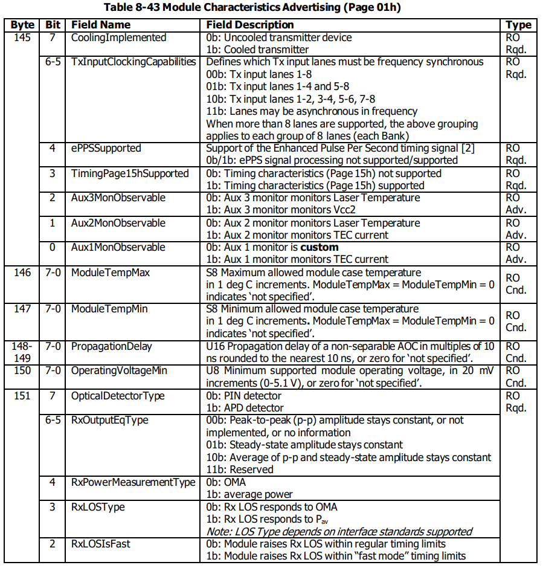
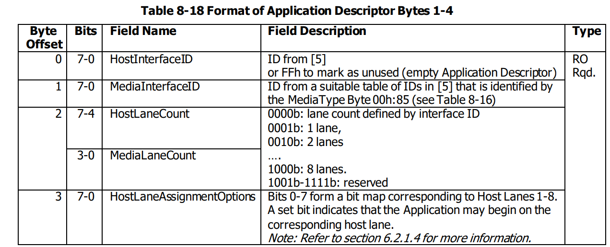
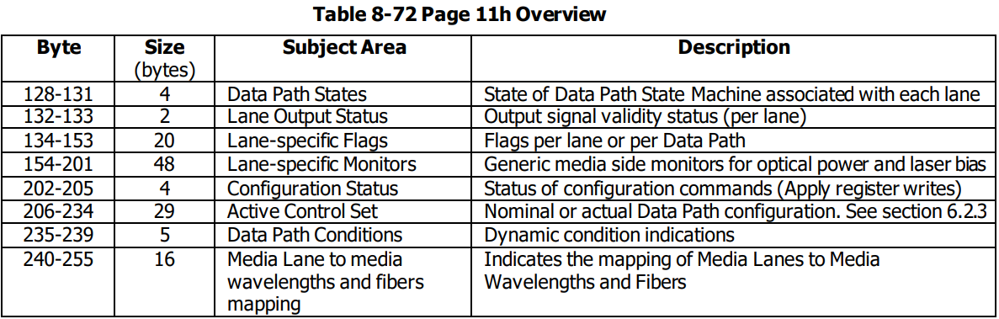
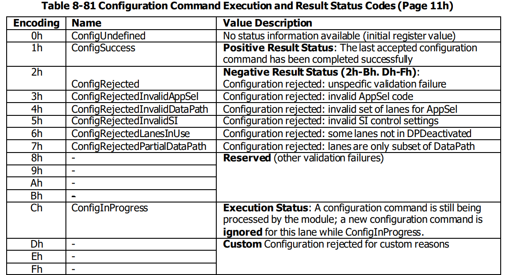
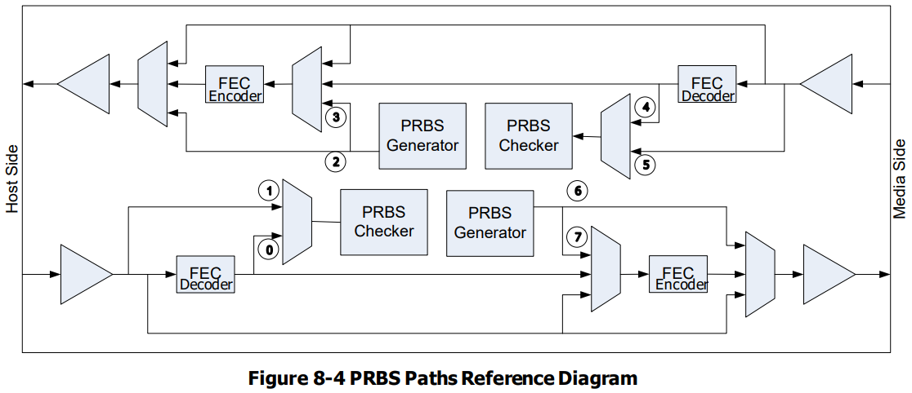
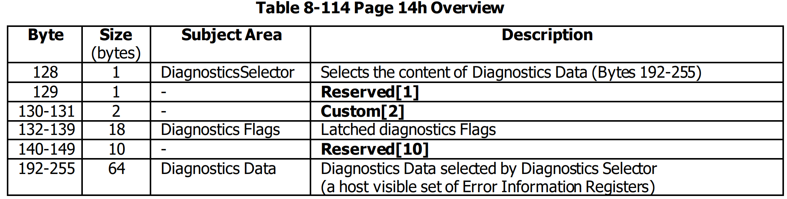

# **CMSIS**
Common Management Interface Specification   

Author: Buendia.Deng[^1a]  
[^1a]: Buendia.Deng@volex.com 


---
## HardWare
封装形式包括OSFP、QSFPDD
硬件引脚包括LPmode，INTL,RestL,ModeselL(只在QSFP中包含)
LPmode：
LPMode/TxDis 是一个来自主机的双模输入信号，采用高电平有效逻辑。该信号在模块内部被拉向 Vcc。在上电或复位取消（ResetL 取消有效）后，LPMode/TxDis 表现为 LPMode 模式。
当 LPMode/TxDis 被配置为 LPMode 模式时，模块表现为 TxDis=0（发射使能）。通过使用 LPMode 信号和 Power_override（电源覆盖）、Power_set（电源设置）以及 High_Power_Class_Enable（高功率类别使能）软件控制位，主机可以控制模块的功耗。当 LPMode/TxDis 被配置为 TxDis 模式时，模块表现为 LPMode=0（正常功率模式）。在此模式下，当 LPMode/TxDis 设为 1 或 0 时，将禁用或使能模块内的所有光学发射器，具体时间请参见表 9。
将 LPMode/TxDis 模式从 LPMode 切换到 TxDis，当 LPMode/TxDis 处于高电平状态时，将禁用所有光学发射器。如果模块处于低功耗模式，则模块会同时退出低功耗模式。如果模块已处于高功率状态（Power Override 控制位为高），并且发射器已被使能，模块将禁用所有光学发射器。将 LPMode/TxDis 模式从 LPMode 切换到 TxDis 时，如果 LPMode/TxDis 处于低电平状态，仅会改变发射器的禁用状态。模块的行为取决于 Power Override 控制位的状态。
LPWn 是一种双功能信号，允许主机向模块发出信号以指示低功耗模式，同时模块也可以通过此信号向主机表明其是否存在（Module Present）
## Abbreviations
**BER** Bit Error Ratio (dimensionless) or Bit Error Rate (per unit time)
**ePPS** enhanced Pulse Per Second (a timing signal)
**PRBS** Pseudo Random Binary Sequence
伪随机二进制序列
由一个确定性的算法生成的一系列二进制数（0和1），该序列在统计上表现得像随机数，但实际上是完全可预测的。

**CDM** Code Division Multiplex
一种多路复用技术，用于在同一个通信信道上同时传输多个信号,它通过为每个信号分配唯一的编码序列，使多个信号能够在同一信道上同时传输，而不会相互干扰。
- 每个信号都被分配一个唯一的编码序列，这个序列称为“码”。
- 信号通过与其唯一编码序列相乘，变成一个编码信号。
- 所有编码信号被组合后传输。
- 接收端使用相同的编码序列对接收到的信号进行解码，恢复原始信号。  

**TDM** Time Division Multiplexing
一种通信技术，通过将时间划分成若干时隙，每个时隙分配给不同的信号，使多个信号可以共享同一个传输介质。
- 同步时分复用（Synchronous TDM）:
每个信号被分配固定的时隙，即使在某些时隙内没有数据要传输，这些时隙也会被保留。  
- 异步时分复用（Asynchronous TDM）或统计时分复用（Statistical TDM）:
时隙按需分配，只有在有数据需要传输时才使用时隙，提高了信道利用率。

**CWDM** Coarse Wavelength Division Multiplexing
粗波分复用：一种波分复用技术，使用较少的波长间隔（通常为20nm），适用于中短距离传输，成本较低。
**DWDM** Dense Wavelength Division Multiplexing
密集波分复用：一种波分复用技术，使用非常窄的波长间隔（通常为0.8nm或更小），适用于长距离和高容量传输，成本较高。

## Management Register Access Layer (RAL)
**Registers in Addressable Memory** 
The directly host addressable management memoryconsists of 256 Bytes and is divided in two segments, called 33 Lower Memory (Byte addresses 00h through 7Fh) and Upper Memory (Byte addresses 80h through FFh).
模块中可以直接通过主机进行访问和操作的内存部分。这种内存用于存储和管理与模块操作相关的数据和控制信息。
**Read Access (READ)**
VALUE = READ( [ByteAddress,] N), 1 ≤ N ≤ 8
The starting byte address for the read access is optionally specified by the host (ByteAddress). If omitted, the module uses an internally maintained current byte address as the starting byte address
A successful READ access returns N bytes by VALUE.
**Write Access (WRITE)**
SUCCESS = WRITE( ByteAddress, VALUE, [VALUE, …])
**Register Access Rejection**
In this section, specifications are limited to the elementary READ and WRITE accesses to addressable management memory. Sequencing and synchronization requirements for interactions at the management application layer.任何读或写寄存器访问可能被模块暂时拒绝
After a WRITE access the module ensures that the following read-back conditions are satisfied for all registers with regular read-write (RW) access type. When needed to fulfill these read-back conditions, the target temporarily rejects further READ or WRITE accesses. The situatuion of `EAD-BACK` is following: 
- Single byte read-back condition: After a properly terminated WRITE to a Byte address with RW access type, an **immediately following successful READ** from that same Byte address yields the value just written. 写完后立刻有个回读
- Multiple bytes read-back condition: After a properly terminated WRITE to a Byte address range with RW access type, an immediately following successful READ from **any part** of that Byte address range yields the value of that part just written.

MCI mechanisms can be used by the module to reject or delay a subsequent ACCESS, either by rejecting or by internally delaying (clock stretch) a subsequent transaction while the read back conditions are not yet satisfied

**Applications and Application Instances**
An Applicationis a type of functional configuration(功能配置) that is characterized by specific signal(传播) or signal processing between one or more host lanes and one or more media lanes, overall providing a well-defined signal or data transmission function to the host.
- specified by reference to a pair of industry standards, one for the host interface and one for the media interface, each comprising a number of lanes.(一条主机一条媒体接口)
- A simple module may support only a fixed single Application, or several parallel Application instances(多条并行application) (for Applications using fewer lanes than the module provides)(通道较少的应用), while a versatile programmable module(多功能模块) may support variant (变体)Applications or even multiple instances of one or more Applications operated in parallel.  

Data Path： specific host and media lanes of a module that are used to implement one instance of an Application, together with all required internal module resources

**Application Description**
Each Application Descriptor is identified by a unique AppSel code, it is simply the `sequence number` of that Application Descriptor in the consecutive array of Application Descriptors advertised by the module.

HostInterfaceID:每个Host Interface ID与一个行业标准相关联，该标准定义了相应接口的必要属性，例如信号传输速率、调制格式、通道数以及隐含的信号或数据处理特性。模块编码应用描述符列表中的每个实例所支持的主机通道数，在HostLaneCount字段中描述。
MediaInterfaceID:与HostInterfaceID描述类似
HostLaneAssignmentOptions:标识模块支持应用实例的主机通道。模块的主机接口可以支持给定应用的多个实例，因此每个通道分配选项标识可以分配应用实例的连续通道组中的最低编号通道。如果模块发布了多个应用实例，则它们所有可能的组合都能被同时支持。例如，如果发布了两个实例，可能的起始点是通道1和通道5，那么两个实例可以同时存在，分别从通道1和通道5开始。
MediaLaneAssignmentOptions:与HostLaneAssignmentOptions类似

**Control Sets**
与一个应用实例关联的通道以及所有关联的模块内部资源，统称为携带该应用实例的数据路径（Data Path）。控制集的内容最终由模块在实际数据路径初始化或重新初始化期间使用，即当已配置的数据路径配置实际投入使用时。
- 活动控制集（Active Control Set）：报告当前使用或将被模块用来控制其硬件的配置设置。
- 暂存控制集（Staged Control Set）：主机用来定义新配置设置以备将来使用，而不会立即影响模块中的配置。

每个控制集包含一个数据路径配置寄存器数组DPConfig，定义每个主机通道的两种类型的配置设置
- Application Instance related settings
- Signal Integrity (SI) related settings 

Application Instance: relevant application `descriptor` and its `Data Path` to lanes. Applicantion and Data path identical on all lanes of Data -Path, SI related individual.

DPConfigLane(i) include AppSelCode field and DataPathID field, signal integrity related ExplicitControl bit( **host-defined SI** to be used for lane i)

**AppSelCode**: Application is advertised by an Application Descriptor and each Application Descriptor is identified by a so called AppSel code (an Application Descriptor sequence number). 
主机使用相关应用程序描述符的AppSel代码将应用程序标识分配给一个或多个通道，并在DPConfig寄存器数组中设置应用程序描述符。对于多通道数据路径，当应用程序需要多个通道时，主机在该数据路径的每个通道中写入相同的AppSel代码。特殊的AppSel代码值0000b在主机通道的Data Path Configuration寄存器中指示该通道未使用，不是数据路径的一部分。
zero valued AppSel code corresponds to a NIL or NULL pointer in programming languages

**DataPathID**:  The value of the DataPathID field in a DPConfig register localizes and identifies a specific Data Path. The DataPathID of a Data Path is defined as the `lowest` lane number of all host lanes in that Data Path.
与数据路径相关的模块资源可以位于模块中的任何位置，并且可以与内存映射中的主机通道或媒体接口共享。模块中资源的任何共享在正常操作中不影响独立数据路径的独立操作。对于多通道数据路径，主机在该数据路径的所有通道中写入相同的DataPathID。

**ExplicitControl**: 
The ExplicitControl bit (EC) determines if the signal integrity (SI) settings for the functional resources associated with a lane are programmed by the host (EC=1) or by the module (EC=0).
**Signal Integrity Control Field** | **ExplicitControl(value to enable)** 
:----: | :----: 
**AdaptiveInputEqEnableTx** | 1 
**AdaptiveInputEqRecallTx** | x 
**FixedInputEqTargetTx** | 1 
**CDREnableTx** | 1 
**CDREnableRx** | 1 
**OutputEqPreCursorTargetRx** | 1 
**OutputEqPostCursorTargetRx** | 1 
**OutputAmplitudeTargetlRx** | 1 

AdaptiveInputEqRecallTx功能的目的是快速恢复之前存储的自适应均衡设置。当EC=0时，该功能始终可用，并且也可以用于此目的。

**Control Set Usage**
1. 主机可以通过请求模块验证并然后将相关通道的设置从暂存控制集(Staged Control )复制到活动控制集(Active Control Set)来请求一个或多个数据路径的供应(RAM-ROM)

供应(Provisioning): 主机请求将暂存控制集的设置应用到活动控制集中（通过ApplyImmediate或ApplyDPInit触发器）
调试(Commissioning):在数据路径初始化期间或当前状态下（ApplyImmediate之后）进行,将活动控制集提交到模块硬件。
2. 配置完成后，所有使用的通道必须属于数据路径的一部分，而不能有部分配置或无效的配置。同时，如果有未使用的通道，它们应明确标识为未使用。
3. 当主机请求调试一个已经供应到活动控制集的数据路径时，模块评估活动控制集中的设置以初始化与该数据路径相关的所有资源。

Apply Trigger Registers:对于每个暂存控制集，主机可以通过两个Apply控制（触发寄存器）请求将暂存控制集中的数据路径设置复制到活动控制集中（使用位掩码指示要应用的通道）。这两个控制是：
SCS<x>::ApplyDPInit
SCS<x>::ApplyImmediate
Apply触发器的典型用例是重新配置应用程序，以在数据路径上执行应用程序、更改数据路径的通道宽度、修改通道上的信号完整性设置或通过选择与该速度相关的其他应用程序来更改接口速度。
Apply triggers are Data Path operations:主机必须在数据路径的所有通道上同时触发Apply（即使只有单个通道的特定属性发生了变化）
若支持ApplyImmediate，则ApplyImmediate可以在每个通道上使用，但仅当仅更改了单个通道的特定信号完整性设置时，并且仅在数据路径处于DPActivated或DPInitialized状态时。
主机可以在一次写访问中在多个数据路径通道上同时触发Apply。

lanes indicating an `initialized Data Path` that is currently in `use`, i.e. on lanes indicating the **DPInitialized** or **DPActivated** state。这两个Apply触发器都会导致模块执行供应和调试步骤顺序进行，无论有无DPSM状态更改都可以用Regular Reconfiguration or Hot Reconfiguration

Regular Reconfiguration：在已初始化状态下触发ApplyDPInit后，模块将
1. 验证
2. 复制暂存设置到活动控制集中
3. 自动将DPSM状态转换为DPDeactivated
4. 初始化数据路径以实现新的活动控制集内容。
这种重新初始化（3+4）作为DPSM状态转换序列自动发生，最终移回到触发ApplyDPInit的状态（除非在此期间DPSM状态转换相关配置已改变）。

Hot Reconfiguration：在不改变DPSM状态的情况下供应和调试
1. 验证
2. 复制
3. 重新初始化
作为一个优化的内部过程，不改变DPSM状态。

Silent Rejection：在表示瞬态状态（DPInit、DPDeinit、DPTxTurnOn、DPTxTurnOff）的通道上调用时，模块可能会忽略Apply触发器；结果通常未定。

在所有情况下，如果在验证过程中请求的数据路径配置未被接受，模块将跳过该数据路径的任何设置复制步骤，并终止过程。
终止：报告结果状态代码，通知每个受影响的通道成功执（ConfigSuccess）或拒绝（ConfigRejected）。

Data Path配置使用：Bringing a Data Path into service，requires three steps, herein called **definition**, **provisioning**, and **commissioning**.

第一步，定义，是一个由主机执行的过程，定义所需的数据路径配置，并在选定的阶段控制集合中进行登记，使用任意顺序的寄存器写访问，而无需模块读取。定义是一个纯主机过程。

第二步，配置，是一个由主机触发的模块过程，验证数据路径中设置的有效性，然后将这些设置从阶段控制集合复制到活动控制集合，如果成功的话。这一步是一个由主机触发的模块过程。

第三步，调试，可以是由主机启动的过程，或者是前一个由主机触发的配置过程的自动后续步骤：在这两种情况下，模块将提交标称配置的选定通道到活动控制集合中，以确保活动控制集合最终准确匹配实际的硬件配置。此步骤是一个由主机触发的模块过程，并且可以直接或间接进行。
**触发与启动**
Triggering：触发具有事件性质，并且实现为主机写入一个无状态触发寄存器。module provides feedback, 可观察到。
initiating：a causal consequence of changing a setting in a configuration registe，程序仅通过其可观察到的效果间接提供反馈。
主机选择Data Path需要写入寄存器或（在模块启动过程中定义步骤中的）字段以及使用位掩码（模块触发的时候）
**配置过程**
配置包括逐步过程（Stepwise Procedure）和无干预（或自动）过程（Intervention-free or automatic procedure）。
Stepwise Procedure：主机根据Data Path State Machine（DPSM）初始化和配置模型逐步执行所有配置操作。
配置步骤不仅仅在当前未使用或部分停用的数据路径上执行（lanes 在 DPDeactivated 状态），而且在初始化数据路径（DPInit 状态）时首先由主机启动，然后由模块在将数据路径初始化到活动状态（DPInit 状态）时执行。
逐步过程足够快的应用程序，例如以太网或传输，建议主机仅使用逐步过程并避免无干预过程
Intervention-free or automatic procedure：主机仅在当前初始化状态下触发配置过程（lanes 在 DPInitialized 或 DPActivated 状态），然后模块随后执行调试步骤，无需主机进一步干预。
reconfiguration：
在常规重新配置过程中（Regular reconfiguration procedure，由 ApplyDPInit 寄存器触发），模块自动检查通过数据路径的所有通道（通过 DPDeactivated 和 DPInit）以执行调试步骤，以确认触发的配置步骤成功执行。
在热重新配置过程中（Hot reconfiguration procedure，由 ApplyImmediate 寄存器触发），模块在当前数据路径状态下执行所有步骤，绕过逐步过程。

Module Procedure Execution Protocol (Command Handling)：
第一步，命令接受阶段，模块确定所请求的过程当前是否可以接受：在这里，当之前触发的配置过程仍在执行时，无法接受新的触发。当接受时，模块立即设置该lane的执行状态（ConfigInProgress）；否则，命令不被接受，并且默默地忽略，不向主机提供反馈。
第二步，命令验证阶段，模块验证命令参数（阶段控制集合的内容），并跳过那些参数验证失败的数据路径的下一步。
第三步，实际命令执行阶段，执行所需的过程。
配置命令
1命令处理准备检查 2输入参数验证 3实际命令执行和 4正面或负面的结果状态反馈。
向应用寄存器写入lane选择位掩码触发一个或多个并行配置命令的执行，具体取决于触发寄存器使用和当前 DPSM 状态

默认配置

SteppedConfigOnly=1的配置

信号完整性控制(Signal Integrity)
适用的阶段控制集合中设置了 ExplicitControl 位,模块将主机提供的信号完整性控制值复制到活动控制集合,当 ApplyDPInit 或 ApplyImmediate 触发器被使用时。
如果未设置 ExplicitControl 位，模块在使用 Apply 触发器时写入适用的依赖应用程序的默认信号完整性控制值到活动控制集合。
 Tx Input Eq control relationship to AdaptiveInputEqEnableTx
**Equalization Type** | **Control** |**AdaptiveInputEqEnableTx**
:----: | :----: | :----: 
**Adaptive** | AdaptiveInputEqFreezeTx | 1
**Adaptive** | AdaptiveInputEqStoreTx | 1
**Adaptive** | AdaptiveInputEqRecallTx | 1 
**Non-Adaptive** | FixedInputEqTargetTx | 0 


Fixed Tx Input Equalization Codes
**Code Value** | **Bit pattern ** |**Input Equalization** 
:----: | :----: | :----: 
0 | 0b | No Equalization
1 | 1b | 1db
2 | 10b | 2db
3-8 | 0011b … 1000b | 3db-8db

A Module State Machine (MSM): 定义了主机-模块交互和行为特性，如管理接口的初始化和模块电源模式。
Data Path State Machine (DPSM): 定义了需要一个数据路径的主机-模块交互和行为特性，这代表了一个应用的信号流和信号处理。
一个模块有一个模块状态机，但数据路径状态机的数量取决于模块配置：一个简单的模块可能只有一个应用的单一数据路径，即一个DPSM。复杂的模块支持一个应用的多个实例或多个应用的多个实例，每个实例都有各自的DPSM实例。
steady states:模块基本上处于等待主机发起操作的状态。
transient states:模块执行专门的活动，并自动进行状态转换直到完成（除非其他状态转换先完成）。

**MSM**
定义了主机与模块之间的交互以及模块的行为特征。MSM的状态反映了模块的状态以及被其主机所需求的状态,描述了整个模块的行为和特征。
模块可能会为每个状态设置特定的标志（可能引起中断）,除非特别说明，否则模块在状态转换时不会清除任何标志，且仅在主机读取或屏蔽所有设置的标志后才会清除中断。
进入新状态后，只有在模块启动的状态转换的子集中，才会设置ModuleStateChangedFlag。此外，在退出新状态时通常会抑制设置ModuleStateChangedFlag。
**New State** | **ModuleStateChangedFlag**
:----: | :----:
Resetting | NO 
Reset | NO
MgmtInit |No
ModuleFault| Yes
ModuleLowPwr| Yes
ModulePwrUp |No
ModuleReady |Yes
ModulePwrDn | NO

Module State Machine for Paged Memory Modules

The state machine exits a given state when specific exit conditions are satisfied. So called transition signals(names ending in S) are used to describe the logic conditions governing a state transition. 

模块状态机退出条件优先级:重置;重置失败;所有其他退出条件

Rest 条件：
**VccReset** | **hardware Reset** | **SoftwareReset**|**ResetS**
:----: | :----: |  :----: |  :----:
ASSERTED | X | X | 1
DEASSERTED | ASSERTED | X | 1
DEASSERTED | DEASSERTED | 1 | 1
DEASSERTED | DEASSERTED | 0 | 0

The LowPwrStransition signal：
LowPwrS = LowPwrRequestSW OR (LowPwrAllowRequestHW AND ASSERTED(LowPwrRequestHW) )

LowPwrExS transition signal：It represents the exit conditions from the ModuleReady state, when the LowPwrS transition signal is TRUE AND **all Data Paths have reached the DPDeactivated state** (represented by the logical term ModuleDeactivatedT).
LowPwrExS = LowPwrS AND ModuleDeactivatedT
```bash
#define LowPwrExS LowPwrS && ModuleDeactivatedT
```


**Module Power**
低功耗模式：所有MSM稳态状态（除ModuleReady外）的特征，最大功耗由特定硬件规格定义。
高功耗模式：在ModuleReady状态下的最大功耗由MaxPower字节定义

所有模块在初始启动时均处于低功耗模式。在管理接口初始化后及MSM达到ModuleReady状态前，只有在满足LowPwrS转换信号条件下的高功耗模式才被允许。
转换条件：
```bash
#define LowPwrS  LowPwrRequestSW || (LowPwrAllowRequestHW&&ASSERTED(LowPwrRequestHW))
```
**Resetting State (Shutting Down)**

Resetting 是一个瞬态状态。ResetS转换信号为TRUE时,任何状态（除Reset状态外）都会进入重置状态
进入时：当分页内存模块进入重置状态时，所有数据路径状态机都停止存在
退出后：当所有模块电子设备已关闭并处于重置状态时，模块状态自动转换回Reset状态。
resetting state action:模块在进入Reset状态前尝试优雅地关闭模块光学和电子部件。在重置状态的部分时间内，模块可能处于高功耗模式。
被动反应：在重置状态期间，主机启动的管理交互可能会被模块忽略。进行中的交易可能在进入重置状态时被终止。

`代码中的显示:`
```c
static void msa_stm_ResettingHandler(void)
{
	/* MCU reset*/
	NVIC_SystemReset();
}
/*1. 复位 CPU 和外设：CPU 和连接到它的外设都会被复位到初始状态。
2.重新启动：系统将从复位向量地址开始执行代码，通常是从闪存中的复位向量表开始。
3. 清除寄存器状态：所有 CPU 寄存器和状态寄存器都会被清零或设置为默认值。*/
```
**Reset State (Ground State)** 
Reset 是一个稳态状态。在模块插入或上电时，重置状态是模块状态机的初始状态。
进入时：自清除的SoftwareReset位自动恢复到默认值。所有其他位不受影响。
退出时：模块在ResetS转换信号为FALSE。退出Reset状态后，模块状态机进入MgmtInit状态。
Reset State action: 模块内部的所有电子设备都处于重置状态。模块保持在低功耗模式。对主机的所有中断都被抑制。
被动反应：模块可能会中止在进入Reset状态时正在进行的所有MCI（管理通信接口）交易。当ResetS转换信号为TRUE时，管理接口可能被保持在重置状态，并且可能不响应；当ResetS信号变为FALSE时，模块可能仍然不响应，直到退出MgmtInit状态。
该状态在代码中的表示为：
清空ROM (0x20000000)，将ram区域0x0807E000复制到rom区0x20002000, 复制大小为0x800(2k)
初始化intL LPmode restL引脚，将状态机每个状态都设置为false
```c

//初始化Flash，将rom地址(base address 0x0807E000)复制到Flash地址0x20002000大小为(uint32_t)0x800
void DRV_FLASH_Init(void)
{
#define SYS_FLASH_PAGE_SIZE		            ((uint32_t)0x800
#define CFG_IFLASH_ADDRESS                  (0x0807E000)
#if CFG_DB_IFLASH_SUPPORT

    /* Init Cache */
   volatile UINT32 ROM_BASEADDR = CFG_IFLASH_ADDRESS;
   volatile UINT32 RAMCOPY_BASEADDR = 0x20002000;
   volatile UINT32 CFGSIZE = SYS_FLASH_PAGE_SIZE;

   HAL_FLASH_Unlock();
   for (volatile UINT32 i = 0; i < CFGSIZE; i++)
   {
	   *((UINT32 *)(RAMCOPY_BASEADDR) + i) = *((UINT32 *)(ROM_BASEADDR) + i);
   }

   HAL_FLASH_Lock();
#endif
}

void DRV_ResetState(void)
{

	#if DRV_IO_SUPPORT
		DRV_IO_Init();//initalize LPmode Modeselect INTL etc.
	#endif

	#if DRV_FLASH_SUPPORT
		DRV_FLASH_Init();
	#endif
}


UINT8 RamPageBuf_00[0x40 * 0x80] __attribute__((section(".user_ram")));
//清空0x20000000的rom区
void CFG_MEMPAGE_ClearRamPageBuf(void)
{
	#if 1
		memset(RamPageBuf_00,0x00,sizeof(RamPageBuf_00));
	#endif
	/* init version */
//	CFG_FW_VERSION_INIT();
}

void MSA_HARDWARE_ResetState(void)
{
	/* INTL pin init  */
	MSA_HARDWARE_INTL_INIT();

	/* Reset Pin init */
	MSA_HARDWARE_RESETL_INIT();

	/* LPMode pin init */
	MSA_HARDWARE_LPMODE_INIT();
}

 void MSA_ResetState(void)
{
	/* hardware pin init */
	MSA_HARDWARE_ResetState();
	/* do nothing */
	//MSA_ISR_ResetState();
	/* do nothing */
	//MSA_FLAG_ResetState();
	/* Disbale DataPath Init */
	MSA_STAGE_ResetState();
}

void CFG_ResetState(void)
{
	/* clear All pages data in RAM( 0x20002000-0x20002000,Module Page Dates),init fw version */
	CFG_MEMPAGE_ClearRamPageBuf();

}


static void msa_stm_ResetHandler(void)
{
	/* data clear and put fw version */
	CFG_ResetState();
	/* GPIO init,all chip in low power */
	DRV_ResetState();
	/* do nothing */
	DEV_ResetState();
	/* init hardare pin(except ModeselL) */
	MSA_ResetState();
}

/*struct of Data Path*/
typedef enum
{
   DATAPATH_STATE_Deactivated = 0x01,
   DATAPATH_STATE_Init,
   DATAPATH_STATE_Deinit,
   DATAPATH_STATE_Activated,
   DATAPATH_STATE_TxTurnOn,
   DATAPATH_STATE_TxTurnOff,
   DATAPATH_STATE_Initialized,
} DATAPATH_STATE_T;

typedef struct
{
	BOOL             bReInit;				/* Re-initialization flag */
	BOOL             bStateTransited;		/* State transited flag */
	BOOL             bEnable[SYSTEM_HOST_LANE_NUM];				/* DataPath Enable/Disable */
	UINT8 			 vHostLaneStart;
	UINT8			 vHostLaneCount;
	DATAPATH_STATE_T vState[SYSTEM_HOST_LANE_NUM];				/* Datapath State */
} DATAPATH_STM_T; 

DATAPATH_STM_T aDataPathSTMInfo;

void MSA_STAGE_ResetState(void)
{
	/* disable all DataPath */
	for(UINT8 LaneCycleTmp = 0x00; LaneCycleTmp < SYSTEM_HOST_LANE_NUM; LaneCycleTmp++)
	{
		aDataPathSTMInfo.bEnable[LaneCycleTmp ] = FALSE;
	}
}

```
**MgmtInit State (Initializing Management Interface)**
MgmtInit状态是一个瞬态状态，适用于分页内存模块和平面内存模块。
进入：每当模块从Reset状态退出时，都会进入MgmtInit状态。
退出：
- 常规退出在模块完成指定的自主行为后自动发生。
- 正常退出后的下一个状态是ModuleLowPwr。
- 在正常退出到ModuleLowPwr状态时，模块确保所有内存映射寄存器位置已被重置到默认值。

MgmtInit State action:
- 在MgmtInit状态期间，模块初始化内存映射到默认值，并初始化管理通信接口，允许主机最终管理模块。
- 模块可能在保持低功耗模式的同时，有限地为数据路径电路供电。
注意：对于分页内存模块，所有数据路径状态在MgmtInit期间都被停用。
被动反应：模块可能会忽略在MgmtInit状态期间的所有MCI交易。

**ModulePwrUp state (Powering Up)**
ModulePwrUp状态是一个瞬态状态。在此状态中，主机被通知模块正在进入高功耗模式。
进入:进入此状态时，模块将模块状态寄存器设置为ModulePwrUp。
退出
- 当LowPwrS转换信号在ModulePwrUp状态期间,LowPwrS transition signal is TRUE，模块状态立即过渡到ModulePwrDn。
- 当模块上电序列完成后，模块状态过渡到ModuleReady状态。

action:
- 在ModulePwrUp状态期间，模块可能处于高功耗模式。
- 预期模块应该上电其组件以加快后续模块和数据路径的重配置。

模块对所有管理操作作出反应。

**ModuleReady State (Fully Operational)**
ModuleReady状态是一个稳定状态。在此状态下，模块处于高功耗模式，主机可以初始化或去初始化数据路径。
进入时
进入ModuleReady状态时，模块应将模块状态寄存器设置为ModuleReady并设置ModuleStateChangedFlag。
退出:除非发生重置或故障，否则导致从ModuleReady状态退出的动作是LowPwrExS转换信号为TRUE，这将使模块状态过渡到ModulePwrDn。
action:模块按照主机的配置进行操作。模块对所有管理操作及所有相关输入信号变化作出反应。

**ModulePwrDn State (Powering Down)**
ModulePwrDn状态是一个瞬态状态。在此状态下，主机被通知模块正在返回低功耗模式。
进入ModulePwrDn状态时，模块将模块状态寄存器设置为ModulePwrDn状态。
退出：当模块到达低功耗模式时，模块状态将过渡到ModuleLowPwr状态。
action：
- 模块降低模块电子部件的功耗，使模块功耗低于低功耗模式阈值。与管理接口相关的电子设备仍然被供电并可用。
- 在ModulePwrDn状态期间，模块可能在任何时候仍处于高功耗模式。

在ModulePwrDn状态中，模块将忽略LowPwrS转换信号。因此，如果在ModulePwrDn期间此信号为（FALSE），模块将完成降功率序列并在重新采样LowPwrS之前过渡到ModuleLowPwr状态。
**ModuleFault State (Module Fault)**
ModuleFault状态是一个稳定状态，用于通知主机模块发生了故障，旨在防止对模块或其环境（例如主机）造成物理损害并避免安全风险。

进入此状态时，模块将模块状态寄存器设置为ModuleFault，模块可能会将故障原因写入ModuleFaultCause寄存器。

退出：除电源循环外，从ModuleFault状态退出的唯一路径是ResetS转换信号变为TRUE

强烈建议模块在ModuleFault状态期间进入低功耗模式，但具体响应取决于故障条件。模块仅对导致ResetS转换信号变为真的事件作出反应。如果可能，模块仍可能响应读取请求。


状态寄存器

**Data Path State Machines (DPSM)**
数据路径状态机（DPSM）描述了与特定数据路径相关的行为和属性，这些行为和属性与数据路径的配置有关，由主机管理。
- DPSM实例需要在模块上电默认应用中表示的管理初始化状态期间被创建并设置。
- 在模块状态机处于ModuleReady状态之前，DPSM保持在DPDeactivated状态。
- 当主机更新Active Control Set中的数据路径配置字段时，模块可能更新或撤销之前的DPSM，并创建并设置任何新定义的DPSM。
- 所有DPSM实例在ModuleReady状态中有效并操作。

DPSM用于表示模块在响应某些配置设置或命令时资源与数据路径的初始化状态。,虽然单个资源可能暂时与数据路径的更新状态不同步，但一旦所有资源都完成了请求的配置或命令操作，关联的DPSM状态会更新以反映数据路径的当前状态。

多应用实例的并行数据路径：
1. 模块中的每个数据路径都需要独立于其他数据路径操作，以便如果主机更改了数据路径状态，该数据路径可以独立响应而不干扰其他数据路径。
2. The module shall only advertise Applications and lane configurations that are supported by the implemented clocking scheme

Data Path State Machine转换流程图

以S为后缀的表示瞬态，即稳态退出条件
DPDeinitS为TRUE的条件
**ModuleReadyT** | **LowPwrS** | **DPDeinitT** |**DPDeinitS**|
:----: | :----: |:----: | :----: 
0 | x | x | 1 |
1 | 1 | x | 1 |
1 | 0 | 1 | 1 |
1 | 0 | x | 0 |

ModuleReadyT = (ModuleState = ModuleReady) 
**DPReDeinitS (DataPathReDeinitS) when SteppedConfigOnly = 0**
DPReDeinitS = DPDeinitS OR DPReinitT

DPInitPending 状态寄存器描述在成功触发 ApplyDPInit 后，状态转换通过 DPInit 状态是待定的。
模块对于每一个触发的数据路径通道[i]同时设置 DPInitPendingLane[i]位，这表明已经成功将所有设置从选定的 Staged Control Set 复制到 Active Control Set，在 Provision 过程中由主机写入触发。DPInitPending 位不会响应 ApplyImmediate 触发器设置。
**DPReDeinitS（DataPathReDeinitS）when SteppedConfigOnly = 1**
当SteppedConfigOnly = 1 ,模块宣布不支持无干预重新配置时
DPReDeinitS = DPDeinitS 

**DPDeactivates（DataPathDeactivates）状态**

DPDeactivates=DPReDeinitS OR DPTxDisableT OR DPTxForceSquelchT
DPTxDisableT 定义为：DPTxDisableT=OutputDisableTx<N> OR OutputDisableTx<N+1> ... OR OutputDisableTx<N+M-1>
DPTxDisableT=OutputDisableTx<N> OR OutputDisableTx<N+1> ... OR OutputDisableTx<N+M-1>
DPTxForceSquelchT 定义为：
DPTxForceSquelchT=OutputSquelchForceTx<N> OR OutputSquelchForceTx<N+1> ... OR OutputSquelchForceTx<N+M-1>
DPTxForceSquelchT=OutputSquelchForceTx<N> OR OutputSquelchForceTx<N+1> ... OR OutputSquelchForceTx<N+M-1>
其中 N 为数据路径中的第一个媒体通道，M 为数据路径中的媒体通道数量。
当 MSM 的 ResetS 转换信号变为 TRUE 时，任何与数据路径相关的降功率活动都在模块的重置状态下执行。此时，DPSM 状态机将不再存在。
模块依赖的预重置清理和降功率活动可能会实施，这可能取决于硬件或软件上的重置触发器
当模块状态机转换到 ModuleFault 状态时，DPSM 的行为没有正式定义，但受模块故障状态的行为要求的约束。


**DPSM状态和Rx输出状态**
在DPSM的任何状态中，模块的行为依赖于接收数据路径的初始化，但不受进一步的数据路径状态机控制。
在DPInit状态下，模块始终转发有效的Rx输出信号，除非被Rx输出覆盖。
在其他DPSM状态（如DPDeinit, DPDeactivated, DPInit）中，模块可能也可能不转发有效的Rx输出信号。
模块可以通过OutputDisableRx控制来确保混合Rx输出。
当启用自动压制功能时，模块会静音Rx输出。
模块总是在OutputStatusRx寄存器中报告Rx输出信号的实际状态，这个状态独立于数据路径状态机状态。

**数据路径控制（主机）**
主机通过一个配置寄存器控制所有数据路径的初始化和去初始化。
此DPDreinit寄存器决定了是否需要初始化或去初始化特定的数据路径。
Tx媒体线的输出和行为由主机使用特定的控制位OutputDisableTx[i]和OutputSquelchForceTx[i]进一步控制。

**数据路径状态（模块）**
模块提供有关数据路径当前状态（DPSM当前状态报告）的信息，这些信息在进入某些DPSM状态时发生变化。
在进入任何DPSM状态时，模块报告作为当前DPSM状态的DPSM状态寄存器中的状态。
由于数据路径的所有通道行为相同，主机只需要读取第一个通道的状态。
模块可能会在其在DPSStateHostLane[i]寄存器中暂停报告当前DPSM状态，特别是当该状态持续时间预计少于1毫秒时。

**DPSM State Change Indication (Flag)**
当模块为与相关 DPSM 实例关联的每个数据路径设置一个DPStateChangedFlag时，会发生 DPSM 状态变化指示.
瞬态状态的最大持续时间在 MaxDuration* 字段中确认，果编码的 MaxDuration* 字段值是 0000b，则认为是不重要的
模块在满足以下两个标志设置条件时，对进入稳定 DPSM 状态的入口进行状态变化指示：
1. 进入的稳定状态没有立即满足退出条件（状态不是瞬间访问）。
2. 模块重置以来如果之前没有设置过状态变化指示
模块不会在进入瞬态 DPSM 状态时执行状态变化指示。


**DPDeactivated State (Ground State)**
DPDeactivated状态是一个稳定状态，表示没有任何数据路径在指定的通道上初始化。
特点：
这种状态表明每个数据通道都没有初始化。
主机可以在报告DPDeactivated后配置或重新配置数据路径。
当SteppedConfigOnly=1时，主机也可以在其他状态下重新配置数据路径，但这通常不推荐。
进入此状态时，模块更新数据路径状态寄存器和数据路径状态改变标志。在DPDeactivated状态，所有Tx媒体通道输出应被静默，而Rx媒体通道输出状态未定义。
对主机操作的反应：
对于处于DPDeactivated状态的数据路径，改变OutputDisableTx或OutputSquelchForceTx寄存器值不会影响这些数据路径的输出静默状态。
只有当ResetS为TRUE时，数据路径才会保持在DPDeactivated状态。
如果DPDeinitS转换信号为FALSE，DPSM会过渡到DPInit状态。

**DPInit State (Initializing)**
DPInit状态是一个瞬态状态
初始化活动:
如果模块在DPDeactivated状态中采用了节能措施的话,此状态涉及选择的应用属性的实现和/或适应，可能包括Tx和Rx电子设备的上电和初始化.
模块进入DPInit状态时，应提供一个有效的高速Tx输入信号。
自主行为:
进入此状态时，模块会更新所有数据路径通道的数据路径状态寄存器，并执行必要的上电和初始化活动。
初始化包括应用属性和信号完整性设置的实现，如在Active Control Set中定义。
需要适应的属性（如CTLE设置）将在DPInit期间适当时进行调整，具体顺序和方法由实现决定，且不在本规范的范围内。
状态指示:
模块会清除数据路径中所有通道的DPInitPending位。
Tx和Rx状态:
在DPInit状态期间，所有Tx媒体通道输出应保持静默，而所有Rx主机通道输出的状态未定义。
Rx通道的实际输出状态取决于配置历史和未指定的模块控制去初始化行为。
对主机操作的反应:
在DPInit状态期间，改变OutputDisableTx或OutputSquelchForceTx控制不会影响数据路径的媒体通道输出静默状态。
建议在此状态期间主机最小化管理操作。在此状态下访问的动态内存映射内容可能不可靠，不应读写。
退出条件:
如果在DPInit状态期间DPDeinitS逻辑信号为真，数据路径状态机将转换到DPDeinit。否则，一旦模块完成了所有Tx和Rx资源的上电和初始化，且相关的Tx和Rx标志和状态寄存器有效，数据路径状态将转换到DPInitialized。
主机可以通过观察DPInit的最大持续时间是否已超过来确定何时退出DPInit。

**DPInitialized State (Initialized)**
DPInitialized状态是一个稳定状态，表示数据路径资源已完全初始化。
退出条件：
1. 在DPInitialized期间DPReDeinitS信号转变为TRUE，状态机将转换到DPDeinit。
2. 若DPInitialized期间DPDeactivates信号为FALSE，状态机转换到DPTxTurnOn.

进入此状态时，模块会更新所有数据路径通道的数据路径状态寄存器，并为所有通道设置数据路径状态改变标志。
尽管数据路径资源已初始化，一个或多个Tx媒体通道可能被主机压制或禁用，因此数据路径不准备传输流量。

数据路径在DPInitialized状态下的传输器输出静默配置根据媒体通道的设置在OutputDisableTx和OutputSquelchForceTx控制中配置。
一个媒体通道的输出也可能在模块内部自动压制控制器响应Tx LOS条件时被压制。

**DPDeinit State (Deinitializing)**
DPDeinit状态是一个瞬态状态，涉及去初始化与数据路径关联的模块内部资源。
退出条件:当模块完成所有相关资源的去初始化活动后，数据路径状态将转换到DPDeactivated.

进入此状态时，模块会更新所有数据路径通道的数据路径状态寄存器。
模块可能会为节约电力而关闭适用的数据路径电子设备。在某些情况下，这些电子设备可能与其他不处于DPDeinit或DPDeactivated的数据路径共享。
对主机操作的反应:
在DPDeinit状态期间，对OutputDisableTx或OutputSquelchForceTx的改变不会影响数据路径的媒体通道输出静默状态。
建议在此状态期间主机最小化管理操作，因为此时动态内存映射内容可能不可靠，不应进行读写。

**DPTxTurnOn State (Turning On)**
DPTxTurnOn状态是一个瞬态状态，涉及激活与数据路径相关的模块内部资源。
退出条件
如果在DPTxTurnOn期间DPDeactivates信号为TRUE，状态机将转换到DPDeactivate。
如果在DPTxTurnOn期间没有其他条件满足，状态机转换到DPActivated。
进入此状态时，模块会更新所有数据路径通道的数据路径状态寄存器并根据规则设置状态改变标志。
在此状态下，模块可能会由于自动检测的条件自动启动输入信号。
在DPTxTurnOn状态期间，更改OutputDisableTx或OutputSquelchForceTx控制不会影响数据路径的媒体通道输出静默状态。

**DPActivated State (Operational)**
DPActivated状态是一个稳定状态，表示数据路径准备好传输流量。
退出条件:如果在DPActivated期间DPTurnOff信号为TRUE，状态机将转换到DPTurnOff。
进入此状态时，模块会更新数据路径状态寄存器并设置状态改变标志。
在此状态下，所有与数据路径关联的输出都被启用，且数据路径准备接收操作流量。
在DPActivated状态下，模块响应所有在此DPSM阶段提供的常规传输服务。

**0DPTxTurnOff State (Turning Off)**
DPTxTurnOff状态是一个瞬态状态，用于执行已编程的OutputDisableTx和/或OutputSquelchForceTx动作，适用于数据路径中的相关媒体通道。
退出条件:在执行了引起进入DPTxTurnOff状态的OutputDisableTx或OutputSquelchForceTx配置动作后，且通道变为静默且稳定时，数据路径状态将推进到DPInitialized状态。

进入此状态时，模块会更新所有数据路径通道的数据路径状态寄存器。
数据路径中的Tx媒体通道输出最终将根据每个媒体通道的已编程设置在OutputDisableTx和OutputSquelchForceTx控制下变为静默。

建议在此状态期间主机最小化寄存器访问，因为在执行关闭动作期间，频繁的寄存器操作可能会干扰或不稳定。


**Memory Mapping**

管理内存系统动态映射到上层内存
平面内存模块：这类模块具有固定的地址空间，不支持上层内存的内容切换。这类模块通常支持静态数据，数据储存在EPROM中。
分页内存模块：这种模块支持更大的内部管理内存空间，并能动态地将页面映射到主机的上层内存中。内存管理采用分页方式，每个页通常是128字节，模块内部的管理内存被安排在多个上层地址子空间中。每次只有一个页面可以被映射到上层内存以供主机使用。
Lower Memory and Page 00h in Upper Memory is supported by all modules.
Flat memory modules support only Lower Memory and Page 00h which is fixed mapped to Upper Memory. 
Paged memory modules must additionally support Pages 01h, 02h and Bank 0 of Pages 10h and 11h.


Information of various pages of CMIS

The default byte order of multi-byte registers representing numerical types is `Big Endian`

A Flag is a latched indicator bit in management memory with associated maskable `Interrupt` request generation. 
While a Flag is set, an Interrupt request is generated unless an `associated Mask bit` is set.
Once asserted, a Flag bit remains set (latched) until cleared by a READ of the Byte containing the Flag (or cleared in the course of the reaction to a Reset signal).
A Flag has clear on read access type

Masks
掩码是主机可写的位，存在于管理内存中，设置后可以抑制未来的中断生成，并阻止当前由其相关标志位引起的中断生成。设置掩码位可以阻止其对应标志位对硬件中断信号的贡献，直到有其他未掩码的标志位被清除。

**Lower Memory (Control and Status Essentials)**
一下都是A0地址的配置
低内存256字节主机可寻址低128字节，通过字节地址在00h到7Fh范围内寻址。低内存的字节地址是静态解释，给定的字节地址总是指向低内存中的同一个物理寄存器。
上内存字节地址在80h到FFh的范围内是动态解释的：实际寻址的寄存器取决于页面映射。

全局信息

Flag Information by lane side

Flag Information by moudle side

Moudle-Monitor
(aux:auxiliary)

Characteristics Advertising

Moudle-Control

Module-mask

CDB status field

The module clears the CdbIsBusy bit on successful or unsuccessful completion of a CDB command, after 
updating the fields describing the result of the completed command
- The CdbHasFailed bit reports if the command has failed
- The CdbCommandResult field provides a detailed classification

moudle fault: in byte 41
Reason of entering the ModuleFault state
0: No Fault detected (or field not supported)
1: TEC runaway
2: Data memory corrupted
3: Program memory corrupted
4-31: Reserved (fault codes)
32-63: Custom (fault codes)
64-255: Reserved (general)

Application Descriptor Fields




**Password Entry and Change**
The password entry and change facility uses 32-bit passwords (U32 values in Big-Endian hex notation).
主机密码的出厂默认值是0000 1011h。模块密码的出厂默认值由模块供应商定义。

更改密码的操作包括在正确输入当前主机密码值后，将新的主机密码值写入密码更改输入区（字节118-121），密码写入区（字节122-125）的效果未定义。写入模块密码值的效果也是未定义的。输入无效密码后，除非输入有效密码或模块被重新初始化，否则模块将保持解锁状态。

模块在退出MgmtInit状态时，密码保护的初始内部状态应该是锁定的。

**Page Mapping (Upper Memory Content Selection)**
页面映射寄存器（00h:126-127）是一个两字节寄存器，包含一个页面地址值，该值决定内存映射注册器在上层内存中的位置，允许通过访问上层内存（字节地址范围128-255）中的一个字节来执行访问操作
The BankSelect Byte (00h:126) storing a Bank Index
The PageSelect Byte (00h:127) storing a Page Index

### **page 00**
Page 00h contains static read-only module characteristic information, which is supported by all modules (including cable assemblies).


 
byte202  Cable Assembly Link Length
bit 6-7: LengthMultiplier
Multiplier for value in bits 5-0:
00: multiplier 0.1
01: multiplier 1
10: multiplier 10
11: multiplier 100

bit 5-0 Link length base value in meters

byte 204, 0 Copper Cable Attenuation


byte 212 Media Interface Technology

Bytes 223-255 are allocated in non-volatile storage for information provided by the original manufacturer of the module or the module reseller. This information persists across module reset and power cycle.

### **page 01**


byte132 Fiber Link Length

单模光纤（SMF）支持的链路长度根据设备在使用单模光纤时遵循的适用标准来规定。支持的链路长度单位为公里。

byte 138 NominalWavelength 单波长模块在室温下的名义发射波长，单位为0.05nm
byte 140 WavelengthTolerance 在所有正常操作条件下名义波长的最坏情况波长容差，单位为0.005nm

byte 142 Advertising

持续时间
例如，如果模块等待时间是1.6毫秒，尾数字段（位4-0）的值将是11001b（25），指数字段（位7-5）的值是110b（6），得出的计算是 25*2^(-6)=1600 微秒
MaxDurationDPInit 和 MaxDurationDPDeinit 字段定义以便主机可以判断在这些状态期间如果模块发生故障，如固件挂起时的情况。这些最大持续时间值代表所有宣传的应用程序和所有可能的数据路径中的最坏情况持续时间。


 Module Characteristics Advertising


Supported Controls Advertisement


Supported Flags Advertisement

Supported Monitors Advertisement


Supported Signal Integrity Controls Advertisement


CDB Messaging Support Advertisement
Command Data Block (CDB)


Page 01 address 163 bit6-7 CdbBackgroundModeSupported,若该位被清除，模块会在 CDB 命令完成之前阻止所有访问。如果设置了 CdbBackgroundModeSupported，模块可能只在 CDB 命令被解析、捕获或排队之前阻止访问。当支持 CDB 后台操作时，主机可以读取 CdbStatus 字段来确定正在进行中的 CDB 命令的状态

自动分页支持的广告（在 CdbAutoPagingSupported 位 01h:163.4 中），支持的 EPL 页数（在 CdbMaxPagesEPL 字段 01h:163.3-0 中），以及最大写入事务长度（在 CdbReadWriteLengthExtension 字节 01h:164 中）是相互关联的


MediaLaneAssignmentOptionsApp[i] Media Lane Assignment Options for the  Application advertised in Application descriptor identified by AppSel[i].Bits 0-7 form a bit map corresponding to Media Lanes 1-8. A set bit indicates that a Data Path for the Application is allowed to  begin on the corresponding Media Lane. Each instance of an Application uses contiguous Media Lane numbers. If multiple instances of a single Application are allowed, each starting point is identified, and all instance must be supported concurrently
byte 176-190 indicates  MediaLaneAssignmentOptionsApp1 to  MediaLaneAssignmentOptionsApp15

byte 255: Page Checksum, The checksum code shall be the low order 8 bits of the arithmetic sum of all byte values from byte 130
4 to byte 254, inclusive.

### **Page 02**


Byte 128-175:
**ModuleReadyT** | **LowPwrS** | **type** 
:----: | :----: |:----: 
128-129 | TempMonHighAlarmThreshold | RO cnd | 
130-131 | TempMonLowAlarmThreshold | RO cnd | 
132-133 | TempMonHighWarningThreshold |  RO cnd | 
134-135 | TempMonLowWarningThreshold | RO cnd | 
136-137 | VccMonHighAlarmThreshold | RO cnd | 
138-139 | VccMonHighWarningThreshold | RO cnd | 
140-141 | VccMonLowWarningThreshold | RO cnd | 
142-143 | Aux1MonHighAlarmThreshold | RO cnd | 
144-145 | Aux1MonHighAlarmThreshold | RO cnd | 
146-147 | Aux1MonLowWarningThreshold | RO cnd | 
148-149 | Aux1MonHighWarningThreshold | RO cnd | 
150-151 | TempMonLowWarningThreshold | RO cnd | 
152-153 | Aux2MonHighAlarmThreshold | RO cnd | 
154-155 | Aux2MonLowAlarmThreshold | RO cnd | 
156-157 | Aux2MonHighWarningThreshold | RO cnd | 
158-159 | Aux2MonLowWarningThreshold | RO cnd | 
160-161 | Aux3MonHighAlarmThreshold | RO cnd | 
162-163 | Aux3MonLowAlarmThreshold | RO cnd | 
164-165 | Aux3MonHighWarningThreshold | RO cnd | 
166-167 | Aux3MonLowWarningThreshold | RO cnd | 
168-169 | CustomMonHighAlarmThreshold | RO cnd | 
170-171 | CustomMonLowAlarmThreshold | RO cnd | 
172-173 | CustomMonHighWarningThreshold | RO cnd | 
174-175 | CustomMonLowWarningThreshold | RO cnd | 


Temperature:S16 Thresholds for internal temperature monitor: 1/256 degree Celsius increments

Vcc:U16 Thresholds for internal 3.3 volt input supply voltage monitor: 100 µV increments

Aux1(auxiliary1):S16 Thresholds for `TEC Current monitor` or `custom Aux 1 monitor TEC Current`: 100/32767% increments of maximum TEC current +32767 (100%) – Max Heating-32767 (-100%) – Max Cooling 

Aux2:S16 Thresholds for `TEC Current` or `Laser Temperature monitorTEC Current`: 100/32767% increments of maximum TEC current+32767 (100%) – Max Heating-32767 (-100%) – Max Cooling Laser Temperature: 1/256 degree Celsius 

Aux3:S16 Thresholds for Laser Temperature or additional supply voltage monitor
Laser Temperature:1/256 degree Celsius increments **NOTE**: Laser Temp can be below 0 if uncooled or in Tx Output Disable.Additional supply voltage monitor: 100 µV increments

Lane-Related Monitor Thresholds


Byte 255: Checksum


### **Page03**
Page 03h is an optional Page that allows the module to provide access to a host writeable EEPROM.
Byte 0x80-7F:User Data

### **Page 10**
Page 10h is an optional Page that contains lane control bytes.
Page 10h may optionally be Banked. Each Bank of Page 10h refers to a group of 8 lanes.


Byte 80h:Data Path Initialization Control (DPDeinit Bits), controls the initialization of the lanes in all configured Data Paths that are associated with 11 the 8 lanes represented in a Bank.

The module evaluates this Byte only in Module State ModuleReady. When the Module State is ModuleReady, the Data Path associated with lanes whose DPDeinit bits are clearedwill transition to the DPInit state and begin the initialization process
Byte 128 indicate DpDeinitLan1-8(bit0-bit7)
0b: Initialize the Data Path associated with host lane 
1b: Deinitialize the Data Path associated with host lane
All lanes of a Data Path must have the same value
当Tx输出被禁用或被压制时，会被静音,输出被禁用时，其输出信号的平均光功率非常低（例如小于-20dBm），输出将处于静默状态。
当Tx输出被压制时，无论是光学调制幅度（OMA）还是平均功率(P_av)过低，输出都将处于静默状态。如果支持，Tx输出压制功能可以由主机和模块内部压制控制器共同控制，后者在没有适合的主机侧输入信号可以转发时自动激活输出压制功能。
Rx输出压制功能由模块内部的压制控制器控制，该控制器在没有合适的主机侧Rx输入信号可以转发时自动激活输出压制功能。当媒体侧Rx媒体线检测到信号丢失时（例如，断言Rx LOS），内部控制器将压制Rx电气输出线路，直到关联的Rx输入线路检测到有效的输入信号并且所有关联的内部模块资源完全初始化并能够发送有效的稳定信号到主机,与Tx不同，主机不能强制Rx输出进行压制，所以控制完全由模块独立进行。
Tx 输出控制
主机可以使用 OutputDisableTxN 启用或禁用 Tx 输出线路 N。
主机可以使用 OutputSquelchForceTxN 强制或强制解除 Tx 输出线路 N 的压制。
主机可以使用 AutoSquelchDisableTxN 启用或禁用 Tx 输出线路 N 的内部压制控制器。

Tx 输入控制
主机可以使用 InputPolarityFlipTxN 切换 Tx 输入线路 N 的主机侧输入信号极性。
主机可以使用 AdaptiveInputEqFreezeTxN 冻结 Tx 输入线路 N 的主机侧输入均衡器适应。
主机可以使用 AdaptiveInputEqStoreTxN 存储 Tx 输入线路 N 的当前均衡器设置以供后续调用。

Rx 输出控制
主机可以使用 OutputDisableRxN 启用或禁用 Rx 输出线路 N。
注意：没有对应于 OutputSquelchForceTxN 的 OutputSquelchForceRxN。
主机可以使用 OutputPolarityFlipRxN 切换 Rx 输出线路 N 的输出信号极性。
主机可以使用 AutoSquelchDisableRxN 启用或禁用 Rx 输出线路 N 的内部压制控制器。

Byte 129 为 InputPolarityFlipTx1 - InputPolarityFlipTx8
Byte 130 为 OutputDisableTx1 - OutputDisableTx8
Byte 131 为 AutoSquelchDisableTx1 - AutoSquelchDisableTx8
Byte 132 为 OutputSquelchForceTx1 - OutputSquelchForceTx8
Byte 134 为 AdaptiveInputEqFreezeTx1 - AdaptiveInputEqFreezeTx8
Byte 135 为 AdaptiveInputEqStoreTx1-AdaptiveInputEqStoreTx4
Byte 136 为 AdaptiveInputEqStoreTx5-AdaptiveInputEqStoreTx8
00b: reserved
01b: store to recall buffer 1
10b: store to recall buffer 2
11b: reserved
Byte 137 为 OutputPolarityFlipRx1 - OutputPolarityFlipRx8
Byte 138 为 OutputDisableRx1 - OutputDisableRx8
Byte 138 为 AutoSquelchDisableRx1 - AutoSquelchDisableRx8

ApplyImmediate不支持SteppedConfigOnly=1的情况；如果设置了，写入访问将被忽略。

ApplyDPInit触发器可能会在不通过DPInit状态转换的情况下直接向硬件委任，这通过DPInitPending位来启动。

一个成功的配置过程会将分阶段控制集的设置复制到活动控制集，并设置DPInitPending位。
命令处理协议:
命令接受：
当一个数据路径的某个配置程序正在执行时，模块（静默地）忽略该数据路径的任何新触发位，并不执行以下步骤。否则，模块立即为所有选中的数据路径ConfigStatusLane[i] => ConfigInProgress

参数验证：
模块验证分阶段控制集0中定义的配置设置，并可选择检查命令有效性后再做出更改

命令执行：
配置过程：当主机写入ApplyDPInit（或针对指示DPDeactivated状态的路径写入ApplyImmediate）时，模块设置DPInitPendingLane位在DPInitPending寄存器中。
配置和启动过程：当主机为指示DPInitialized或DPActivated状态的路径写入ApplyImmediate时，模块将活动控制集的配置提交给硬件。

Staged control set as 0
Byte 143 为 ApplyDPInitLane1 - ApplyDPInitLane8
Byte 144 为 ApplyImmediateLane1 - ApplyImmediateLane8


Page 10 Staged Control Set 0, Data Path Configuration

Tx and Rx Signal Integrity Controls


Staged Control Set 1
Staged Control Set 1 is optional.
Byte 178 为 ApplyDPInitLane1 - ApplyDPInitLane8
Byte 179 为 ApplyImmediateLane1 - ApplyImmediateLane8
ApplyImmediate:
0b: No action for host lane 
1b: Trigger the Provision or the Provision-and-Commission
procedure using the Staged Control Set 1 settings for host 
lane [i], with feedback provided in the associated 
ConfigStatusLane[i] field


Lane-Specific Mask
The host can control which lane-specific Flags contribute to hardware Interrupt request generation by setting Mask bits

Byte 213 为 DPStateChangedMask1 - DPStateChangedMask8
Byte 214 为 FailureMaskTx1 - FailureMaskTx8
Byte 215 为 LOSMaskTx1 - LOSMaskTx8
Byte 216 为 CDRLOLMaskTx1 - CDRLOLMaskTx8
Byte 217 为 AdaptiveInputEqFailMaskTx1 - AdaptiveInputEqFailMaskTx8
Byte 218 为 AdaptiveInputEqStoreTx1-AdaptiveInputEqStoreTx4
Byte 219 为 AdaptiveInputEqStoreTx5-AdaptiveInputEqStoreTx8
Byte 220 为 OutputPolarityFlipRx1 - OutputPolarityFlipRx8
Byte 221 为 OutputDisableRx1 - OutputDisableRx8
Byte 222 为 AutoSquelchDisableRx1 - AutoSquelchDisableRx8
Byte 223 为 LaserBiasLowAlarmMaskTx1 - LaserBiasLowAlarmMaskTx8
Byte 224 为 LaserBiasHighWarningMaskTx1 - LaserBiasHighWarningMaskTx8
Byte 225 为 LaserBiasLowWarningMaskTx1 - LaserBiasLowWarningMaskTx8
Byte 226 为 LOSMaskRx1 - LOSMaskRx8
Byte 227 为 CDRLOLMaskRx1 - CDRLOLMaskRx8
Byte 228 为 OpticalPowerHighAlarmMaskRx1 - OpticalPowerHighAlarmMaskRx8
Byte 229 为 OpticalPowerLowAlarmMaskRx1 - OpticalPowerLowAlarmMaskRx8
Byte 230 为 OpticalPowerHighWarningMaskRx1 - OpticalPowerHighWarningMaskRx8
Byte 231 为 OpticalPowerLowWarningMaskRx1 - OpticalPowerLowWarningMaskRx8
Byte 232 为 OutputStatusChangedMaskRx1 - OutputStatusChangedMaskRx8


### **page 11**
Page 11h is an optional Page that contains lane **dynamic status** bytes. All fields on Page 11h are read-only.


Byte 128-131 为 DPStateHostLane1 - DPStateHostLane8
Byte 128 的 前4个Bit为 DPStateHostLane1， 后四个bit为DPStateHostLane2(大端)

OutputStatusTx和OutputStatusRx
仅当模块实际发送有效信号到`主机`时,Rx输出主机通道上的信号在OutputStatusRx寄存器才会被声明为有效，在OutputStatusRx寄存器中，每个Rx输出主机通道状态有一个相关的状态变化标志
仅当模块实际发送有效的`媒体通道`信号时，x输出媒体通道上的信号在OutputStatusTx寄存器中被声明为有效
Byte 132 为 OutputStatusRx1 - OutputStatusRx8
Byte 133 为 OutputStatusTx1 - OutputStatusTx8

Lane-Specific Flags
Byte 134 为 DPStateChangedFlag1 - DPStateChangedFlag8
Lane-Specific Tx Flags
Byte 135 为 FailureFlagTx1 - FailureFlagTx8
Byte 136 为 LOSFlagTx1 - LOSFlagTx8
Byte 137 为 CDRLOLFlagTx1 - CDRLOLFlagTx8
Byte 138 为 AdaptiveInputEqFailFlagTx1 - AdaptiveInputEqFailFlagTx8
Byte 139 为 OpticalPowerHighAlarmFlagTx1 - OpticalPowerHighAlarmFlagTx8
Byte 140 为 OpticalPowerLowAlarmFlagTx1 - OpticalPowerLowAlarmFlagTx8
Byte 141 为 OpticalPowerHighWarningFlagTx1 - OpticalPowerHighWarningFlagTx8
Byte 142 为 OpticalPowerLowWarningFlagTx1 - OpticalPowerLowWarningFlagTx8
Byte 143 为 LaserBiasHighAlarmFlagTx1 - LaserBiasHighAlarmFlagTx8
Byte 144 为 LaserBiasLowAlarmFlagTx1 - LaserBiasLowAlarmFlagTx8
Byte 145 为 LaserBiasHighWarningFlagTx1 - LaserBiasHighWarningFlagTx8
Byte 146 为 LaserBiasLowWarningFlagTx1 - LaserBiasLowWarningFlagTx8
Byte 147 为 LOSFlagRx1 - LOSFlagRx8
Byte 148 为 CDRLOLFlagRx1 - CDRLOLFlagRx8
Byte 149 为 OpticalPowerHighAlarmFlagRx1 - OpticalPowerHighAlarmFlagRx8
Byte 150 为 OpticalPowerLowAlarmFlagRx1 - OpticalPowerLowAlarmFlagRx8
Byte 151 为 OpticalPowerHighWarningFlagRx1 - OpticalPowerHighWarningFlagRx8
Byte 152 为 OpticalPowerLowWarningFlagRx1 - OpticalPowerLowWarningFlagRx8
Byte 153 为 OutputStatusChangedFlagRx1 - OutputStatusChangedFlagRx8

针对每个通道的检测：
**发送光功率**
发送光功率监测：用于监测发送端光输出功率。模块会定期检查实际发送功率是否超出设定的警告和报警阈值。
警告阈值：当发送光功率接近警告阈值时，模块会设置警告标志。
报警阈值：当发送光功率超出报警阈值时，模块会触发报警标志，通常会影响模块的运行状态或触发通知。
**接收光功率**
接收光功率监测：用于监测接收端光输入功率。模块会检查实际接收功率是否超出设定的警告和报警阈值。
警告阈值：当接收光功率接近警告阈值时，模块会设置警告标志。
报警阈值：当接收光功率超出报警阈值时，模块会触发报警标志，可能会影响模块的操作或者触发外部通知。
**偏置电流**
偏置电流监测：用于监测发送光模块的偏置电流。模块会检查实际偏置电流是否超出警告和报警阈值。
警告阈值：当偏置电流接近警告阈值时，模块会设置警告标志。
报警阈值：当偏置电流超出报警阈值时，模块会触发报警标志，这通常会导致模块进入保护状态或进行其他预定的响应。

主机可以通过在分阶段控制集中向Apply寄存器写入**触发位掩码**来命令配置程序由模块执行。配置程序和配置-启动程序可能需要显著的`执行时间`并可能因多种原因被拒绝。因此，关于当前正在执行的配置的状态需要通过配置命令执行和结果状态（ConfigStatus）寄存器来同步。
当向Apply寄存器写入时，模块执行四个通用的命令处理活动：1.命令接受，2.参数验证，3.命令执行，4.结果反馈。
1. 命令接受步骤：
模块检查相关字段ConfigStatusLane[i]是否为Busy以外的状态。如果这些前提条件满足，则将所有相关数据路径的ConfigStatusLane[i]字段设置为ConfigInProgress。否则，模块将静默中止所有相关数据路径的进一步命令处理步骤（无反馈）。
2. 参数验证步骤：
模块验证相关分阶段控制集的设置。如果确定所需配置无效，将跳过接下来的命令执行步骤。
3. 命令执行步骤：
模块实际执行所需程序，如下图
4. 结果反馈步骤：
在命令执行完成后，模块将实际的命令结果状态填充到所有相关数据路径的ConfigStatusLane[i]字段，从而清除ConfigInProgress。结果状态的存在向主机表明模块将接受新的配置命令。


Congifure Status 状态CMD


**Data Path Configuration (Application Assignment)**
The following fields allow the host to infer the current baud rate, modulation format, and Data Path width, as well as other interface related specification elements, for each lane in the module


Tx&Rx SI Field


在通过ApplyDPInit触发的成功配置过程中，从一个分阶段控制集将数据路径的线路设置复制到活动控制集后，模块同时为该数据路径的线路设置**DPInitPendingLane[i]**位。这表明与数据路径相关的Lane[i]配置已在活动控制集中更新，而通过DPInit状态最终将活动控制集的标称设置提交到硬件的过程仍在等待中。
当支持无干预重新配置(默认情况下，SteppedConfigOnly=0)时，这些位也可能引发DPSM状态转换。
Byte 235 为 DPInitPendingLane1 - DPInitPendingLane8
0b: DPInit not pending
1b: DPInit not yet executed after successful ApplyDPInit, hence 
the Active Control Set content may deviate from the actual 
hardware configuration.

媒体通道到媒体波长和物理光纤的映射，适用于混合或波分复用（WDM）实现。对于WDM应用，最短的波长总是被指定为媒体波长1，并且从最短到最长的波长依次列出。


### **Page 13**
13页和第14页是可选页面，包含模块诊断控制和结果状态字段。每个分区对应8个通道。
intrusive(侵入式) measurements of error performance metrics using pattern generators and checkers
- U64 bit error counts and total bits
- F16 bit error ratio (BER)

non-intrusive measurements or estimations of physical channel metrics (SNR)
counting-based error performance metrics
- host controlled for on-demand single-shot or quasi-periodic measurements (with stop-restart gap)单次或准周期性测量
- module controlled gating interval for single-shot or periodic measurements (gap-free diagnostics)单次或准周期性测量

对于这两种间隔控制，可能会提供渐进更新，这些更新也会使用总间隔的子间隔周期性发生。

LoopBack advertisement

Byte 128: LoopBack Capability 各个bit作用
7 - 
6 SimultaneousHostAndMediaSideLoopbacks 
5 PerLaneMediaSideLoopbacks 
4 PerLaneHostSideLoopbacks
3 HostSideInputLoopback
2 HostSideOutputLoopback
1 MediaSideInputLoopback
0 MediaSideOutputLoopback

Diagnostics Measurement Capabilities Advertisement


Diagnostic Reporting Capabilities


PRBS Paths Reference Diagram


Pattern Generation and Checking Location


PRBS Pattern Generation & Checking capbailities


Byte 132 为 HostSideGeneratorSupportsPattern0 - HostSideGeneratorSupportsPattern7
Byte 133 为 HostSideGeneratorSupportsPattern8 - HostSideGeneratorSupportsPattern15
Byte 134 为 MediaSideGeneratorSupportsPattern0 - MediaSideGeneratorSupportsPattern7
Byte 135 为 MediaSideGeneratorSupportsPattern8 - MediaSideGeneratorSupportsPattern15
Byte 136 为 HostSideCheckerSupportsPattern0 - HostSideCheckerSupportsPattern7
Byte 137 为 HostSideCheckerSupportsPattern8 - HostSideCheckerSupportsPattern15
Byte 138 为 MediaSideCheckerSupportsPattern0 - MediaSideCheckerSupportsPattern7
Byte 139 为 MediaSideCheckerSupportsPattern8-MediaSideCheckerSupportsPattern15
Pattern Generator and Checker swap and invert Capabilities(交换/翻转检查)


**Host Side Pattern Generator Controls**

Byte 148 为 HostSideGeneratorPatternSelectLane1 - HostSideGeneratorPatternSelectLane2
Byte 149 为 HostSideGeneratorPatternSelectLane3 - HostSideGeneratorPatternSelectLane4
Byte 159 为 HostSideGeneratorPatternSelectLane5 - HostSideGeneratorPatternSelectLane6
Byte 151 为 HostSideGeneratorPatternSelectLane7 - HostSideGeneratorPatternSelectLane8

**Media Side Pattern Generator Controls**


**Host Side Pattern Checker Controls**


**Media Side Pattern Checker Controls**


**Clocking and Measurement Controls**


2h: All lanes use Reference Clock
3h: Reserved


**Gated Measurements with Global Gate Timer**


**Gated Measurements with Per Lane Gate Timer**


### **Page 14**
Page 14h may optionally be Banked. Each Bank of Page 14h refers to 8 lanes.

Diagnostics Selection:
The DiagnosticsSelector values 01-05h allowthe host to read intermediate results while gating is in progress, values 11-15h allow the host to read the results of the last completed gating period.
The module updates the values in Diagnostics Data area (Bytes 14h:192-255) with the selected diagnostic data within the Diagnostics Data Content Switch time (tDDCS) after the DiagnosticsSelector has been written.


Diagnostics Flags:
Byte 132 bit7 为 LossOfReferenceClockFlag
Byte 134 为 PatternCheckGatingCompleteFlagHostLane1 - PatternCheckGatingCompleteFlagHostLane8
Byte 135 为 PatternCheckGatingCompleteFlagMediaLane1 - PatternCheckGatingCompleteFlagMediaLane8
Byte 136 为 PatternGeneratorLOLFlagHostLane1 - PatternGeneratorLOLFlagHostLane8
Byte 137 为 PatternGeneratorLOLFlagMediaLane1 - PatternGeneratorLOLFlagMediaLane8
Byte 138 为 PatternCheckerLOLFlagHostLane1 - PatternCheckerLOLFlagHostLane8
Byte 139 为 PatternCheckerLOLFlagMediaLane1 - PatternCheckerLOLFlagMediaLane8

Regular pattern checker loss of synchronization lock (LOL) Flags
Diagnostics Data (Bytes 192-255)Contents per Diagnostics Selector (Page 14h)


### **Page 9F**
Page 9Fh is the main Page of the optional Command Data Block (CDB) messaging feature.


The CDB EPL Pages range (A0h-AFh) is called ExtendedPayload(EPL) and allows for large message.
byte 136-255: Local Payload (LPL): Message body area sufficient for lengths 
not exceeding 120 bytes for host-written CMD data or module written REPLY data (possibly overwriting CMD data) 

### **Page A0-AF**
Pages A0-AFh contain the optional Extended Payload (EPL) area for the optional Command Data Block (CDB) messaging feature, providing space for long message body data beyond the capacity of the Local Payload (LPL) area on CDB Message Page 9Fh.

If the CdbAutoPagingSupported bit is set,host READ or WRITE accesses past the end of a Page in the EPL Page Range A0h-AEh cause the module to automatically increment the Page number and wrap the current address pointer to the beginning of the next Page.


## **Code:
Read Byte(读取byte，最关键的是密码和页判定)
```c
UINT8 CFG_DB_ReadByte(UINT8 vOffset, UINT16 vCount)
{
	/* Read roll over */
	UINT8 RegAddrTmp = (vOffset + vCount) & I2CS_PAGE_MASK;//roll over: 当读取的地址超过7F，直接从0x00开始读取剩余超越地址
	UINT8 vPID = MEMPAGE_ROM_EXTEND_A0_00;

	/* Data Read */
	if(vOffset < I2CS_PAGE_SIZE) //LowPage
	{
		vPID = MEMPAGE_RAM_DIRECT_A0_00;//cfg_db_GetPID(RegAddrTmp);
		return cfg_db_A0DirectReadHandler(vPID, RegAddrTmp);
	}
	else
	{
		vPID = cfg_db_GetPID(RegAddrTmp + 0x80);//如果读取的地址大于7F,自动加上128，这样可以读取ROM不同页
		if(vPID == MEMPAGE_PID_INVALID)
		{
			return CFG_GETV8(MEMPAGE_ROM_EXTEND_A0_00, RegAddrTmp);/*Undefined page,return Page 00h*/
		}
#if 0
		else if(vPID == MEMPAGE_ROM_EXTEND_A0_01)
		{
			return cfg_db_Page01hReadHandler(vPID, RegAddrTmp);
		}

		else if(vPID == MEMPAGE_RAM_EXTEND_A0_10)
		{
			return cfg_db_Page10hReadHandler(vPID, RegAddrTmp);
		}
#endif
		else
		{
			return cfg_db_ReadMemPage(vPID, RegAddrTmp);
		}
	}
}
```
增加偏移量;不超过80
```c
#define _OFFSET_INC(_o)                                                                                                \
    do                                                                                                                 \
    {                                                                                                                  \
        (_o) = (((_o) & 0x80) | ((_o) + 1));                                                                           \
    } while (0)
```
更新ROM,设计EFWriteflag的数组，确定均衡器哪一位修改了，最后更新整个EF page,EF page 在RAM中有个备份，先设置RAM区的数组，再更新RAM
```c
void cfg_db_PageEFhWriteHandler(UINT8 vOffset, UINT16 vCount, UINT8 *pBuf)
{
	UINT16 vLoop,vLoopMax;
	UINT8 RegAddrTmp;

	/* factory,dsp fw downloader cmd */
	if(CFG_PWD_GetLevel() >= aPagePwdWriteTable[MEMPAGE_ROM_EXTEND_A0_EF])
	{
		vLoopMax = vOffset + vCount;
		for(vLoop = vOffset; vLoop < vLoopMax; vLoop++)/* begin from vOffset is for roll over function */
		{
			RegAddrTmp = vLoop & 0x7F;/* vLoop1 is for roll over function */
			if((RegAddrTmp < (CFG(ROM_RESERVED_PAGEEF_C0_FF) & 0x7F)) && (EFWriteflag[RegAddrTmp] == 0x00))
			{
				EFWriteflag[RegAddrTmp] = 0x01;
				CFG_SETV8(MEMPAGE_ROM_EXTEND_A0_EF, RegAddrTmp, pBuf[RegAddrTmp]);
			}
			else
			{
				CFG_SETV8(MEMPAGE_ROM_EXTEND_A0_EF, RegAddrTmp, pBuf[RegAddrTmp]);
			}
			cfg_db_WriteFlashCallback(CFG_IFLASH_ADDRESS+((MEMPAGE_ROM_EXTEND_A0_EF - MEMPAGE_ROM_PAGES_HEAD)*128), (UINT8 *)MEMPAGE_ROM_LMA(MEMPAGE_ROM_EXTEND_A0_EF), I2CS_PAGE_SIZE);
		}
	}
}

BOOL DRV_FLASH_Update(UINT32 vDstAddr, UINT8 *pSrcAddr, UINT16 vLen)
{
    volatile UINT16 vLoop;
    UINT32 vPageBase;
    UINT16 vPageOffset;
    UINT32 vPageNum;
    UINT32 vBankNum;

    /* calculate flash page base address & offset of this page */
    vPageNum = GetPage(vDstAddr);
    vBankNum = GetBank(vDstAddr);

    vPageBase = vDstAddr & ~FLASH_PAGE_MASK;
    vPageOffset = vDstAddr & FLASH_PAGE_MASK;

    /* Limit data length */
    if ((vPageOffset + vLen) > SYS_FLASH_PAGE_SIZE)
    {
        vLen = SYS_FLASH_PAGE_SIZE - vPageOffset;
    }

    /* 1) copy all content into cache page; */
    for (vLoop = 0; vLoop < SYS_FLASH_PAGE_SIZE; vLoop++)
    {
        flash_ram_cache[vLoop] = *(((UINT8 *)vPageBase) + vLoop);
    }

    /* 3) update cache page with new data; */
    for (vLoop = 0; vLoop < vLen; vLoop++)
    {
        flash_ram_cache[vPageOffset + vLoop] = *(pSrcAddr + vLoop);
    }

    /* Unlock the Flash to enable the flash control register access *************/
    /*2) erase  */
    if (DRV_FLASH_ErasePages(vBankNum, vPageNum, vPageNum) != HAL_OK)
    {
        /* If Error occurred while page erase.		*/
        return FALSE;
    }

    /* 4) copy cache page content into target flash page */
    DRV_FLASH_ProgramPage(vPageBase, (UINT8 *)flash_ram_cache);

    return TRUE;
}
//获取基地址和偏移地址，先保存基地址的数值，更新0x800(2K)大小，然后在偏移地址处开始，更新要写入的数值，最后擦除FLash，写入新的数值
#define CFG_RAM_SET8(addr,v)		do { *(volatile UINT8*)(addr)  = (UINT8)(v);  } while (0)
#define CFG_ROM_SET8(addr,v)		do { *(volatile UINT8*)(addr)  = (UINT8)(v);  } while (0)

```
