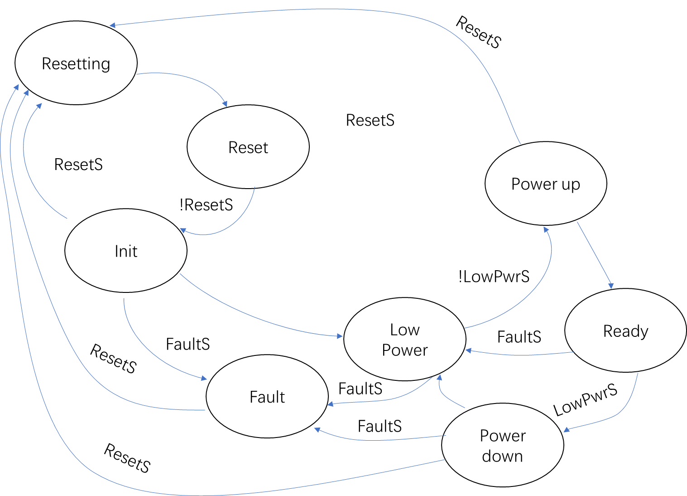

# **remote ssh**
Common Management Interface Specification   

Author: Buendia.Deng[^1a]  
[^1a]: Buendia.Deng@volex.com 

## generate key
open cmd/powershell, command as
```
C:\Users\Lenovo>ssh-keygen
Generating public/private rsa key pair.
Enter file in which to save the key (C:\Users\Lenovo/.ssh/id_rsa)
```
afrter key "enter", it will shows :
```
Enter passphrase (empty for no passphrase):
```
if without key, just push button key"enter", then it will generate a  random key

ras is priviate key, .pub as public key, the next step is send the .pub to device(UTP)
## UTP operate
open .pub , copy its content into .shh(/home/volex123/.ssh)
create a file name as "authorized_key", then plaste the content
then ssh the utp as its name(the name can be found in cmd of UTP)

if slave has changed, use 
```cmd
code C:\Users\Lenovo\.ssh\known_hosts
```
if has the 'error'
```cmd
IT IS POSSIBLE THAT SOMEONE IS DOING SOMETHING NASTY!
Someone could be eavesdropping on you right now (man-in-the-middle attack)!
It is also possible that a host key has just been changed.
The fingerprint for the ED25519 key sent by the remote host is
SHA256:bzbA7I+dL4oxcotY9kzsKvz+xNhxzx5XQrynHsmkPRE.
Please contact your system administrator.
Add correct host key in C:\\Users\\Lenovo/.ssh/known_hosts to get rid of this message.
Offending ED25519 key in C:\\Users\\Lenovo/.ssh/known_hosts:10
Host key for vsz-l01-utp04 has changed and you have requested strict checking.
Host key verification failed.
```
detelect the C:\\Users\\Lenovo/.ssh/known_hosts line 10, reconnect if will successfully.
