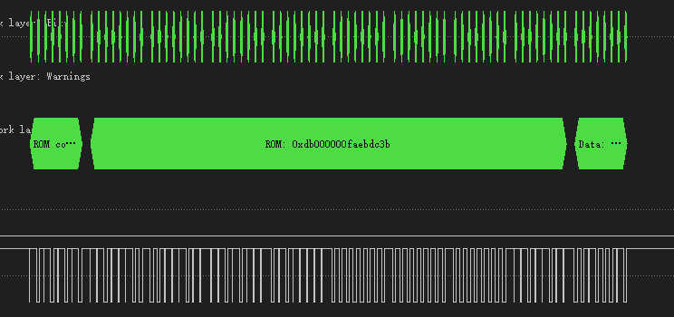
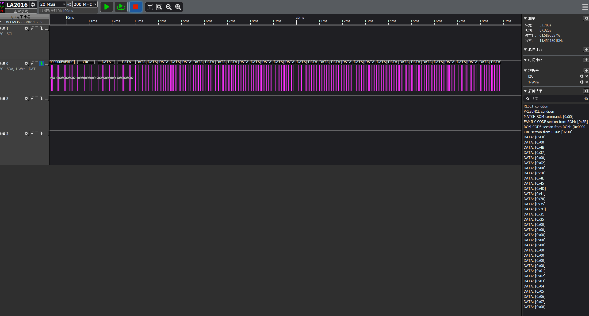

# **Max31826 eeprom 操作**
Author: Buendia.Deng[^1a]  
Rev 1.0  
[^1a]: Buendia.Deng@volex.com 

## 1.获取rom 
按照max31826 datasheet，每次操作都需要rest，match rom/skip, command 因此首先需要获取rom
操作步骤：
1.reset 设备

2.读取rom,命令为0x33，获取8字节数据，最后一字节为crc结果，检查crc

读取的SN如图所示

经过这一步骤，可以初步判定 onewire读写时序满足要求
## 2.进行eeprom写操作
按照datasheet，eeprom写入操作是写入Scratchpad 2，所推荐操作为
1) Write Scratchpad 2 (0x0f).
2) Read Scratchpad 2 (0xaa).
3) Copy Scratchpad 2 to EEPROM (0x55).
4) 写入CMD_WRITE_EEPROM （0xA5）
现写入32byte数据,每次写8字节数据，写4次，写入地址为0x00-0x18

```
 uint8_t write_buf[32] = 
 {
    0x4B, 0x37, 0x00, 0x02, 0x00, 0x10, 0x4E, 0x45,
    0x4D, 0x41, 0x20, 0x35, 0x2D, 0x31, 0x35, 0x00,
    0x00, 0x00, 0x00, 0x00, 0x00, 0x00, 0x00, 0x08,
    0x01, 0x02, 0x03, 0x04, 0x05, 0x06, 0x07,0x08
  };
```
在MAX3182x_ReadScratchpad2处打断点可以根据receivedata检查写入数据,根据逻辑分析仪结果，read Scratchpad2的数据与写入数据match

## 3.进行eeprom读操作 
根据datasheet,"Read Memory [F0h]"，读取eeprom数据(从0x00读取24字节)，逻辑分析仪抓取结果如下


数据符合写入数值，可以证明读写正确